# Action Tree — Global Remittance Platform

## Mermaid Code

```mermaid
graph TD
    Root["Global Remittance Platform"]

    Root --> M1["Customer Identity & eKYC Onboarding"]
    Root --> M2["Foreign Exchange FX & Fee Engine"]
    Root --> M3["Remittance Transaction Processing"]
    Root --> M4["AML, PEP & Sanctions Compliance"]
    Root --> M5["Correspondent Settlement & Payout Routing"]
    Root --> M6["Financial Reporting & Audit Controls"]

    M1 --> A11["Scan Passport/ID via Optical Character Recognition OCR"]
    M1 --> A12["Perform 3D Facial Liveness Biometric Verification"]
    M1 --> A13["Validate Proof of Address Documents"]
    M1 --> A14["Assign Customer KYC Risk Tiers"]

    M2 --> A21["Lock 15-Minute Guaranteed Mid-Market FX Rates"]
    M2 --> A22["Calculate Transfer Fees & Regulatory Taxes"]
    M2 --> A23["Apply Foreign Exchange FX Spread Markups"]
    M2 --> A24["Execute Multi-Currency Liquidity Hedging"]

    M3 --> A31["Debit Sender Originating Bank Account"]
    M3 --> A32["Generate 10-Digit Money Transfer Control Number MTCN"]
    M3 --> A33["Format SWIFT ISO 20022 pax.008 Payment Messages"]
    M3 --> A34["Cancel Uncollected Transfers & Refund Senders"]

    M4 --> A41["Fuzzy Match Names against OFAC/UN Sanctions Lists"]
    M4 --> A42["Screen Politically Exposed Persons PEP Watchlists"]
    M4 --> A43["Detect Structuring & Velocity Anomaly Limits"]
    M4 --> A44["File FinCEN Suspicious Activity Reports SAR"]

    M5 --> A51["Route Beneficiary Cash Payouts to Agent Desks"]
    M5 --> A52["Disburse Instant Mobile Wallet Payments M-Pesa"]
    M5 --> A53["Reconcile Nostro/Vostro Correspondent Accounts"]
    M5 --> A54["Calculate Payout Agent Commission Tiers"]

    M6 --> A61["Export Daily Remittance Volume Ledger Reports"]
    M6 --> A62["Track SWIFT gpi End-to-End Payment Latency"]
    M6 --> A63["Generate Withholding Tax Settlement Files"]
    M6 --> A64["Configure Regulatory FX Corridor Volume Limits"]
```

## Module Description | Mô tả Module

| # | Module | Description | Actions |
|---|--------|-------------|---------|
| 1 | Customer Identity & eKYC Onboarding | Manages passport/ID OCR scans, 3D facial liveness verification, proof of address validation, and KYC risk tier assignment. | Scan Passport/ID via Optical Character Recognition OCR, Perform 3D Facial Liveness Biometric Verification, Validate Proof of Address Documents, Assign Customer KYC Risk Tiers |
| 2 | Foreign Exchange FX & Fee Engine | Locks 15-minute FX quotes, calculates origin fees and taxes, applies FX spreads, and manages multi-currency hedging. | Lock 15-Minute Guaranteed Mid-Market FX Rates, Calculate Transfer Fees & Regulatory Taxes, Apply Foreign Exchange FX Spread Markups, Execute Multi-Currency Liquidity Hedging |
| 3 | Remittance Transaction Processing | Debits sender accounts, generates 10-digit MTCN codes, formats ISO 20022 SWIFT payment messages, and processes refunds. | Debit Sender Originating Bank Account, Generate 10-Digit Money Transfer Control Number MTCN, Format SWIFT ISO 20022 pax.008 Payment Messages, Cancel Uncollected Transfers & Refund Senders |
| 4 | AML, PEP & Sanctions Compliance | Screens sender/beneficiary names against OFAC/UN lists, checks PEP watchlists, detects structuring, and files SAR reports. | Fuzzy Match Names against OFAC/UN Sanctions Lists, Screen Politically Exposed Persons PEP Watchlists, Detect Structuring & Velocity Anomaly Limits, File FinCEN Suspicious Activity Reports SAR |
| 5 | Correspondent Settlement & Payout Routing | Routes cash payouts to retail agents, disburses mobile wallet deposits, reconciles Nostro/Vostro ledgers, and pays agent commissions. | Route Beneficiary Cash Payouts to Agent Desks, Disburse Instant Mobile Wallet Payments M-Pesa, Reconcile Nostro/Vostro Correspondent Accounts, Calculate Payout Agent Commission Tiers |
| 6 | Financial Reporting & Audit Controls | Exports daily remittance ledgers, tracks SWIFT gpi payment latency, generates tax files, and configures FX corridor volume limits. | Export Daily Remittance Volume Ledger Reports, Track SWIFT gpi End-to-End Payment Latency, Generate Withholding Tax Settlement Files, Configure Regulatory FX Corridor Volume Limits |
