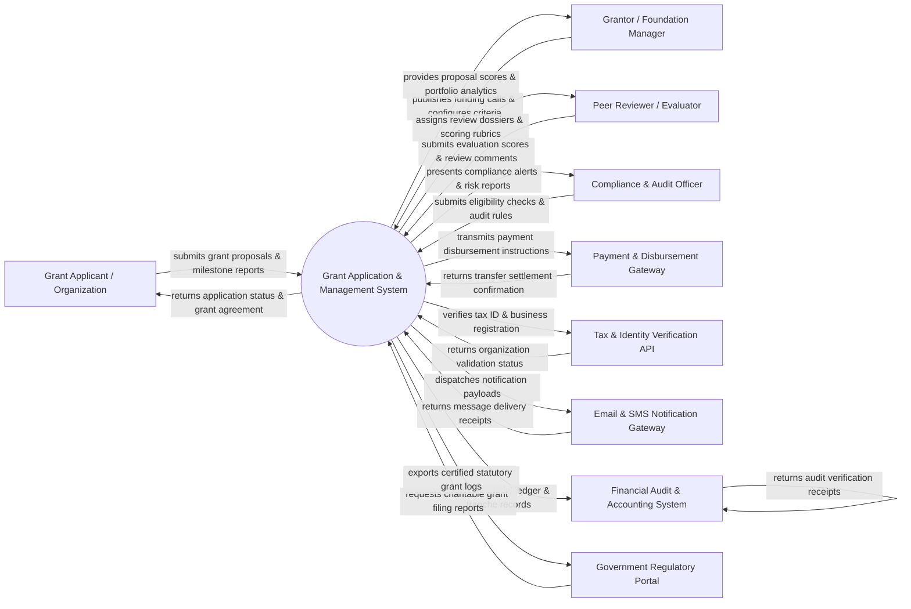

# Context Diagram — Grant Application & Management System

## Mermaid Code

## Actor & Interaction Table | Bảng Actor & Tương tác

| # | Actor | Actor Type | Data Sent TO System | Data Received FROM System | Notes |
|---|-------|------------|---------------------|---------------------------|-------|
| 1 | Grant Applicant / Organization | Primary | Grant proposals, organization tax ID, project budgets, team credentials, milestone reports, expense receipts | Funding call guidelines, application tracking status, grant award contracts, disbursement notices | Non-profit organizations, researchers, or startups applying for financial grant funding. |
| 2 | Grantor / Foundation Manager | Primary | Funding opportunity announcements, budget caps, evaluation rubrics, reviewer assignments, funding approval decisions | Proposal dashboards, scoring aggregates, portfolio expenditure metrics, award agreement tracking | Program officers and foundation leaders managing grant programs and allocating funds. |
| 3 | Peer Reviewer / Evaluator | Primary | Evaluation scores, qualitative feedback comments, conflict-of-interest disclosures | Assigned application dossiers, scoring rubrics, review deadline alerts | Subject matter experts evaluating grant applications against defined rubrics. |
| 4 | Compliance & Audit Officer | Primary | Eligibility verification checks, anti-money laundering (AML) rules, audit flags, risk thresholds | Non-compliance alerts, risk scoring reports, post-award expenditure logs | Internal compliance officers ensuring legal, tax, and institutional grant compliance. |
| 5 | Payment & Disbursement Gateway | Supporting System | Payment settlement codes, bank transfer transaction IDs, failed payout alerts | Wire disbursement payloads, beneficiary bank details, tranche payment schedules | External banking network or payment processor disbursing grant funds to awardees. |
| 6 | Tax & Identity Verification API | Supporting System | Entity validation status, tax-exempt 501(c)(3) status, business registry records | Tax Identification Number (TIN/EIN), business registration code, organization legal name | Government or third-party API validating applicant legal and tax-exempt status. |
| 7 | Email & SMS Notification Gateway | Supporting System | Delivery receipts, bounce alerts, SMS carrier response codes | Email notification payloads, deadline reminders, application submission receipts, OTP tokens | Messaging service sending system alerts, review reminders, and award notifications. |
| 8 | Financial Audit & Accounting System | Supporting System | General ledger sync status, accounting audit trail approvals, reconciliation codes | Certified grant disbursement logs, expense claim reports, fund balance ledgers | Enterprise ERP or accounting software recording financial grant transactions. |
| 9 | Government Regulatory Portal | Regulatory System | Statutory reporting guidelines, charitable grant compliance rules | Annual grant distribution reports, tax filing data, statutory compliance exports | Government tax and regulatory agencies overseeing grant-making foundations and non-profits. |

## System Boundary Description | Mô tả Phạm vi Hệ thống

The **Grant Application & Management System (GAMS)** is an end-to-end cloud platform built to administer the complete lifecycle of grant funding programs. Inside the system boundary, GAMS handles funding call publishing, online application intake, eligibility vetting, automated peer reviewer assignment, multi-stage evaluation scoring, award contracting, milestone tracking, and expense claim verification. External to the system boundary are commercial banking networks (Payment & Disbursement Gateway), official tax databases (Tax & Identity Verification API), notification delivery infrastructure (Email & SMS Gateway), enterprise accounting platforms (Financial Audit & Accounting System), and statutory tax authority portals (Government Regulatory Portal).
