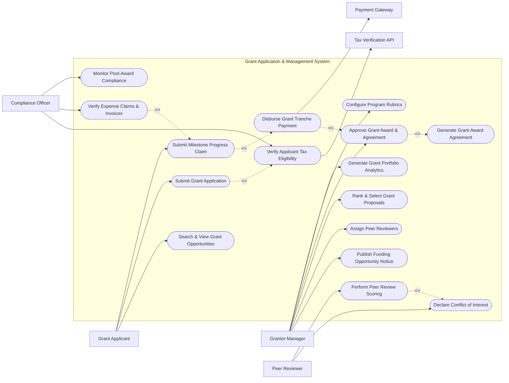

# Use Case Diagram — Grant Application & Management System

## Mermaid Code

## Actor Table | Bảng Actor

| # | Actor | Actor Type | Role Description | Related Use Cases |
|---|-------|------------|------------------|-------------------|
| 1 | Grantor Manager | Primary | Foundation officer managing funding calls, reviewer assignments, and award selections. | UC01, UC05, UC08, UC10, UC15, UC16 |
| 2 | Grant Applicant | Primary | Organization or individual preparing and submitting grant applications and milestone reports. | UC02, UC03, UC12 |
| 3 | Peer Reviewer | Primary | Independent expert reviewing, scoring, and providing commentary on assigned grant dossiers. | UC06, UC07 |
| 4 | Compliance Officer | Primary | Legal/financial auditor verifying applicant tax eligibility, expense claims, and regulatory compliance. | UC04, UC13, UC14 |
| 5 | Tax Verification API | System | External government database confirming 501(c)(3) / tax registration validity. | UC04 |
| 6 | Payment Gateway | System | Commercial banking service executing wire transfers for approved grant tranches. | UC11 |

## Use Case Table | Bảng Use Case

| # | UC ID | Use Case Name | Primary Actor | Secondary Actor | Description | Priority |
|---|-------|---------------|---------------|-----------------|-------------|----------|
| 1 | UC01 | Publish Funding Opportunity Notice | Grantor Manager | None | Creates and publishes a public call for grant proposals with guidelines, deadlines, and budget limits. | High |
| 2 | UC02 | Search & View Grant Opportunities | Grant Applicant | None | Searches active grant funding calls by category, eligibility, geographic region, and deadline. | High |
| 3 | UC03 | Submit Grant Application | Grant Applicant | Tax Verification API | Submits a formal grant proposal package including executive summary, project budget, and legal tax docs. | High |
| 4 | UC04 | Verify Applicant Tax Eligibility | Compliance Officer | Tax Verification API | Queries official databases to verify applicant tax-exempt status, TIN, and organizational standing. | High |
| 5 | UC05 | Assign Peer Reviewers | Grantor Manager | Peer Reviewer | Matches submitted grant applications to qualified peer reviewers based on domain expertise. | High |
| 6 | UC06 | Declare Conflict of Interest | Peer Reviewer | None | Requires reviewers to disclose or recuse themselves from evaluating specific applications. | Medium |
| 7 | UC07 | Perform Peer Review Scoring | Peer Reviewer | Grantor Manager | Evaluates proposal dossiers against scoring rubrics and provides qualitative feedback. | High |
| 8 | UC08 | Rank & Select Grant Proposals | Grantor Manager | None | Aggregates reviewer scores, generates applicant ranking lists, and selects award winning proposals. | High |
| 9 | UC09 | Generate Grant Award Agreement | Grantor Manager | Grant Applicant | Auto-populates legal grant award terms, tranche schedules, and performance deliverables. | Medium |
| 10 | UC10 | Approve Grant Award & Agreement | Grantor Manager | Grant Applicant | Executes formal grant award approval and signs binding agreement with grant recipient. | High |
| 11 | UC11 | Disburse Grant Tranche Payment | Grantor Manager | Payment Gateway | Triggers electronic wire disbursement of approved grant fund tranches to awardee bank accounts. | High |
| 12 | UC12 | Submit Milestone Progress Claim | Grant Applicant | Compliance Officer | Submits project progress reports, financial expense receipts, and deliverable evidence for tranche releases. | High |
| 13 | UC13 | Verify Expense Claims & Invoices | Compliance Officer | Grant Applicant | Reviews submitted receipts and invoices to confirm expenditures match approved grant budget lines. | High |
| 14 | UC14 | Monitor Post-Award Compliance | Compliance Officer | None | Tracks post-award reporting deadlines, unspent fund returns, and financial audit flags. | Medium |
| 15 | UC15 | Generate Grant Portfolio Analytics | Grantor Manager | None | Exports overall grant portfolio performance, geographical fund distribution, and impact summaries. | Medium |
| 16 | UC16 | Configure Program Rubrics | Grantor Manager | None | Defines scoring criteria weights, application form templates, and evaluation rubrics. | Low |

## Use Case Specification | Đặc tả Use Case

---

### UC01 — Publish Funding Opportunity Notice

| Field | Detail |
|-------|--------|
| **UC ID** | UC01 |
| **Use Case Name** | Publish Funding Opportunity Notice |
| **Actor(s)** | Primary: Grantor Manager / Secondary: None |
| **Description** | Enables a Grantor Manager to create, configure, and publish a public Funding Opportunity Notice (NOFO) detailing program goals, eligibility rules, total funding pool, award caps, and submission deadlines. |
| **Precondition** | 1. User is logged in as an authorized Grantor Manager or Foundation Officer.   2. The grant program budget has been approved by the foundation board. |
| **Main Flow** | 1. Actor selects "Create New Funding Opportunity".   2. System displays program configuration form.   3. Actor inputs Opportunity Title, Program Summary, Funding Category, Total Pool Amount, Min/Max Award Limits, and Submission Deadline.   4. Actor selects or configures custom Application Question Templates and Scoring Rubric (UC16).   5. Actor defines applicant eligibility criteria (e.g. 501(c)(3) non-profit, higher education institution, small business).   6. Actor submits the opportunity notice for publishing.   7. System validates input data, generates a unique Opportunity Code (e.g. GO-2026-ENV), and publishes the notice to the public portal. |
| **Alternative Flow** | **AF1** — Schedule Future Publishing: Actor sets a future release date; System stores notice in "Scheduled" status and automatically publishes it on the specified date.   **AF2** — Restricted Invitation-Only Call: Actor checks "By Invitation Only", and System generates private application access tokens sent to pre-selected organizations. |
| **Exception Flow** | **EX1** — Total Pool Exceeds Program Allocation: If Total Pool Amount exceeds foundation budget allocation, System blocks publication with error "Total pool exceeds allocated program budget".   **EX2** — Past Deadline Date: If submission deadline is set to a past date, System alerts "Deadline must be at least 14 days in the future". |
| **Postcondition** | A Funding_Opportunity entity is persisted in status "Published", allowing grant applicants to view guidelines and apply. |
| **Business Rule** | **BR1**: All public funding notices must remain open for applications for a minimum of 30 days unless designated as emergency relief. |

---

### UC03 — Submit Grant Application

| Field | Detail |
|-------|--------|
| **UC ID** | UC03 |
| **Use Case Name** | Submit Grant Application |
| **Actor(s)** | Primary: Grant Applicant / Secondary: Tax Verification API |
| **Description** | Allows an applicant organization to complete an online grant application form, upload project narrative, submit budget breakdown, attach legal tax documents, and submit the proposal package. |
| **Precondition** | 1. Grant Applicant is registered and logged into the portal.   2. The target Funding Opportunity is active and open for submission. |
| **Main Flow** | 1. Actor selects an open funding opportunity and clicks "Start Grant Application".   2. System creates a draft application dossier and presents section tabs: Executive Summary, Project Narrative, Budget & Financials, Team Credentials, and Tax & Compliance Docs.   3. Actor fills in project objectives, methodology, timeline, and itemized budget line items.   4. Actor enters Tax Identification Number (TIN/EIN) and attaches tax exemption certificate (501(c)(3) letter or equivalent).   5. System queries Tax Verification API (UC04) to confirm organization identity and tax status.   6. Actor reviews final application package and clicks "Submit Application".   7. System verifies completeness, locks editing, stamps submission timestamp, generates Application Reference ID (e.g. APP-88402), and sends confirmation email. |
| **Alternative Flow** | **AF1** — Multi-Member Co-Drafting: Applicant invites team members via email; System allows concurrent editing of different application sections before final submission.   **AF2** — Pre-Eligibility Screening Pass: System performs automated pre-screening check and immediately confirms "Eligibility Passed". |
| **Exception Flow** | **EX1** — Tax ID Verification Failure: If Tax Verification API returns "Invalid Tax ID / Ineligible Status", System alerts "Tax ID validation failed. Upload current proof of tax-exempt status."   **EX2** — Deadline Expired During Submission: If Actor attempts final submit after deadline timestamp, System locks form and displays "Application portal closed for this funding call." |
| **Postcondition** | A Grant_Application record is created in status "Submitted - Pending Screening", and application files are locked against further edits. |
| **Business Rule** | **BR1**: Total requested budget amount cannot exceed the maximum award cap specified in the Funding Opportunity Notice. |

---

### UC07 — Perform Peer Review Scoring

| Field | Detail |
|-------|--------|
| **UC ID** | UC07 |
| **Use Case Name** | Perform Peer Review Scoring |
| **Actor(s)** | Primary: Peer Reviewer / Secondary: Grantor Manager |
| **Description** | Enables an assigned independent peer reviewer to evaluate a grant application dossier against established scoring criteria, input weighted scores, and write evaluation comments. |
| **Precondition** | 1. Reviewer is logged in with an assigned reviewer account.   2. Application dossier has been assigned to reviewer (UC05) and conflict of interest declared (UC06). |
| **Main Flow** | 1. Reviewer opens Review Workspace and selects an assigned application dossier.   2. System displays full application narrative, budget, project goals, and scoring rubric side-by-side.   3. Reviewer evaluates each rubric criterion (e.g. Innovation [0-25], Impact [0-30], Feasibility [0-25], Budget Justification [0-20]).   4. Reviewer enters numerical scores for each criterion and types qualitative strengths/weaknesses commentary.   5. Reviewer inputs overall recommendation rating (e.g. Strongly Recommend, Recommend, Neutral, Do Not Recommend).   6. Reviewer submits evaluation.   7. System calculates total weighted score, records Evaluation_Score record, and updates application review completion status. |
| **Alternative Flow** | **AF1** — Request Clarification: Reviewer flags a question regarding budget details; System routes anonymous inquiry to Applicant via Grantor Manager.   **AF2** — Save Evaluation Draft: Reviewer clicks "Save Draft"; System saves partial scores for completion later. |
| **Exception Flow** | **EX1** — Missing Required Commentary: If Reviewer inputs low score (<50%) without providing explanatory text comments, System prompts "Written feedback required for scores below 50%".   **EX2** — Conflict of Interest Flagged Late: If Reviewer discovers conflict of interest during review, Reviewer clicks "Recuse Self", and System unassigns application and alerts Grantor Manager. |
| **Postcondition** | An Evaluation_Score record is stored in status "Completed", contributing to the composite application rank score. |
| **Business Rule** | **BR1**: Each application must receive at least 3 independent reviewer evaluations before being eligible for final ranking. |

---

### UC10 — Approve Grant Award & Agreement

| Field | Detail |
|-------|--------|
| **UC ID** | UC10 |
| **Use Case Name** | Approve Grant Award & Agreement |
| **Actor(s)** | Primary: Grantor Manager / Secondary: Grant Applicant |
| **Description** | Allows a Grantor Manager or Foundation Board to formally approve selected top-ranked applications, generate legal award contracts, and execute binding award agreements with recipients. |
| **Precondition** | 1. Peer review scoring (UC07) and proposal ranking (UC08) are complete.   2. User has formal financial approval authority for award decisions. |
| **Main Flow** | 1. Actor views Ranked Proposal Selection matrix.   2. Actor selects top-ranked proposals within available grant budget limits and clicks "Approve for Award".   3. System changes application status to "Award Approved" and triggers Grant Award Agreement generation (UC09).   4. System populates legal contract template with Award Amount, Performance Period, Tranche Schedule, and Reporting Conditions.   5. Actor reviews award contract draft and sends digital agreement package to Grant Applicant for signature.   6. Grant Applicant signs agreement via e-signature portal.   7. System records signed contract, sets application status to "Grant Active", and queues initial tranche payment (UC11). |
| **Alternative Flow** | **AF1** — Negotiate Reduced Award Budget: Grantor Manager approves award with a reduced budget (e.g. $80,000 instead of requested $100,000); Applicant receives prompt to submit revised work plan and budget prior to signing.   **AF2** — Reject Award Agreement: Applicant rejects award terms; System returns funds to unallocated pool and updates status to "Declined by Applicant". |
| **Exception Flow** | **EX1** — Insufficient Remaining Grant Pool: If selected awards exceed remaining program pool budget, System alerts "Exceeds available program pool by $15,000. Adjust award amounts or selection."   **EX2** — Signature Deadline Expiration: If Applicant fails to sign agreement within 30 days, System flags award as "Offer Expired". |
| **Postcondition** | A binding Grant_Award contract is executed, setting grant status to "Active" and locking in tranche disbursement schedules. |
| **Business Rule** | **BR1**: Awards exceeding $250,000 require two-factor board approval before agreement dispatch. |

---

### UC12 — Submit Milestone Progress & Expense Claim

| Field | Detail |
|-------|--------|
| **UC ID** | UC12 |
| **Use Case Name** | Submit Milestone Progress & Expense Claim |
| **Actor(s)** | Primary: Grant Applicant / Secondary: Compliance Officer |
| **Description** | Enables active grant recipients to submit periodic progress reports, deliverable evidence, and itemized financial expense claims to unlock subsequent grant tranche payments. |
| **Precondition** | 1. Grant status is "Active" with signed award agreement.   2. A scheduled milestone date has arrived or expense reporting period has closed. |
| **Main Flow** | 1. Actor opens Active Grant Dashboard and selects "Submit Milestone Report / Expense Claim".   2. System displays milestone reporting form with pre-populated project deliverables and budget line items.   3. Actor inputs progress summary, upload deliverable files (e.g. research findings, event photos, publication drafts).   4. Actor inputs itemized financial expenses incurred during the period and uploads vendor invoices/receipts.   5. System checks claimed expenses against approved budget categories.   6. Actor submits milestone report and expense claim package.   7. System assigns package reference ID (e.g. MS-2026-Q2), updates milestone status to "Under Compliance Verification", and notifies Compliance Officer (UC13). |
| **Alternative Flow** | **AF1** — Final Closeout Report Submission: Actor submits final project completion report, asset disposal log, and audit summary; System routes for final grant closeout review.   **AF2** — Unspent Funds Declaration: Actor declares unspent balance at milestone end; System calculates net amount for next tranche adjustment or return refund. |
| **Exception Flow** | **EX1** — Missing Receipt Proof: If an expense item over $100 lacks attached receipt document, System blocks submission with error "Receipt upload required for expenses exceeding $100".   **EX2** — Unapproved Budget Category Reallocation: If expenses are claimed under an unapproved category, System alerts "Expense category mismatch. Request budget variance approval." |
| **Postcondition** | A Milestone_Report and associated Expense_Claim records are persisted in status "Submitted - Under Review". |
| **Business Rule** | **BR1**: Milestone progress reports must be approved by Compliance Officers before subsequent tranche payments can be released. |
