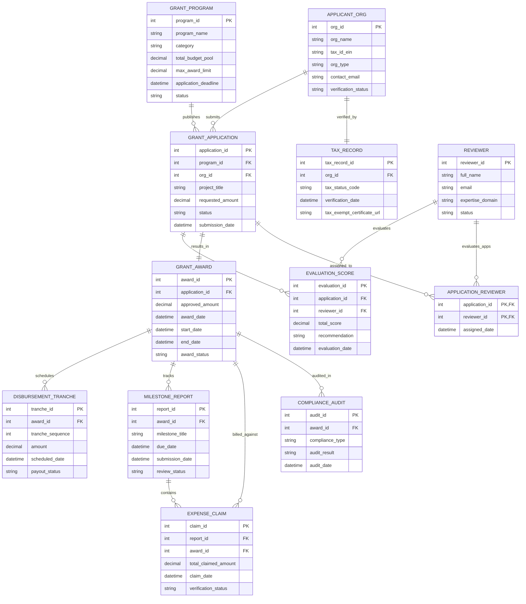

# Conceptual ERD — Grant Application & Management System

## Mermaid Code

## Entity Description Table | Bảng mô tả Entity

| # | Entity Name | Vietnamese Name | Description | Key Attributes | Main Relationships |
|---|-------------|-----------------|-------------|----------------|-------------------|
| 1 | GRANT_PROGRAM | Chương trình Tài trợ | Represents a specific grant opportunity call with total budget pool, eligibility criteria, and submission deadline. | program_id (PK), program_name, category, total_budget_pool, application_deadline | Publishes Applications |
| 2 | APPLICANT_ORG | Tổ chức Nộp đơn | Non-profit organization, research institute, or small business applying for grant funding. | org_id (PK), org_name, tax_id_ein, org_type, verification_status | Submits Applications, verified by Tax Record |
| 3 | TAX_RECORD | Hồ sơ Mã số Thuế | Official tax verification record confirming 501(c)(3) / tax-exempt status and legal registration. | tax_record_id (PK), org_id (FK), tax_status_code, tax_exempt_certificate_url | Verifies Applicant Org |
| 4 | GRANT_APPLICATION | Đơn Xin Tài trợ | Formal grant proposal submitted by an applicant organization for a specific grant program. | application_id (PK), program_id (FK), org_id (FK), project_title, requested_amount, status | Belongs to Grant Program & Applicant Org, scored in Evaluation Score, results in Grant Award |
| 5 | REVIEWER | Chuyên gia Đánh giá | External or internal domain expert assigned to review and score grant application dossiers. | reviewer_id (PK), full_name, email, expertise_domain | Evaluates Applications via Evaluation Score |
| 6 | EVALUATION_SCORE | Điểm Đánh giá | Numerical criteria scores, qualitative notes, and recommendation submitted by a peer reviewer. | evaluation_id (PK), application_id (FK), reviewer_id (FK), total_score, recommendation | Belongs to Application & Reviewer |
| 7 | GRANT_AWARD | Quyết định Cấp Vốn | Binding grant contract awarded to an application, defining approved amount and performance period. | award_id (PK), application_id (FK), approved_amount, award_date, award_status | Belongs to Application, schedules Tranches, tracks Milestone Reports & Audits |
| 8 | DISBURSEMENT_TRANCHE | Trực Đợt Giải ngân | Individual payment installment disbursed to awardee based on milestone achievements. | tranche_id (PK), award_id (FK), tranche_sequence, amount, payout_status | Belongs to Grant Award |
| 9 | MILESTONE_REPORT | Báo cáo Tiến độ | Periodic milestone progress deliverable submitted by grant recipient to verify performance. | report_id (PK), award_id (FK), milestone_title, due_date, review_status | Belongs to Grant Award, contains Expense Claims |
| 10 | EXPENSE_CLAIM | Yêu cầu Thanh toán | Itemized financial expense report submitted with receipts to account for grant expenditures. | claim_id (PK), report_id (FK), award_id (FK), total_claimed_amount, verification_status | Belongs to Milestone Report & Grant Award |
| 11 | COMPLIANCE_AUDIT | Kiểm toán Tuân thủ | Risk and financial audit record tracking grant recipient compliance with statutory rules. | audit_id (PK), award_id (FK), compliance_type, audit_result, audit_date | Audits Grant Award |

## Relationship Description | Mô tả Quan hệ

| # | From Entity | Cardinality | To Entity | Relationship Label | Business Explanation |
|---|-------------|-------------|-----------|-------------------|----------------------|
| 1 | GRANT_PROGRAM | one-to-many | GRANT_APPLICATION | publishes | A Grant Program receives multiple Grant Applications. |
| 2 | APPLICANT_ORG | one-to-many | GRANT_APPLICATION | submits | An Applicant Org can submit multiple Grant Applications over time. |
| 3 | APPLICANT_ORG | one-to-one | TAX_RECORD | verified_by | An Applicant Org is verified by a unique Tax Record. |
| 4 | GRANT_APPLICATION | one-to-many | EVALUATION_SCORE | scored_in | A Grant Application receives multiple peer review Evaluation Scores. |
| 5 | REVIEWER | one-to-many | EVALUATION_SCORE | evaluates | A Reviewer submits Evaluation Scores across assigned applications. |
| 6 | GRANT_APPLICATION | one-to-one | GRANT_AWARD | results_in | An approved Grant Application results in a formal Grant Award contract. |
| 7 | GRANT_AWARD | one-to-many | DISBURSEMENT_TRANCHE | schedules | A Grant Award schedules multiple payment Disbursement Tranches. |
| 8 | GRANT_AWARD | one-to-many | MILESTONE_REPORT | tracks | A Grant Award tracks periodic Milestone Reports. |
| 9 | MILESTONE_REPORT | one-to-many | EXPENSE_CLAIM | contains | A Milestone Report contains itemized Expense Claims. |
| 10 | GRANT_AWARD | one-to-many | EXPENSE_CLAIM | billed_against | Expense Claims are billed against approved Grant Award budget lines. |
| 11 | GRANT_AWARD | one-to-many | COMPLIANCE_AUDIT | audited_in | A Grant Award undergoes periodic Compliance Audits. |
| 12 | GRANT_APPLICATION | many-to-many | REVIEWER | assigned_to | Applications are assigned to multiple Reviewers (via APPLICATION_REVIEWER). |
