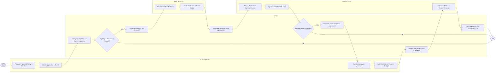

# Swimlane Diagram — Grant Application & Management System

## Mermaid Code

## Flow Description | Mô tả luồng

| Lane | Actor | Role in Flow |
|------|-------|-------------|
| 1 | Grant Applicant | Authors project proposals, submits tax documentation, executes signed award contracts, and logs milestone deliverables with expense receipts. |
| 2 | System | Automates tax verification checks, routes application dossiers, calculates composite rubric scores, generates award contracts, and triggers electronic bank wire payouts. |
| 3 | Peer Reviewer | Discloses potential conflicts of interest, reviews assigned application narratives, and submits weighted scoring rubrics. |
| 4 | Grantor Board | Evaluates candidate ranking rosters, makes final award selection decisions, and approves milestone tranche releases. |
