# Action Tree — Grant Application & Management System

## Mermaid Code

```mermaid
graph TD
    Root["Grant Application & Management System"]

    Root --> M1["Grant Program & Call Setup"]
    Root --> M2["Application Submission & Portal"]
    Root --> M3["Review & Evaluation Management"]
    Root --> M4["Awarding & Contracting"]
    Root --> M5["Disbursement & Financial Tracking"]
    Root --> M6["Impact & Compliance Audit"]

    M1 --> A11["Publish Funding Opportunity Notice"]
    M1 --> A12["Configure Application Templates"]
    M1 --> A13["Set Eligibility Criteria"]
    M1 --> A14["Define Scoring Rubric Weights"]

    M2 --> A21["Search Active Opportunities"]
    M2 --> A22["Submit Grant Application"]
    M2 --> A23["Verify Tax & 501c3 Status"]
    M2 --> A24["Attach Project Budget Breakdown"]

    M3 --> A31["Assign Peer Reviewers"]
    M3 --> A32["Declare Conflict of Interest"]
    M3 --> A33["Input Rubric Scores & Notes"]
    M3 --> A34["Generate Proposal Rank Roster"]

    M4 --> A41["Select Award Recipients"]
    M4 --> A42["Generate Award Contract Template"]
    M4 --> A43["Execute Digital Award Signatures"]
    M4 --> A44["Issue Formal Award Notifications"]

    M5 --> A51["Schedule Tranche Payouts"]
    M5 --> A52["Submit Milestone Progress Claims"]
    M5 --> A53["Verify Invoices & Receipts"]
    M5 --> A54["Execute Wire Bank Disbursements"]

    M6 --> A61["Audit Post-Award Compliance"]
    M6 --> A62["Track Unspent Fund Returns"]
    M6 --> A63["Export Statutory Tax Reports"]
    M6 --> A64["Generate Portfolio Impact Dashboard"]
```

## Module Description | Mô tả Module

| # | Module | Description | Actions |
|---|--------|-------------|---------|
| 1 | Grant Program & Call Setup | Manages the creation of funding notices, submission guidelines, budget limits, eligibility criteria, and scoring rubrics. | Publish Funding Opportunity Notice, Configure Application Templates, Set Eligibility Criteria, Define Scoring Rubric Weights |
| 2 | Application Submission & Portal | Facilitates online proposal submission, tax ID verification, itemized budget uploads, and applicant portal management. | Search Active Opportunities, Submit Grant Application, Verify Tax & 501c3 Status, Attach Project Budget Breakdown |
| 3 | Review & Evaluation Management | Coordinates peer reviewer assignments, conflict of interest recusals, weighted rubric scoring, and composite proposal ranking. | Assign Peer Reviewers, Declare Conflict of Interest, Input Rubric Scores & Notes, Generate Proposal Rank Roster |
| 4 | Awarding & Contracting | Handles final award selection, legal agreement generation, e-signatures, and formal award notification dispatch. | Select Award Recipients, Generate Award Contract Template, Execute Digital Award Signatures, Issue Formal Award Notifications |
| 5 | Disbursement & Financial Tracking | Manages tranche payout scheduling, milestone progress claims, expense invoice verification, and electronic bank wire transfers. | Schedule Tranche Payouts, Submit Milestone Progress Claims, Verify Invoices & Receipts, Execute Wire Bank Disbursements |
| 6 | Impact & Compliance Audit | Monitors post-award compliance, tracks unspent fund returns, generates portfolio analytics, and exports statutory tax reports. | Audit Post-Award Compliance, Track Unspent Fund Returns, Export Statutory Tax Reports, Generate Portfolio Impact Dashboard |
