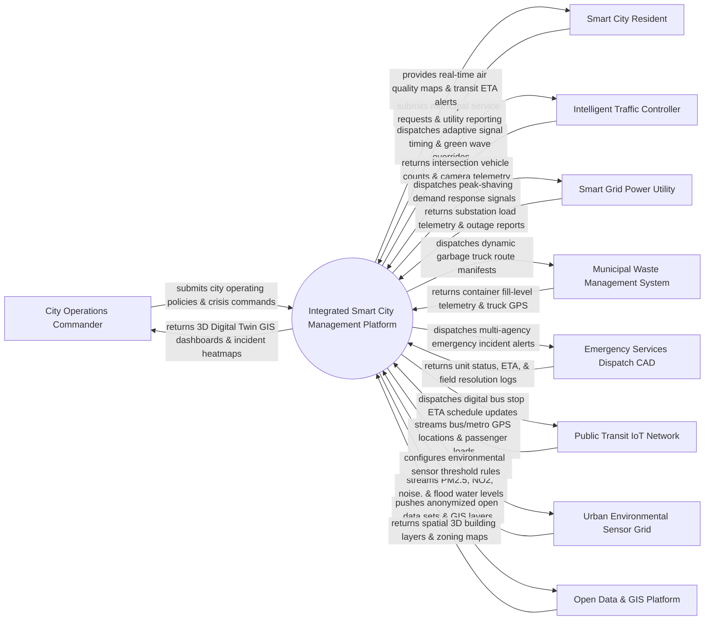

# Context Diagram — Integrated Smart City Management Platform

## Mermaid Code

## Actor & Interaction Table | Bảng Actor & Tương tác

| # | Actor | Actor Type | Data Sent TO System | Data Received FROM System | Notes |
|---|-------|------------|---------------------|---------------------------|-------|
| 1 | City Operations Commander | Primary | Strategic city operating policies, emergency override commands, event management rules, resource allocations | 3D Digital Twin GIS dashboards, multi-sector incident heatmaps, KPI scorecards, emergency alerts | Mayor, city manager, or chief urban operations officer directing city command console. |
| 2 | Smart City Resident | Primary | Citizen service requests (311 pothole reports), utility outage reports, public feedback ratings | Air Quality Index (AQI) forecasts, public transit real-time ETA alerts, municipal bill receipts | Citizens living in the smart city accessing public services via mobile app or web portal. |
| 3 | Intelligent Traffic Controller | Supporting System | Intersection vehicle flow rates, radar speed detection data, pedestrian crosswalk triggers, traffic camera feeds | Adaptive traffic signal timing parameters, green-wave emergency vehicle overrides, signal plans | Smart traffic light controllers (SCATS, SCOOT) managing city road intersections. |
| 4 | Smart Grid Power Utility | Supporting System | Electrical substation load telemetry, renewable solar/wind generation data, grid outage alerts | Peak-shaving demand response commands, streetlight dimming policies, load balancing signals | Electric utility company managing smart grid distribution, transformers, and streetlights. |
| 5 | Municipal Waste Management System | Supporting System | Smart trash container fill-level percentages, garbage truck GPS locations, weight scale receipts | Optimized dynamic waste collection route manifests, container maintenance dispatches | Municipal waste authority managing smart trash bins and automated collection trucks. |
| 6 | Emergency Services Dispatch CAD | Supporting System | Emergency 911 incident call logs, police/fire unit status, field unit ETA, incident resolution reports | Cross-agency emergency CAD alerts, hazard location GIS layers, traffic signal priority routing | Computer-Aided Dispatch (CAD) systems used by Police, Fire, and Emergency Medical Services (EMS). |
| 7 | Public Transit IoT Network | Supporting System | Bus/Metro vehicle GPS tracking coordinates, passenger counter telemetry, EV bus battery levels | Digital transit stop ETA display updates, route adjustment dispatches, driver schedule sync | Municipal transit authority managing buses, light rail, subways, and micro-mobility fleets. |
| 8 | Urban Environmental Sensor Grid | Hardware | Air quality sensors (PM2.5, PM10, NO2, CO2), acoustic noise level meters (dB), flood water level gauges | Sensor sampling rate configurations, telemetry calibration commands, battery alerts | City-wide IoT sensor network monitoring air, noise, water, and weather conditions. |
| 9 | Open Data & GIS Platform | Supporting System | High-resolution 3D city building meshes, land zoning shapefiles, underground utility pipeline maps | Anonymized municipal open data sets, API feeds, environmental performance metrics | Municipal GIS mapping department and public open data portal hosting city spatial data. |

## System Boundary Description | Mô tả Phạm vi Hệ thống

The **Integrated Smart City Management Platform (ISCMP)** is an enterprise central command, urban IoT telemetry ingestion, and multi-domain operations control system. Inside the system boundary, ISCMP manages city-wide IoT device telemetry ingestion, adaptive traffic signal optimization, smart grid power load balancing, dynamic municipal waste routing, multi-agency emergency CAD coordination, urban environmental monitoring, and open data citizen service delivery. External to the system boundary are city executives (City Operations Commander), citizens (Smart City Resident), traffic light hardware (Intelligent Traffic Controller), power substations (Smart Grid Power Utility), garbage collection fleets (Waste Management System), police/fire CAD networks (Emergency Services Dispatch CAD), transit fleets (Public Transit IoT Network), environmental sensors (Urban Environmental Sensor Grid), and city mapping repositories (Open Data & GIS Platform).
