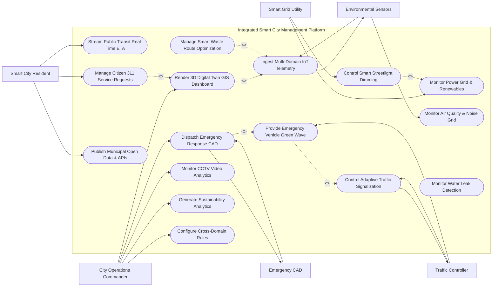

# Use Case Diagram — Integrated Smart City Management Platform

## Mermaid Code

## Actor Table | Bảng Actor

| # | Actor | Actor Type | Role Description | Related Use Cases |
|---|-------|------------|------------------|-------------------|
| 1 | City Operations Commander | Primary | Senior city manager viewing 3D digital twin dashboards, directing emergency CAD response, and configuring automation rules. | UC02, UC08, UC14, UC15, UC16 |
| 2 | Smart City Resident | Primary | Citizen submitting 311 service requests, viewing transit ETAs, and accessing municipal open data portals. | UC09, UC10, UC13 |
| 3 | Traffic Controller | Primary / System | Intelligent traffic controller receiving adaptive signalization updates and executing emergency green wave priority. | UC03, UC04 |
| 4 | Smart Grid Utility | Primary / System | Electric power utility monitoring substation loads, solar generation, and executing smart streetlight dimming. | UC05, UC06 |
| 5 | Emergency CAD | System | Computer-Aided Dispatch system receiving cross-agency emergency incident alerts and dispatching field units. | UC08 |
| 6 | Environmental Sensors | Hardware | Urban IoT sensor network streaming air quality (PM2.5), noise levels (dB), and water pipeline acoustic data. | UC01, UC07 |

## Use Case Table | Bảng Use Case

| # | UC ID | Use Case Name | Primary Actor | Secondary Actor | Description | Priority |
|---|-------|---------------|---------------|-----------------|-------------|----------|
| 1 | UC01 | Ingest Multi-Domain IoT Telemetry | Environmental Sensors | None | Ingests real-time MQTT/CoAP telemetry streams from traffic sensors, power meters, air monitors, and trash bins. | High |
| 2 | UC02 | Render 3D Digital Twin GIS Dashboard | City Operations Commander | None | Renders real-time 3D Digital Twin GIS spatial visualization displaying city infrastructure metrics and alerts. | High |
| 3 | UC03 | Control Adaptive Traffic Signalization | Traffic Controller | None | Adjusts traffic light green-time splits dynamically based on real-time vehicle queue counts to relieve congestion. | High |
| 4 | UC04 | Provide Emergency Vehicle Green Wave | Traffic Controller | None | Automatically clears green-wave traffic signals ahead of approaching fire trucks or ambulances to accelerate response. | High |
| 5 | UC05 | Monitor Power Grid & Renewables | Smart Grid Utility | None | Monitors substation power loads, rooftop solar generation, battery storage reserves, and triggers peak-shaving. | High |
| 6 | UC06 | Control Smart Streetlight Dimming | Smart Grid Utility | None | Automatically dims LED streetlights during low-pedestrian hours (e.g. 2:00 AM) to cut municipal energy usage by 40%. | Medium |
| 7 | UC07 | Monitor Air Quality & Noise Grid | Environmental Sensors | None | Maps real-time Air Quality Index (AQI) heatmap, PM2.5 concentrations, and acoustic noise pollution spikes. | High |
| 8 | UC08 | Dispatch Emergency Response CAD | City Operations Commander | Emergency CAD | Coordinates inter-agency emergency response dispatch, sharing real-time CCTV video feeds and hazard GIS maps. | High |
| 9 | UC09 | Stream Public Transit Real-Time ETA | Smart City Resident | None | Calculates accurate Arrival Time (ETA) for municipal buses and light rail using live vehicle GPS tracking feeds. | High |
| 10 | UC10 | Manage Citizen 311 Service Requests | Smart City Resident | None | Processes geolocated citizen 311 reports (potholes, broken streetlights), dispatching municipal repair work orders. | High |
| 11 | UC11 | Manage Smart Waste Route Optimization | Environmental Sensors | None | Analyzes smart trash bin fill-level percentages, generating optimized dynamic collection truck routes. | High |
| 12 | UC12 | Monitor Water Leak Detection | Environmental Sensors | None | Monitors acoustic pipe sensors and pressure differentials to detect municipal water main leaks before bursts occur. | High |
| 13 | UC13 | Publish Municipal Open Data & APIs | Smart City Resident | None | Exports anonymized open data sets and REST APIs for public transportation, air quality, and municipal budgets. | Medium |
| 14 | UC14 | Monitor CCTV Video Analytics | City Operations Commander | None | Analyzes traffic camera feeds using AI computer vision to detect vehicle accidents, illegal parking, and crowd surges. | High |
| 15 | UC15 | Generate Sustainability Analytics | City Operations Commander | None | Exports city-wide carbon footprint metrics, energy consumption savings, waste diversion rates, and ESG compliance. | Medium |
| 16 | UC16 | Configure Cross-Domain Rules | City Operations Commander | None | Configures automated cross-domain event rules (e.g. IF Heavy Rain >50mm THEN Raise Flood Barrier AND Alert Bus Transit). | Low |

## Use Case Specification | Đặc tả Use Case

---

### UC01 — Ingest Multi-Domain IoT Telemetry

| Field | Detail |
|-------|--------|
| **UC ID** | UC01 |
| **Use Case Name** | Ingest Multi-Domain IoT Telemetry |
| **Actor(s)** | Primary: Environmental Sensors / Secondary: None |
| **Description** | Continuously ingests, validates, and normalizes high-frequency MQTT/CoAP/HTTP telemetry data streams from over 50,000 heterogeneous smart city IoT devices (traffic radar, power meters, air sensors, trash bins). |
| **Precondition** | 1. Smart city IoT gateways and communication brokers (MQTT, LORAWAN, NB-IoT) are operational.   2. Device registry database contains authenticated IoT device hardware IDs. |
| **Main Flow** | 1. Smart city IoT edge gateways transmit telemetry packets containing Device ID, Sensor Type, Timestamp, Geo-coordinates, and Payload data.   2. System message broker (Apache Kafka / EMQX) ingests incoming telemetry stream (>100,000 events/second).   3. System validates payload schema against standard OGC SensorObservationService (SOS) data formats.   4. System performs real-time data cleansing: filters out out-of-range sensor noise (e.g. Temperature reading of 150°C).   5. System normalizes data into unified time-series database (TimescaleDB / InfluxDB) with geospatial indexing.   6. System checks telemetry values against cross-domain alert threshold rules (UC16).   7. System updates live 3D Digital Twin GIS layers (UC02). |
| **Alternative Flow** | **AF1** — Cellular NB-IoT Low-Power Mode: Battery-powered smart trash bin sensor wakes up once every 6 hours, transmits fill-level percentage, and returns to sleep mode.   **AF2** — Edge AI Pre-Processing: Smart camera processes license plate OCR on edge hardware, transmitting only text events rather than full video stream to save bandwidth. |
| **Exception Flow** | **EX1** — Malicious IoT Device Spoofing: Unrecognized device attempts to inject fake telemetry; System security gateway drops packet, flags "Unauthorized Device ID", and alerts cybersecurity.   **EX2** — Broker Buffer Overflow: Telemetry spike during severe storm threatens to overflow queue; System auto-scales Kafka worker nodes to handle load. |
| **Postcondition** | Heterogeneous IoT telemetry is cleansed, normalized, stored in time-series databases, and fed into the 3D Digital Twin engine. |
| **Business Rule** | **BR1**: All smart city IoT telemetry streams must be ingested, normalized, and made available for cross-domain analytics within 500 milliseconds of arrival. |

---

### UC03 — Control Adaptive Traffic Light Signalization

| Field | Detail |
|-------|--------|
| **UC ID** | UC03 |
| **Use Case Name** | Control Adaptive Traffic Light Signalization |
| **Actor(s)** | Primary: Traffic Controller / Secondary: None |
| **Description** | Dynamically optimizes traffic light green-phase durations across urban intersection corridors in real-time, reducing vehicle delays, congestion queues, and idle carbon emissions. |
| **Precondition** | 1. Intersection radar sensors and camera vehicle counters are streaming real-time queue length data.   2. Smart traffic light controllers support remote NTCIP/SCATS signal plan commands. |
| **Main Flow** | 1. System receives real-time vehicle queue counts and speed telemetry from 8 intersection radar sensors along Main Street corridor.   2. System detects heavy traffic congestion buildup on Northbound lane (Queue: 45 vehicles; Speed: 8 km/h).   3. System traffic optimization engine runs real-time Reinforcement Learning / Webster signal timing model.   4. System calculates optimized signal plan: extends Northbound green-light phase by 18 seconds while shortening clear Eastbound phase by 10 seconds.   5. System dispatches adaptive signal plan command to physical Intelligent Traffic Controller hardware.   6. Controller executes new signal phase split; traffic queue clears, increasing corridor average speed to 32 km/h.   7. System logs traffic performance metrics (vehicle throughput, delay reduction, CO2 saved) and updates 3D GIS traffic layer. |
| **Alternative Flow** | **AF1** — Pedestrian Rush Hour Adaptation: High-density pedestrian crowd detected at subway station crosswalk; System extends pedestrian walk signal duration by 15 seconds.   **AF2** — Severe Weather Signal Mode: Heavy snowstorm reduces road traction; System automatically switches corridor to extended safety cycle times. |
| **Exception Flow** | **EX1** — Traffic Controller Communication Failure: Local controller loses network connection; Controller automatically falls back to failsafe pre-timed local signal plan.   **EX2** — Conflicting Emergency Vehicle Priority: Two ambulances approach same intersection simultaneously from orthogonal directions; System prioritizes vehicle with higher urgency code (UC04). |
| **Postcondition** | Intersection signal timing is dynamically adjusted, clearing vehicle queues and smoothing traffic flow along the urban corridor. |
| **Business Rule** | **BR1**: Adaptive traffic signal adjustments must maintain minimum mandatory pedestrian crossing times mandated by national road safety standards. |

---

### UC05 — Monitor Power Grid & Renewable Generation

| Field | Detail |
|-------|--------|
| **UC ID** | UC05 |
| **Use Case Name** | Monitor Power Grid & Renewable Generation |
| **Actor(s)** | Primary: Smart Grid Utility / Secondary: None |
| **Description** | Monitors municipal electrical substation loads, rooftop solar PV generation, EV charging station demand, and executes automated peak-shaving demand response. |
| **Precondition** | 1. Smart power meters and substation SCADA gateways are integrated.   2. Demand response peak-shaving rules are configured. |
| **Main Flow** | 1. System receives real-time power consumption telemetry from 12 municipal electrical substations and 15,000 smart building meters.   2. System aggregates distributed renewable solar generation inputs (45 MW solar PV) and grid energy storage battery levels (20 MWh capacity).   3. System detects afternoon peak load spike (Substation 4 reaching 94% rated capacity due to intense AC usage).   4. System executes automated Demand Response Peak-Shaving protocol:   &nbsp;&nbsp;&nbsp;&nbsp;a. Dispatches battery discharge command to Municipal Energy Storage (injecting 5 MW into Substation 4).   &nbsp;&nbsp;&nbsp;&nbsp;b. Dispatches smart streetlight dimming payload (UC06), reducing street lamp wattage by 20%.   &nbsp;&nbsp;&nbsp;&nbsp;c. Sends incentive signal to connected EV charging stations to pause non-essential fast charging for 30 minutes.   5. Substation 4 peak load drops to 78% capacity, preventing transformer overheating and avoiding a rolling blackout.   6. System logs Power_Grid_Substation metrics and reports avoided carbon emissions. |
| **Alternative Flow** | **AF1** — Solar Cloud Cover Compensation: Sudden cloud cover causes 15 MW drop in solar generation; System automatically ramps up battery storage discharge to stabilize grid frequency (60 Hz).   **AF2** — Vehicle-to-Grid (V2G) Bi-Directional Power: System draws temporary power from parked municipal EV bus fleet batteries to support emergency grid demand. |
| **Exception Flow** | **EX1** — Substation Transformer Fault Outage: Lightning strikes substation; System detects immediate voltage drop, alerts utility repair crews, and auto-reroutes power via adjacent feeder lines.   **EX2** — Critical Frequency Deviation (<59.5 Hz): Grid frequency drops dangerously; System triggers automated load shedding of non-essential municipal industrial loads. |
| **Postcondition** | Substation electrical loads are balanced, peak demand spikes shaved using renewable energy storage, and grid blackout risks mitigated. |
| **Business Rule** | **BR1**: Peak-shaving demand response actions must never curtail critical life-safety loads (Hospitals, Emergency Command Centers, Water Pumping Stations). |

---

### UC08 — Dispatch Emergency Response & Inter-Agency CAD

| Field | Detail |
|-------|--------|
| **UC ID** | UC08 |
| **Use Case Name** | Dispatch Emergency Response & Inter-Agency CAD |
| **Actor(s)** | Primary: City Operations Commander / Secondary: Emergency CAD |
| **Description** | Coordinates cross-agency emergency response between Police, Fire, EMS, and Public Works during multi-vehicle collisions, fires, or natural disasters, sharing real-time GIS layers and video feeds. |
| **Precondition** | 1. Inter-agency CAD gateway integration is active.   2. City 3D Digital Twin GIS dashboard (UC02) is open on commander console. |
| **Main Flow** | 1. Emergency 911 CAD receives call reporting a major multi-vehicle accident with chemical tanker spill on Highway 101.   2. CAD system dispatches incident payload to Integrated Smart City Management Platform.   3. System automatically creates City_Operations_Incident event and highlights location on 3D Digital Twin GIS map.   4. System aggregates real-time situational awareness assets for the incident zone:   &nbsp;&nbsp;&nbsp;&nbsp;a. Streams live traffic camera video feeds to police and fire command consoles.   &nbsp;&nbsp;&nbsp;&nbsp;b. Queries chemical plume dispersion model (UC01) based on current wind speed (12 km/h W).   &nbsp;&nbsp;&nbsp;&nbsp;c. Triggers UC04 (Emergency Vehicle Green Wave) clearing traffic signals along incoming fire truck and ambulance routes.   5. Commander reviews 3D map, confirms multi-agency response dispatch (Fire, Police, Hazmat, EMS).   6. System dispatches CAP emergency alert (Cell Broadcast) warning nearby residents to seal windows due to chemical fumes.   7. First responders arrive on scene 4 minutes faster due to traffic signal priority; Hazmat team neutralizes chemical spill.   8. System logs Emergency_Dispatch_Call and closes incident event upon completion. |
| **Alternative Flow** | **AF1** — Automated Crash Detection via AI CCTV: Computer vision camera detects multi-car crash on highway (UC14); System auto-generates CAD incident ticket BEFORE 911 call is received.   **AF2** — Flood Evacuation Emergency Dispatch: River level gauge triggers severe flood warning; System dispatches amphibious rescue teams and opens emergency shelters. |
| **Exception Flow** | **EX1** — Inter-Agency Radio System Disconnect: Police CAD link drops; System routes incident updates via backup cellular FirstNet encrypted data channel.   **EX2** — Hazardous Material Explosion Risk: Tanker chemical identified as volatile Chlorine gas; System expands evacuation boundary polygon from 500m to 2,000m. |
| **Postcondition** | Multi-agency emergency response is coordinated, traffic green waves cleared, video feeds shared, and public hazard warnings broadcasted. |
| **Business Rule** | **BR1**: Emergency inter-agency CAD incidents involving hazardous materials must automatically trigger chemical dispersion plume modeling and immediate spatial alerts. |

---

### UC11 — Manage Smart Municipal Waste Route Optimization

| Field | Detail |
|-------|--------|
| **UC ID** | UC11 |
| **Use Case Name** | Manage Smart Municipal Waste Route Optimization |
| **Actor(s)** | Primary: Environmental Sensors / Secondary: None |
| **Description** | Analyzes real-time fill-level percentages from ultrasonic sensors inside municipal trash containers, generating dynamically optimized collection truck routes to cut fuel and labor costs. |
| **Precondition** | 1. Smart trash bins are equipped with ultrasonic fill-level IoT sensors.   2. Garbage truck fleet GPS and driver mobile dispatch terminals are active. |
| **Main Flow** | 1. System ingests daily fill-level telemetry reports from 2,500 smart trash containers across the city.   2. System identifies containers requiring collection: filters bins exceeding 80% capacity (e.g. 340 bins full) or bins containing organic waste exceeding 3-day hold times.   3. System skips partially filled bins (<50% capacity), eliminating unnecessary collection visits.   4. System route optimization engine runs Capacitated Vehicle Routing Problem (CVRP) algorithm factoring in: truck weight capacities, traffic congestion forecasts (UC03), fuel efficiency, and road width constraints.   5. System generates optimized turn-by-turn route manifests for 8 active garbage collection trucks.   6. System dispatches route manifests to garbage truck driver mobile navigation displays.   7. Drivers execute collection; as bins are emptied, optical sensors detect zero fill and auto-update status to "Empty - 0%".   8. System logs Waste_Container_Sensor statistics: calculates 35% reduction in total truck mileage and 420 liters of diesel fuel saved. |
| **Alternative Flow** | **AF1** — Overfilling / Fire Hazard Sensor Alert: Smart bin sensor detects sudden temperature spike (>70°C, trash fire) or 100% overflow; System dispatches immediate emergency pickup and alerts fire department.   **AF2** — Major Festival Event Waste Mode: City street festival occurs; System sets nearby bins to 15-minute high-frequency polling mode and dispatches dedicated festival collection crews. |
| **Exception Flow** | **EX1** — Garbage Truck Breakdown: Truck #4 suffers engine failure mid-route; System automatically recalculates remaining bin collection stops and redistributes workload to Truck #5 and #6.   **EX2** — Blocked Alley Access: Driver flags "Alley Blocked by Illegal Parking"; System reschedules bin pickup for next day and dispatches parking enforcement. |
| **Postcondition** | Garbage truck collection routes are dynamically optimized based on real-time bin fill levels, cutting municipal fuel usage and carbon emissions. |
| **Business Rule** | **BR1**: Municipal waste collection routes must be generated dynamically based on actual bin fill percentages rather than fixed, inefficient calendar schedules. |
