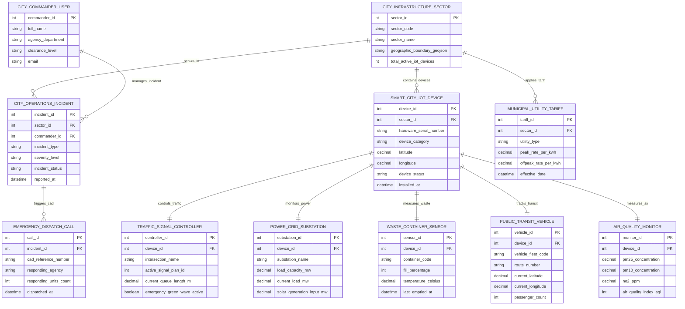

# Conceptual ERD — Integrated Smart City Management Platform

## Mermaid Code

## Entity Description Table | Bảng mô tả Entity

| # | Entity Name | Vietnamese Name | Description | Key Attributes | Main Relationships |
|---|-------------|-----------------|-------------|----------------|-------------------|
| 1 | CITY_COMMANDER_USER | Cán bộ Điều hành Thành phố | Municipal operations commander, city manager, or emergency coordinator user profile. | commander_id (PK), full_name, agency_department, clearance_level | Manages Incidents |
| 2 | CITY_INFRASTRUCTURE_SECTOR | Phân khu Hạ tầng Thành phố | Geographic urban district or sector boundary (Downtown, Industrial Park, Waterfront). | sector_id (PK), sector_code, sector_name, geographic_boundary_geojson | Contains Devices, occurs Incidents, applies Tariffs |
| 3 | SMART_CITY_IOT_DEVICE | Thiết bị IoT Thành phố | Physical IoT gateway or sensor node deployed across city infrastructure. | device_id (PK), sector_id (FK), hardware_serial_number, device_category, latitude, longitude | Contained in Sector, specializes into Traffic/Power/Waste/Transit/Air |
| 4 | CITY_OPERATIONS_INCIDENT | Sự cố Điều hành Thành phố | Urban operational incident record (Traffic Jam, Power Outage, Water Burst, Chemical Spill). | incident_id (PK), sector_id (FK), commander_id (FK), incident_type, severity_level | Occurs in Sector, managed by Commander, triggers CAD Calls |
| 5 | TRAFFIC_SIGNAL_CONTROLLER | Bộ Điều khiển Đèn Giao thông | Smart traffic signal controller managing intersection signal phases and green-wave overrides. | controller_id (PK), device_id (FK), intersection_name, active_signal_plan_id, current_queue_length_m | Specialized from Smart City IoT Device |
| 6 | POWER_GRID_SUBSTATION | Trạm Biến áp Lưới Điện | Electrical power substation monitoring grid load, solar input MW, and transformer status. | substation_id (PK), device_id (FK), substation_name, load_capacity_mw, current_load_mw | Specialized from Smart City IoT Device |
| 7 | WASTE_CONTAINER_SENSOR | Cảm biến Thùng Rác Thông minh | Ultrasonic sensor inside municipal trash container tracking fill level % and temperature. | sensor_id (PK), device_id (FK), container_code, fill_percentage, temperature_celsius | Specialized from Smart City IoT Device |
| 8 | PUBLIC_TRANSIT_VEHICLE | Xe Giao thông Công cộng | Municipal bus or light-rail vehicle tracking GPS coordinates, route number, and passenger counts. | vehicle_id (PK), device_id (FK), vehicle_fleet_code, route_number, current_latitude | Specialized from Smart City IoT Device |
| 9 | AIR_QUALITY_MONITOR | Cảm biến Chất lượng Không khí | Environmental sensor station measuring PM2.5, PM10, NO2, and computing Air Quality Index (AQI). | monitor_id (PK), device_id (FK), pm25_concentration, no2_ppm, air_quality_index_aqi | Specialized from Smart City IoT Device |
| 10 | EMERGENCY_DISPATCH_CALL | Cuộc gọi Điều động Khẩn cấp | Inter-agency emergency CAD dispatch record linking police/fire calls to city incidents. | call_id (PK), incident_id (FK), cad_reference_number, responding_agency, responding_units_count | Triggered by City Operations Incident |
| 11 | MUNICIPAL_UTILITY_TARIFF | Biểu giá Tiện ích Đô thị | Municipal tariff structure defining peak/off-peak power rates and water pricing for sectors. | tariff_id (PK), sector_id (FK), utility_type, peak_rate_per_kwh, offpeak_rate_per_kwh | Applied to City Infrastructure Sector |

## Relationship Description | Mô tả Quan hệ

| # | From Entity | Cardinality | To Entity | Relationship Label | Business Explanation |
|---|-------------|-------------|-----------|-------------------|----------------------|
| 1 | CITY_INFRASTRUCTURE_SECTOR | one-to-many | SMART_CITY_IOT_DEVICE | contains_devices | A City Infrastructure Sector contains multiple Smart City IoT Devices. |
| 2 | CITY_INFRASTRUCTURE_SECTOR | one-to-many | CITY_OPERATIONS_INCIDENT | occurs_in | A City Infrastructure Sector has multiple City Operations Incidents. |
| 3 | CITY_COMMANDER_USER | one-to-many | CITY_OPERATIONS_INCIDENT | manages_incident | A City Commander User manages multiple City Operations Incidents. |
| 4 | SMART_CITY_IOT_DEVICE | one-to-one | TRAFFIC_SIGNAL_CONTROLLER | controls_traffic | A Smart City IoT Device specializes as a Traffic Signal Controller. |
| 5 | SMART_CITY_IOT_DEVICE | one-to-one | POWER_GRID_SUBSTATION | monitors_power | A Smart City IoT Device specializes as a Power Grid Substation. |
| 6 | SMART_CITY_IOT_DEVICE | one-to-one | WASTE_CONTAINER_SENSOR | measures_waste | A Smart City IoT Device specializes as a Waste Container Sensor. |
| 7 | SMART_CITY_IOT_DEVICE | one-to-one | PUBLIC_TRANSIT_VEHICLE | tracks_transit | A Smart City IoT Device specializes as a Public Transit Vehicle. |
| 8 | SMART_CITY_IOT_DEVICE | one-to-one | AIR_QUALITY_MONITOR | measures_air | A Smart City IoT Device specializes as an Air Quality Monitor. |
| 9 | CITY_OPERATIONS_INCIDENT | one-to-many | EMERGENCY_DISPATCH_CALL | triggers_cad | A City Operations Incident triggers multiple Emergency Dispatch Calls. |
| 10 | CITY_INFRASTRUCTURE_SECTOR | one-to-many | MUNICIPAL_UTILITY_TARIFF | applies_tariff | A City Infrastructure Sector applies multiple Municipal Utility Tariffs. |
