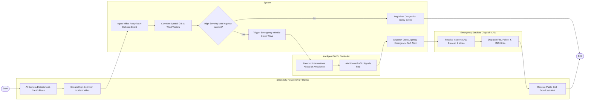

# Swimlane Diagram — Integrated Smart City Management Platform

## Mermaid Code

## Flow Description | Mô tả luồng

| Lane | Actor | Role in Flow |
|------|-------|-------------|
| 1 | Smart City Resident / IoT Device | Smart CCTV camera with AI computer vision detects a major multi-vehicle highway collision, streams high-definition video telemetry, and citizens receive public emergency cell broadcast alerts. |
| 2 | System | Ingests video analytics event, correlates 3D spatial GIS layers, validates incident severity threshold, triggers traffic signal emergency green wave, and dispatches cross-agency emergency CAD alert. |
| 3 | Intelligent Traffic Controller | Receives green-wave priority command, holds cross-traffic signals red, and clears green-light corridor for approaching fire trucks and ambulances. |
| 4 | Emergency Services Dispatch CAD | Receives cross-agency CAD payload and live video feeds, dispatches police/fire/EMS field units, and resolves the urban emergency incident. |
