# Action Tree — Integrated Smart City Management Platform

## Mermaid Code

```mermaid
graph TD
    Root["Integrated Smart City Management Platform"]

    Root --> M1["Multi-Domain IoT Sensor Ingestion & GIS"]
    Root --> M2["Adaptive Traffic & Public Mobility Management"]
    Root --> M3["Smart Power Grid & Energy Optimization"]
    Root --> M4["Smart Environmental & Waste Management"]
    Root --> M5["Emergency Inter-Agency CAD Command"]
    Root --> M6["Open Data API & Resident Services"]

    M1 --> A11["Ingest 100k Events/Sec MQTT & CoAP Telemetry Streams"]
    M1 --> A12["Render Real-Time 3D Digital Twin GIS City Layers"]
    M1 --> A13["Normalize Sensor Observation OGC SOS Formats"]
    M1 --> A14["Authenticate Smart City IoT Device Serial Numbers"]

    M2 --> A21["Optimize Adaptive Intersection Traffic Signal Splits"]
    M2 --> A22["Preempt Green-Wave Signals for Emergency Vehicles"]
    M2 --> A23["Stream Public Transit Live GPS Locations & ETAs"]
    M2 --> A24["Detect Traffic Collisions via CCTV Video Analytics"]

    M3 --> A31["Monitor Substation Electrical Loads & Solar PV MW"]
    M3 --> A32["Execute Automated Peak-Shaving Demand Response"]
    M3 --> A33["Control Smart LED Streetlight Dimming Schedules"]
    M3 --> A34["Manage Vehicle-to-Grid V2G Bus Battery Discharge"]

    M4 --> A41["Generate Dynamic Waste Collection Truck Routes"]
    M4 --> A42["Monitor Ultrasonic Smart Trash Bin Fill Levels"]
    M4 --> A43["Map Urban Air Quality Index AQI & PM2.5 Grids"]
    M4 --> A44["Detect Water Distribution Pipe Acoustic Leaks"]

    M5 --> A51["Coordinate Cross-Agency Police/Fire/EMS CAD Calls"]
    M5 --> A52["Stream Real-Time CCTV Video to Field CAD Consoles"]
    M5 --> A53["Dispatch Wireless Emergency Alert WEA Cell Broadcasts"]
    M5 --> A54["Model Chemical Spill Plume CFD Dispersion Grids"]

    M6 --> A61["Process Resident 311 Service Requests & Potholes"]
    M6 --> A62["Publish Municipal Open Data REST APIs & Shapefiles"]
    M6 --> A63["Calculate City Carbon Footprint & ESG Analytics"]
    M6 --> A64["Configure Automated Cross-Domain Event Rules"]
```

## Module Description | Mô tả Module

| # | Module | Description | Actions |
|---|--------|-------------|---------|
| 1 | Multi-Domain IoT Sensor Ingestion & GIS | Ingests high-frequency MQTT/CoAP streams, renders 3D Digital Twin GIS layers, normalizes OGC sensor formats, and verifies IoT hardware. | Ingest 100k Events/Sec MQTT & CoAP Telemetry Streams, Render Real-Time 3D Digital Twin GIS City Layers, Normalize Sensor Observation OGC SOS Formats, Authenticate Smart City IoT Device Serial Numbers |
| 2 | Adaptive Traffic & Public Mobility Management | Optimizes adaptive traffic signal splits, preempts green-wave signals for ambulances, streams transit ETAs, and detects crashes via AI CCTV. | Optimize Adaptive Intersection Traffic Signal Splits, Preempt Green-Wave Signals for Emergency Vehicles, Stream Public Transit Live GPS Locations & ETAs, Detect Traffic Collisions via CCTV Video Analytics |
| 3 | Smart Power Grid & Energy Optimization | Monitors substation electrical loads, executes peak-shaving demand response, dims LED streetlights, and manages V2G bus batteries. | Monitor Substation Electrical Loads & Solar PV MW, Execute Automated Peak-Shaving Demand Response, Control Smart LED Streetlight Dimming Schedules, Manage Vehicle-to-Grid V2G Bus Battery Discharge |
| 4 | Smart Environmental & Waste Management | Generates dynamic garbage truck collection routes, monitors ultrasonic bin fill levels, maps AQI heatmaps, and detects water main leaks. | Generate Dynamic Waste Collection Truck Routes, Monitor Ultrasonic Smart Trash Bin Fill Levels, Map Urban Air Quality Index AQI & PM2.5 Grids, Detect Water Distribution Pipe Acoustic Leaks |
| 5 | Emergency Inter-Agency CAD Command | Coordinates Police/Fire/EMS CAD dispatch, streams CCTV video, dispatches cell broadcast WEA alerts, and models chemical plume dispersion. | Coordinate Cross-Agency Police/Fire/EMS CAD Calls, Stream Real-Time CCTV Video to Field CAD Consoles, Dispatch Wireless Emergency Alert WEA Cell Broadcasts, Model Chemical Spill Plume CFD Dispersion Grids |
| 6 | Open Data API & Resident Services | Processes citizen 311 pothole requests, publishes open data APIs/shapefiles, calculates city carbon footprints, and configures cross-domain rules. | Process Resident 311 Service Requests & Potholes, Publish Municipal Open Data REST APIs & Shapefiles, Calculate City Carbon Footprint & ESG Analytics, Configure Automated Cross-Domain Event Rules |
