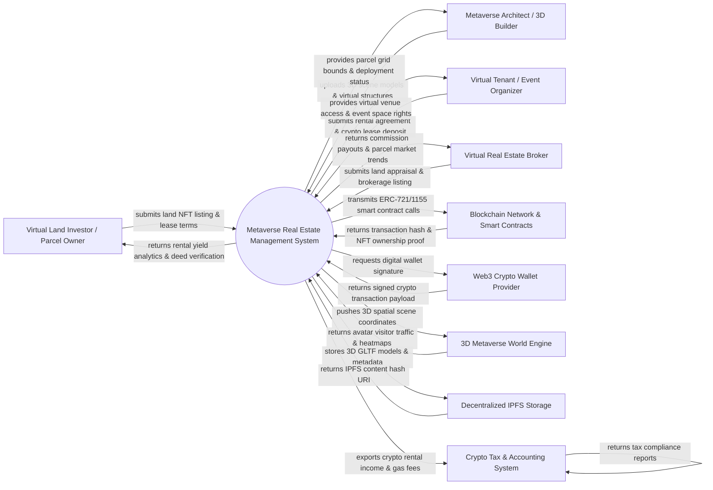

# Context Diagram — Metaverse Real Estate Management System

## Mermaid Code

## Actor & Interaction Table | Bảng Actor & Tương tác

| # | Actor | Actor Type | Data Sent TO System | Data Received FROM System | Notes |
|---|-------|------------|---------------------|---------------------------|-------|
| 1 | Virtual Land Investor / Parcel Owner | Primary | Land parcel NFT tokens, desired lease prices, rental terms, parcel sales listings, payout wallet addresses | Rental yield dashboards, tenant lease status, verified land deeds, property valuation metrics | Individuals or Web3 funds owning digital land parcels in virtual worlds (e.g. Decentraland, Sandbox). |
| 2 | Metaverse Architect / 3D Builder | Primary | 3D structure models (.gltf / .fbx), virtual building layouts, scene interactive scripts, texture assets | Land parcel coordinate grids, height/building restrictions, 3D scene deployment logs | Digital architects and 3D designers building virtual stores, galleries, and event spaces on land. |
| 3 | Virtual Tenant / Event Organizer | Primary | Lease applications, crypto security deposits, virtual event booking schedules, venue customization options | Temporary land build permissions, virtual space access tokens, event hosting rights | Brands, creators, or event organizers renting virtual land for pop-up shops, concerts, or meetups. |
| 4 | Virtual Real Estate Broker | Primary | Land valuation appraisals, comparative market analyses (CMA), exclusive listing agreements | Brokerage commission payouts, active land inventory feeds, parcel traffic heatmaps | Licensed Web3 brokers facilitating high-value virtual land sales, acquisitions, and leases. |
| 5 | Blockchain Network & Smart Contracts | Supporting System | On-chain transaction receipts, ERC-721/ERC-1155 NFT ownership proofs, token transfer events | Smart contract deployment bytecode, escrow lock calls, rental yield distribution payloads | Decentralized blockchains (Ethereum, Polygon, Solana) executing immutable land deeds and leases. |
| 6 | Web3 Crypto Wallet Provider | Supporting System | Signed cryptographic transactions, wallet public keys (0x addresses), authentication tokens | Unsigned transaction hex payloads, Web3 login challenges, network gas fee estimates | Non-custodial crypto wallet protocols (e.g. MetaMask, WalletConnect) managing user keys. |
| 7 | 3D Metaverse World Engine | Supporting System | Real-time avatar visit counts, dwell time heatmaps, spatial rendering telemetry, avatar interactions | Parcel boundary coordinate files, active 3D scene assets, land permissions lists | Virtual world engines (Decentraland, Sandbox, Somnium Space, Spatial) rendering virtual land. |
| 8 | Decentralized IPFS Storage | Supporting System | IPFS content hash URIs (ipfs://...), pinned file confirmations, retrieval data streams | 3D GLTF model files, parcel metadata JSON schemas, high-res texture assets | Decentralized file storage network (IPFS / Filecoin) hosting immutable 3D virtual assets. |
| 9 | Crypto Tax & Accounting System | Supporting System | Capital gains tax reports, crypto cost-basis ledgers, tax compliance receipts | Rental income ledgers (ETH/USDC), gas fee expense logs, token exchange rate history | Web3 financial accounting tools (e.g. CoinTracker, Cryptio) tracking crypto real estate tax events. |

## System Boundary Description | Mô tả Phạm vi Hệ thống

The **Metaverse Real Estate Management System (MREMS)** is a Web3-native software platform engineered to tokenize, manage, lease, and analyze virtual land parcels across decentralized 3D metaverses. Inside the system boundary, MREMS manages virtual land NFT inventories, spatial coordinate mapping, 3D structure deployment workflows, automated smart contract leasing, rental yield distribution, virtual tenant management, and avatar visitor traffic analytics. External to the system boundary are Layer-1/2 blockchains (Blockchain Network), crypto wallet signature tools (Web3 Wallet Provider), 3D game client engines (Metaverse World Engine), decentralized file stores (IPFS Storage), and crypto tax calculation platforms (Crypto Tax & Accounting System).
