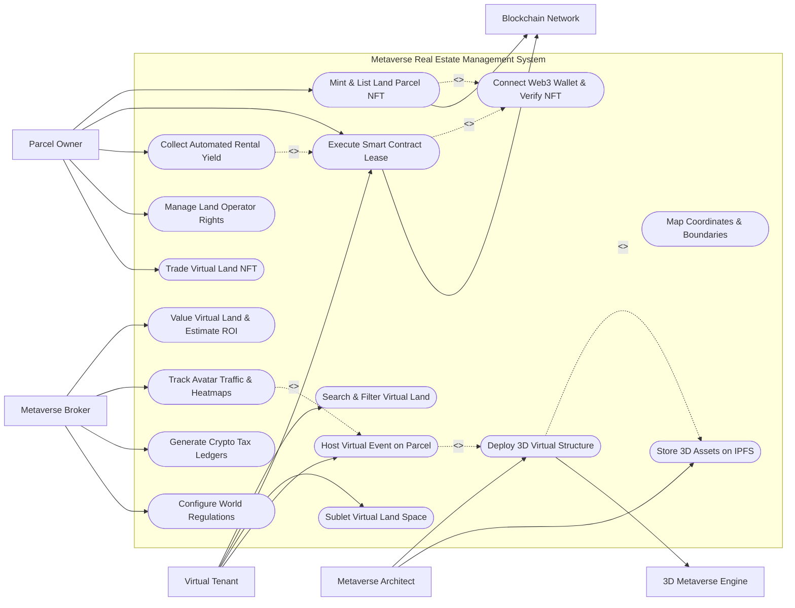

# Use Case Diagram — Metaverse Real Estate Management System

## Mermaid Code

## Actor Table | Bảng Actor

| # | Actor | Actor Type | Role Description | Related Use Cases |
|---|-------|------------|------------------|-------------------|
| 1 | Parcel Owner | Primary | Virtual land investor holding parcel NFT deeds, listing land for rent/sale, and collecting yield. | UC01, UC05, UC11, UC13, UC14 |
| 2 | Metaverse Architect | Primary | 3D designer building virtual stores, galleries, and structures deployed onto land parcels. | UC08, UC09 |
| 3 | Virtual Tenant | Primary | Brand, creator, or event organizer renting virtual land for commercial or social events. | UC03, UC05, UC07, UC10 |
| 4 | Metaverse Broker | Primary | Web3 real estate agent conducting land appraisals, traffic analysis, and configuring world rules. | UC04, UC12, UC15, UC16 |
| 5 | Blockchain Network | System | Layer-1/2 blockchain executing NFT minting, smart contract escrow, and token transfers. | UC01, UC05 |
| 6 | 3D Metaverse Engine | System | Virtual world client rendering 3D spatial buildings and tracking avatar foot traffic telemetry. | UC08 |

## Use Case Table | Bảng Use Case

| # | UC ID | Use Case Name | Primary Actor | Secondary Actor | Description | Priority |
|---|-------|---------------|---------------|-----------------|-------------|----------|
| 1 | UC01 | Mint & List Land Parcel NFT | Parcel Owner | Blockchain Network | Tokenizes virtual land coordinates into an ERC-721 NFT deed and lists parcel on marketplace. | High |
| 2 | UC02 | Map Coordinates & Boundaries | Metaverse Broker | None | Defines (X,Y) grid coordinates, parcel square meters, district location, and neighbor adjacencies. | High |
| 3 | UC03 | Search & Filter Virtual Land | Virtual Tenant | None | Searches available virtual parcels by world name, district, foot traffic rank, and lease price. | High |
| 4 | UC04 | Value Virtual Land & Estimate ROI | Metaverse Broker | None | Conducts automated valuation model (AVM) analysis based on floor prices, location, and traffic. | Medium |
| 5 | UC05 | Execute Smart Contract Lease | Parcel Owner | Blockchain Network | Locks NFT deed into smart contract escrow, establishing automated monthly crypto rent terms. | High |
| 6 | UC06 | Connect Web3 Wallet & Verify NFT | Parcel Owner | None | Authenticates user via Web3 wallet signature (MetaMask) and verifies NFT ownership on-chain. | High |
| 7 | UC07 | Sublet Virtual Land Space | Virtual Tenant | None | Allows primary tenant to sublease portions of virtual structure (e.g., billboard, shop booth) to third parties. | Medium |
| 8 | UC08 | Deploy 3D Virtual Structure | Metaverse Architect | 3D Metaverse Engine | Uploads GLTF 3D scene model, attaches interactive scripts, and deploys building onto land parcel. | High |
| 9 | UC09 | Store 3D Assets on IPFS | Metaverse Architect | None | Uploads heavy 3D GLTF models and textures to IPFS decentralized storage and pins content hashes. | Medium |
| 10 | UC10 | Host Virtual Event on Parcel | Virtual Tenant | None | Configures virtual concert, product launch, or exhibition space on leased land with avatar access controls. | High |
| 11 | UC11 | Collect Automated Rental Yield | Parcel Owner | Blockchain Network | Automatically dispatches monthly crypto rental payments (ETH/USDC) from smart contract to owner wallet. | High |
| 12 | UC12 | Track Avatar Traffic & Heatmaps | Metaverse Broker | None | Generates real-time 3D spatial heatmaps tracking avatar visitor counts, peak times, and dwell duration. | Medium |
| 13 | UC13 | Manage Land Operator Rights | Parcel Owner | None | Assigns temporary "Operator" wallet permissions allowing architects to build without transferring NFT deed. | High |
| 14 | UC14 | Trade Virtual Land NFT | Parcel Owner | Blockchain Network | Sells or swaps virtual land NFT on decentralized real estate marketplace. | Medium |
| 15 | UC15 | Generate Crypto Tax Ledgers | Metaverse Broker | None | Exports historical transaction logs, rental yield income in USD, gas fee expenses, and cost-basis ledgers. | Medium |
| 16 | UC16 | Configure World Regulations | Metaverse Broker | None | Sets maximum building height limits, polygon counts, audio volume boundaries, and zoning rules. | Low |

## Use Case Specification | Đặc tả Use Case

---

### UC01 — Mint & List Land Parcel NFT

| Field | Detail |
|-------|--------|
| **UC ID** | UC01 |
| **Use Case Name** | Mint & List Land Parcel NFT |
| **Actor(s)** | Primary: Parcel Owner / Secondary: Blockchain Network |
| **Description** | Tokenizes virtual land spatial coordinates into an ERC-721/1155 Non-Fungible Token (NFT) deed, verifies smart contract metadata, and lists parcel for lease or sale. |
| **Precondition** | 1. Owner's Web3 wallet is connected (UC06).   2. Virtual world grid coordinates (X, Y) are verified and un-minted. |
| **Main Flow** | 1. Actor selects "Mint New Land Parcel NFT".   2. System displays minting form requesting Metaverse World (e.g. Decentraland, Sandbox), District, Grid Coordinates (e.g. X: -42, Y: 118), and Parcel Size (e.g. 16m x 16m).   3. Actor attaches metadata description, preview thumbnail, and initial listing price (in ETH/SOL or native world tokens).   4. System prepares minting smart contract transaction payload and requests wallet signature via UC06.   5. Actor approves transaction and gas fee in Web3 wallet.   6. System transmits transaction to Blockchain Network and monitors block confirmation.   7. Blockchain Network returns transaction hash and minted Token ID; System stores Land_Parcel_NFT entity and sets status to "Listed on Marketplace". |
| **Alternative Flow** | **AF1** — Bulk Parcel Estate Minting: Actor selects multiple adjacent parcels to mint as an "Estate" NFT bundle; System executes batch minting contract call.   **AF2** — Pre-Minted NFT Import: Actor imports existing land NFT from wallet; System verifies on-chain ownership via Etherscan API. |
| **Exception Flow** | **EX1** — Gas Price Spike Alert: If gas fee exceeds user threshold limit, System prompts "Gas fees high (>50 Gwei). Proceed or defer minting?"   **EX2** — Coordinates Already Minted: If target grid coordinates are already tokenized on-chain, System blocks minting with error "Parcel coordinates already minted." |
| **Postcondition** | An ERC-721 Land_Parcel_NFT is minted on-chain, linked to the owner's wallet, and published on the virtual real estate catalog. |
| **Business Rule** | **BR1**: All land NFT metadata JSON schemas must be pinned to IPFS (UC09) to ensure permanent decentralized provenance. |

---

### UC03 — Search & Filter Virtual Land Parcels

| Field | Detail |
|-------|--------|
| **UC ID** | UC03 |
| **Use Case Name** | Search & Filter Virtual Land Parcels |
| **Actor(s)** | Primary: Virtual Tenant / Secondary: None |
| **Description** | Allows prospective tenants or buyers to search virtual land listings across multiple metaverses, filter by district, price range, foot traffic, and view interactive 3D map previews. |
| **Precondition** | 1. Land parcel listings are active on the marketplace index.   2. 3D spatial map engine is online. |
| **Main Flow** | 1. Actor accesses Metaverse Real Estate Marketplace.   2. System displays interactive 2D/3D metaverse grid map with color-coded parcel availability.   3. Actor applies search filters: Metaverse World (Decentraland, Sandbox), Listing Type (For Lease vs For Sale), District (Fashion District, Gaming Hub, Financial Plaza), Lease Price Range (ETH/month), and Min Avatar Foot Traffic score.   4. System queries parcel database and highlights matching grid coordinates on the map.   5. Actor selects a specific parcel pin (e.g. Parcel -12, 88).   6. System displays detailed parcel dossier: Owner Wallet Address, Parcel Size, Neighboring Landmark proximity, Avatar Traffic Heatmap (UC12), 3D Structure Preview (UC08), and Lease Terms.   7. Actor clicks "Lease Land Parcel" to initiate UC05. |
| **Alternative Flow** | **AF1** — Compare Parcels: Tenant selects 3 parcels; System displays side-by-side comparison table of price, traffic, height limits, and historical ROI.   **AF2** — Virtual World Teleport Preview: Tenant clicks "Teleport In-World"; System launches metaverse 3D client directly at parcel coordinates. |
| **Exception Flow** | **EX1** — Parcel Currently Leased: If parcel is under active lease, System displays badge "Leased until [Expiry Date]" and allows tenant to request notification when available.   **EX2** — No Parcels Match Filters: If search criteria yields no results, System suggests adjusting price filters or exploring adjacent districts. |
| **Postcondition** | Tenant identifies optimal virtual land parcel and initiates smart contract lease negotiations. |
| **Business Rule** | **BR1**: Foot traffic scores must be updated daily based on verifiable 3D engine avatar telemetry data to prevent traffic spoofing. |

---

### UC05 — Execute Smart Contract Land Lease

| Field | Detail |
|-------|--------|
| **UC ID** | UC05 |
| **Use Case Name** | Execute Smart Contract Land Lease |
| **Actor(s)** | Primary: Parcel Owner / Secondary: Blockchain Network |
| **Description** | Locks land NFT deed into a non-custodial leasing smart contract, sets monthly crypto rent terms, collects security deposit from tenant, and grants temporary building access. |
| **Precondition** | 1. Parcel Owner and Virtual Tenant have agreed on lease terms (monthly rent, duration, collateral deposit).   2. Tenant's Web3 wallet contains sufficient crypto balance (ETH/USDC). |
| **Main Flow** | 1. Actor (Land Owner) selects "Create Lease Agreement" for target parcel NFT.   2. System populates lease terms: Monthly Rent Amount (e.g. 1.5 ETH/month), Lease Duration (e.g. 6 Months), Security Deposit (e.g. 0.5 ETH), and Allowed Usage (Commercial Store, Event Space).   3. System deploys a Lease Smart Contract escrow instance on the Blockchain Network.   4. Actor approves transferring land NFT operator rights to the Lease Contract.   5. Tenant opens pending lease agreement, reviews smart contract code verification, and clicks "Sign & Fund Lease".   6. Tenant approves initial month's rent + security deposit in Web3 wallet (UC06).   7. Blockchain Network executes contract transaction, locks funds in escrow, grants Tenant "Operator" build rights on parcel, and sets parcel status to "Actively Leased". |
| **Alternative Flow** | **AF1** — Automated Renewal Option: Lease contract includes auto-renew clause; System automatically deducts monthly rent from tenant wallet if authorized.   **AF2** — Early Lease Termination: Tenant or Owner requests early termination; Smart contract calculates penalty fees and releases remaining collateral deposit according to code logic. |
| **Exception Flow** | **EX1** — Tenant Wallet Insufficient Funds: If tenant wallet lacks required crypto balance + gas fees, System halts execution with error "Insufficient ETH balance for initial rent + deposit."   **EX2** — Smart Contract Reversion: If blockchain transaction reverts due to gas limit or state conflict, System alerts "Transaction reverted on-chain. Retry lease setup." |
| **Postcondition** | A binding Lease_Smart_Contract is deployed on-chain, securing rental income for the owner and granting building rights to the tenant without transferring NFT deed ownership. |
| **Business Rule** | **BR1**: Smart contract lease code must be audited and verified on Etherscan/BscScan to protect both owner NFT collateral and tenant deposits. |

---

### UC08 — Deploy 3D Virtual Structure Asset

| Field | Detail |
|-------|--------|
| **UC ID** | UC08 |
| **Use Case Name** | Deploy 3D Virtual Structure Asset |
| **Actor(s)** | Primary: Metaverse Architect / Secondary: 3D Metaverse Engine |
| **Description** | Uploads a 3D architectural model file (.gltf / .glb), verifies scene polygon and height constraints, pins files to IPFS (UC09), and deploys the building onto the virtual land parcel. |
| **Precondition** | 1. User holds active Operator or Owner permissions for the target land parcel (UC05/UC13).   2. 3D scene model file is prepared according to metaverse world SDK guidelines. |
| **Main Flow** | 1. Actor selects "Deploy 3D Structure" and selects target parcel coordinates.   2. System opens 3D Scene Deployment Workspace and prompts for model file upload (.gltf / .glb format).   3. Actor uploads 3D structure file, textures, and interactive TypeScript/JS event scripts.   4. System analyzes 3D file: checks polygon count (e.g. Max 10,000 tris), texture memory size (e.g. Max 20MB), materials count, and building height limits against world rules (UC16).   5. System uploads 3D model files to IPFS (UC09) and receives IPFS content URI (ipfs://Qm...).   6. Actor clicks "Deploy to World".   7. System transmits deployment scene JSON containing IPFS URI to the 3D Metaverse Engine API, updating the live 3D world render at the parcel coordinates. |
| **Alternative Flow** | **AF1** — Pre-Built Architecture Template: Architect selects a pre-built 3D template (e.g. Art Gallery, Retail Store, Convention Hall) from system library; System deploys template instantly.   **AF2** — Real-Time Scene Update: Architect modifies interactive script (e.g., changes video screen URL in virtual store); System hot-reloads scene without downtime. |
| **Exception Flow** | **EX1** — Polygon Limit Exceeded: If 3D model exceeds maximum allowed triangles for the parcel size, System blocks deployment with error "Polygon limit exceeded: 18,500 / 10,000 max. Optimize 3D mesh."   **EX2** — Out-of-Bounds Mesh Extrusion: If building model extends beyond parcel grid boundary, System alerts "Structure extends 1.2m outside parcel boundary." |
| **Postcondition** | Structure_Asset_3D entity is deployed, live rendering the 3D building on the metaverse world map. |
| **Business Rule** | **BR1**: 3D assets must pass automated malware and malicious script scanning prior to IPFS pinning and engine deployment. |

---

### UC11 — Collect Automated Rental Yield

| Field | Detail |
|-------|--------|
| **UC ID** | UC11 |
| **Use Case Name** | Collect Automated Rental Yield |
| **Actor(s)** | Primary: Parcel Owner / Secondary: Blockchain Network |
| **Description** | Processes scheduled monthly crypto rent payouts from the active lease smart contract escrow directly into the land owner's Web3 crypto wallet. |
| **Precondition** | 1. Active Lease Smart Contract (UC05) is deployed and generating rental income.   2. Monthly rent due date has arrived or automated yield trigger executed. |
| **Main Flow** | 1. System cron task monitors active Lease Smart Contracts for due rent payments.   2. Smart contract executes automated rent pull from tenant escrow balance.   3. Smart contract splits payment according to programmed logic: Owner Net Yield (e.g. 95%), Platform Fee (e.g. 3%), and Brokerage Commission (e.g. 2%).   4. Blockchain Network executes multi-output token transfer (in ETH, USDC, or MANA/SAND tokens).   5. System records Rental_Transaction entity and logs block transaction hash.   6. System updates owner's cumulative yield balance dashboard and dispatches email/push payout notification to Parcel Owner.   7. System exports transaction data to Crypto Tax & Accounting module (UC15). |
| **Alternative Flow** | **AF1** — Manual Yield Claim: Owner opens dashboard and clicks "Claim Accumulated Yield"; Smart contract pushes uncollected rent to owner's wallet on-demand.   **AF2** — Auto-Conversion to Fiat/Stablecoin: System triggers DEX swap (e.g. Uniswap) converting volatile crypto rent into USDC stablecoin upon collection. |
| **Exception Flow** | **EX1** — Escrow Payment Default: If tenant escrow balance is insufficient on due date, Smart contract alerts "Lease Default Notice: Rent payment failed", issues 48-hour cure notice, and locks tenant building access.   **EX2** — Gas Fee Exceeds Payout: If transaction gas fee exceeds 10% of yield value, System defers payout execution until gas fees normalize. |
| **Postcondition** | Rental_Transaction is posted, transferring crypto yield to owner's wallet and updating financial ledgers. |
| **Business Rule** | **BR1**: Smart contract yield distributions must execute non-custodially directly to owner wallet addresses without platform custody holding. |
