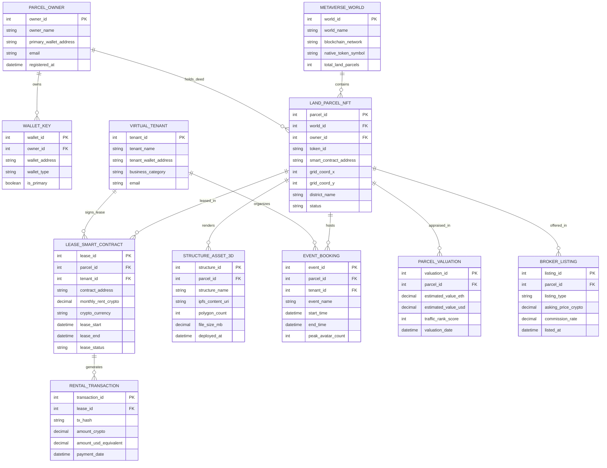

# Conceptual ERD — Metaverse Real Estate Management System

## Mermaid Code

## Entity Description Table | Bảng mô tả Entity

| # | Entity Name | Vietnamese Name | Description | Key Attributes | Main Relationships |
|---|-------------|-----------------|-------------|----------------|-------------------|
| 1 | METAVERSE_WORLD | Thế giới Metaverse | Represents a 3D virtual world ecosystem (Decentraland, Sandbox, Somnium Space). | world_id (PK), world_name, blockchain_network, native_token_symbol | Contains Land Parcel NFTs |
| 2 | PARCEL_OWNER | Chủ sở hữu Bất động sản | Virtual land investor or Web3 fund holding land parcel NFT deeds. | owner_id (PK), owner_name, primary_wallet_address, email | Owns Wallet Keys, holds deed for Land Parcel NFTs |
| 3 | WALLET_KEY | Ví Crypto Web3 | Non-custodial Web3 crypto wallet address (0x...) associated with a parcel owner. | wallet_id (PK), owner_id (FK), wallet_address, wallet_type | Belongs to Parcel Owner |
| 4 | LAND_PARCEL_NFT | NFT Đất Virtual | Tokenized virtual land parcel NFT (ERC-721/1155) with spatial grid coordinates. | parcel_id (PK), world_id (FK), owner_id (FK), token_id, grid_coord_x, grid_coord_y, status | Belongs to World & Owner, leased in Smart Contracts, renders 3D Structures, appraised in Valuations |
| 5 | VIRTUAL_TENANT | Thẻ Người Thuê Virtual | Brand, creator, or company renting virtual land to host 3D venues or events. | tenant_id (PK), tenant_name, tenant_wallet_address, business_category | Signs Lease Contracts, organizes Event Bookings |
| 6 | LEASE_SMART_CONTRACT | Hợp đồng Thông minh Thuê | On-chain smart contract locking land NFT escrow and enforcing monthly crypto rent. | lease_id (PK), parcel_id (FK), tenant_id (FK), contract_address, monthly_rent_crypto, lease_status | Leases Land Parcel NFT, signed by Virtual Tenant, generates Rental Transactions |
| 7 | STRUCTURE_ASSET_3D | Công trình 3D Virtual | Deployed 3D architectural model file (.gltf) rendered on a virtual land parcel. | structure_id (PK), parcel_id (FK), structure_name, ipfs_content_uri, polygon_count | Renders on Land Parcel NFT |
| 8 | RENTAL_TRANSACTION | Giao dịch Tiền thuê Crypto | On-chain monthly rental payment execution, tracking transaction hash and crypto amount. | transaction_id (PK), lease_id (FK), tx_hash, amount_crypto, amount_usd_equivalent | Generated by Lease Smart Contract |
| 9 | EVENT_BOOKING | Sự kiện Virtual | Concert, exhibition, or brand product launch hosted on a virtual land parcel. | event_id (PK), parcel_id (FK), tenant_id (FK), event_name, start_time, peak_avatar_count | Hosted on Land Parcel NFT, organized by Virtual Tenant |
| 10 | PARCEL_VALUATION | Định giá Đất Virtual | Automated market valuation appraisal based on floor prices, location, and avatar traffic. | valuation_id (PK), parcel_id (FK), estimated_value_eth, estimated_value_usd, traffic_rank_score | Appraises Land Parcel NFT |
| 11 | BROKER_LISTING | Niêm yết Môi giới | Marketplace sales or lease listing managed by virtual real estate brokers. | listing_id (PK), parcel_id (FK), listing_type, asking_price_crypto, commission_rate | Offers Land Parcel NFT |

## Relationship Description | Mô tả Quan hệ

| # | From Entity | Cardinality | To Entity | Relationship Label | Business Explanation |
|---|-------------|-------------|-----------|-------------------|----------------------|
| 1 | METAVERSE_WORLD | one-to-many | LAND_PARCEL_NFT | contains | A Metaverse World contains multiple Land Parcel NFTs. |
| 2 | PARCEL_OWNER | one-to-many | WALLET_KEY | owns | A Parcel Owner owns one or multiple Web3 Wallet Keys. |
| 3 | PARCEL_OWNER | one-to-many | LAND_PARCEL_NFT | holds_deed | A Parcel Owner holds deeds for multiple Land Parcel NFTs. |
| 4 | LAND_PARCEL_NFT | one-to-many | LEASE_SMART_CONTRACT | leased_in | A Land Parcel NFT can be leased in multiple Lease Smart Contracts over time. |
| 5 | VIRTUAL_TENANT | one-to-many | LEASE_SMART_CONTRACT | signs_lease | A Virtual Tenant signs multiple Lease Smart Contracts. |
| 6 | LAND_PARCEL_NFT | one-to-many | STRUCTURE_ASSET_3D | renders | A Land Parcel NFT renders one active or historical 3D Structure Assets. |
| 7 | LEASE_SMART_CONTRACT | one-to-many | RENTAL_TRANSACTION | generates | A Lease Smart Contract generates monthly crypto Rental Transactions. |
| 8 | LAND_PARCEL_NFT | one-to-many | EVENT_BOOKING | hosts | A Land Parcel NFT hosts multiple Virtual Event Bookings over time. |
| 9 | VIRTUAL_TENANT | one-to-many | EVENT_BOOKING | organizes | A Virtual Tenant organizes multiple Event Bookings. |
| 10 | LAND_PARCEL_NFT | one-to-many | PARCEL_VALUATION | appraised_in | A Land Parcel NFT is appraised across multiple historical Parcel Valuations. |
| 11 | LAND_PARCEL_NFT | one-to-many | BROKER_LISTING | offered_in | A Land Parcel NFT is offered in multiple Broker Listings over time. |
