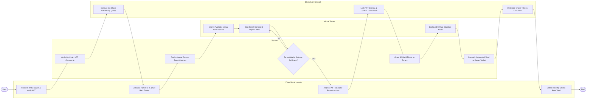

# Swimlane Diagram — Metaverse Real Estate Management System

## Mermaid Code

## Flow Description | Mô tả luồng

| Lane | Actor | Role in Flow |
|------|-------|-------------|
| 1 | Virtual Land Investor | Connects Web3 crypto wallet, verifies land NFT deeds, configures lease pricing terms, approves escrow permissions, and collects rental yield. |
| 2 | System | Automates on-chain NFT ownership checks, deploys escrow smart contracts, checks tenant crypto balances, grants 3D build permissions, and triggers yield payouts. |
| 3 | Virtual Tenant | Searches virtual land listings, signs smart contract lease agreements, funds crypto deposits, and deploys 3D architectural building models. |
| 4 | Blockchain Network | Verifies ERC-721/1155 NFT deeds, locks smart contract escrows on-chain, and executes immutable token transfers (ETH/USDC). |
