# Action Tree — Metaverse Real Estate Management System

## Mermaid Code

```mermaid
graph TD
    Root["Metaverse Real Estate Management System"]

    Root --> M1["Parcel Minting & NFT Inventory"]
    Root --> M2["Virtual Land Marketplace"]
    Root --> M3["Smart Contract Leasing & Subletting"]
    Root --> M4["3D Asset & Scene Deployment"]
    Root --> M5["Metaverse Event & Traffic Analytics"]
    Root --> M6["Web3 Financial & Valuation Accounting"]

    M1 --> A11["Mint ERC-721 Land Parcel NFT"]
    M1 --> A12["Verify Web3 Wallet Signature"]
    M1 --> A13["Map X,Y Grid Coordinates"]
    M1 --> A14["Group Parcels into Estate Bundles"]

    M2 --> A21["Browse Interactive 3D World Map"]
    M2 --> A22["Filter Parcels by Price & District"]
    M2 --> A23["Trade Land NFTs on Marketplace"]
    M2 --> A24["Teleport Avatar for In-World Preview"]

    M3 --> A31["Deploy Lease Escrow Smart Contract"]
    M3 --> A32["Fund Crypto Deposit & Rent"]
    M3 --> A33["Sublet Virtual Store & Booth Space"]
    M3 --> A34["Assign Operator Build Permissions"]

    M4 --> A41["Upload 3D GLTF Building Assets"]
    M4 --> A42["Pin 3D Models to IPFS Storage"]
    M4 --> A43["Validate Polygon & Height Limits"]
    M4 --> A44["Attach Interactive Event Scripts"]

    M5 --> A51["Track Real-Time Avatar Foot Traffic"]
    M5 --> A52["Generate Dwell Time Heatmaps"]
    M5 --> A53["Manage Virtual Event RSVPs"]
    M5 --> A54["Export Visitor Demographic Metrics"]

    M6 --> A61["Collect Automated Crypto Rental Yield"]
    M6 --> A62["Calculate Automated AVM Land Valuation"]
    M6 --> A63["Export Crypto Capital Gains Tax Ledgers"]
    M6 --> A64["Track Gas Fees & Cost Basis"]
```

## Module Description | Mô tả Module

| # | Module | Description | Actions |
|---|--------|-------------|---------|
| 1 | Parcel Minting & NFT Inventory | Controls ERC-721/1155 tokenization of virtual land coordinates, Web3 wallet verification, grid mapping, and estate bundling. | Mint ERC-721 Land Parcel NFT, Verify Web3 Wallet Signature, Map X,Y Grid Coordinates, Group Parcels into Estate Bundles |
| 2 | Virtual Land Marketplace | Facilitates interactive 3D map browsing, multi-criteria parcel filtering, decentralized real estate trading, and in-world teleport previews. | Browse Interactive 3D World Map, Filter Parcels by Price & District, Trade Land NFTs on Marketplace, Teleport Avatar for In-World Preview |
| 3 | Smart Contract Leasing & Subletting | Deploys on-chain escrow contracts, automates monthly crypto rent deposits, manages commercial subleasing, and sets operator build rights. | Deploy Lease Escrow Smart Contract, Fund Crypto Deposit & Rent, Sublet Virtual Store & Booth Space, Assign Operator Build Permissions |
| 4 | 3D Asset & Scene Deployment | Manages GLTF 3D architectural model uploads, IPFS decentralized file pinning, polygon constraint validation, and interactive scene scripting. | Upload 3D GLTF Building Assets, Pin 3D Models to IPFS Storage, Validate Polygon & Height Limits, Attach Interactive Event Scripts |
| 5 | Metaverse Event & Traffic Analytics | Captures real-time avatar visit telemetry, renders 3D spatial heatmaps, manages virtual event registrations, and exports visitor analytics. | Track Real-Time Avatar Foot Traffic, Generate Dwell Time Heatmaps, Manage Virtual Event RSVPs, Export Visitor Demographic Metrics |
| 6 | Web3 Financial & Valuation Accounting | Automates non-custodial crypto rental yield collections, automated valuation models (AVM), crypto tax ledger exports, and gas fee accounting. | Collect Automated Crypto Rental Yield, Calculate Automated AVM Land Valuation, Export Crypto Capital Gains Tax Ledgers, Track Gas Fees & Cost Basis |
