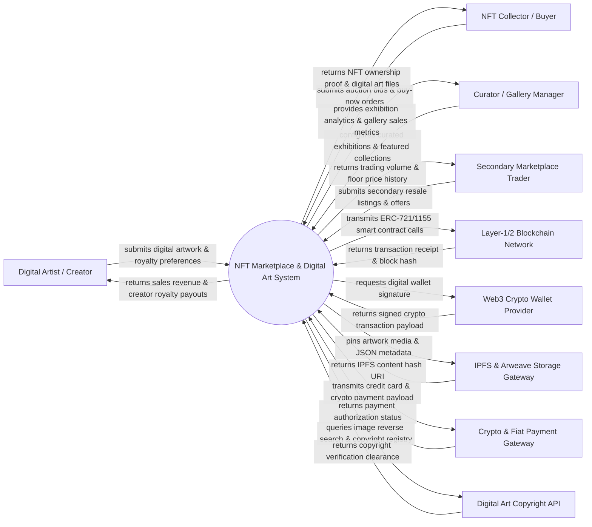

# Context Diagram — NFT Marketplace & Digital Art System

## Mermaid Code

## Actor & Interaction Table | Bảng Actor & Tương tác

| # | Actor | Actor Type | Data Sent TO System | Data Received FROM System | Notes |
|---|-------|------------|---------------------|---------------------------|-------|
| 1 | Digital Artist / Creator | Primary | Digital artwork files (PNG, GIF, MP4, 3D), collection metadata, minting parameters, perpetual royalty percentage (EIP-2981), payout wallet address | Primary minting confirmations, primary sales revenue, perpetual royalty payouts, collector follower stats | Digital artists, animators, 3D sculptors, and generative code artists creating and selling NFT art. |
| 2 | NFT Collector / Buyer | Primary | Auction bids, fixed-price buy orders, offer bids, shipping details for physical redemption, favorite tags | NFT token transfer confirmation, high-res digital art download links, auction outbid alerts, collection provenance | Art collectors and crypto investors purchasing primary or secondary digital artworks. |
| 3 | Curator / Gallery Manager | Primary | Featured gallery themes, curated collection selections, exhibition dates, artist spotlight submissions | Exhibition sales metrics, visitor impression analytics, gallery commission shares | Art gallery directors and Web3 curators organizing featured exhibitions and drops. |
| 4 | Secondary Marketplace Trader | Primary | Secondary resale listings, floor price bids, portfolio collection swaps, offer cancellations | Real-time floor prices, collection trading volume, sales history graphs, royalty enforcement tags | Traders engaging in secondary market buying, selling, and arbitrage of existing NFTs. |
| 5 | Layer-1/2 Blockchain Network | Supporting System | Block confirmation hashes, smart contract state updates, ERC-721/1155 token transfer events | Smart contract deployment bytecode, minting function calls, EIP-2981 royalty payout transfers | Decentralized blockchain networks (Ethereum, Polygon, Solana, Tezos) settling NFT transactions. |
| 6 | Web3 Crypto Wallet Provider | Supporting System | Signed transaction hex strings, Web3 wallet addresses (0x...), cryptographic signature proofs | Unsigned transaction payloads, network gas fee estimates, Web3 login challenge nonces | Non-custodial crypto wallet apps (e.g. MetaMask, Phantom, Coinbase Wallet) managing keys. |
| 7 | IPFS & Arweave Storage Gateway | Supporting System | IPFS content hash URIs (ipfs://...), Arweave transaction IDs, pinned file status | High-resolution art media streams, JSON metadata schemas, permanent storage proofs | Decentralized file storage networks (IPFS, Pinata, Arweave) providing permanent asset storage. |
| 8 | Crypto & Fiat Payment Gateway | Supporting System | Credit card authorization codes, Apple Pay tokens, fiat-to-crypto settlement statuses | Credit card charge payloads, fiat payout instructions, currency conversion rates | Payment processors (e.g. MoonPay, Stripe Crypto) allowing credit card NFT purchases. |
| 9 | Digital Art Copyright API | Supporting System | Reverse image search matches, perceptual hash similarity scores, duplicate art alerts | High-res image hash queries, artist verification tokens, DMCA copyright check requests | Third-party AI reverse search APIs checking for stolen or plagiarized digital artwork. |

## System Boundary Description | Mô tả Phạm vi Hệ thống

The **NFT Marketplace & Digital Art System (NDAS)** is an end-to-end Web3 platform designed for digital artists, galleries, and collectors to mint, curate, trade, and collect non-fungible token (NFT) artworks. Inside the system boundary, NDAS handles artwork file ingestion, automated IPFS metadata pinning, Web3 wallet authentication, smart contract minting, English/Dutch auction engines, secondary market trading, EIP-2981 royalty enforcement, gallery curation, and provenance tracking. External to the system boundary are decentralized Layer-1/2 blockchains (Blockchain Network), Web3 wallet signature interfaces (Web3 Wallet Provider), permanent file storage nodes (IPFS & Arweave Storage Gateway), credit card / fiat payment processors (Crypto Payment Gateway), and AI copyright verification APIs (Digital Art Copyright API).
