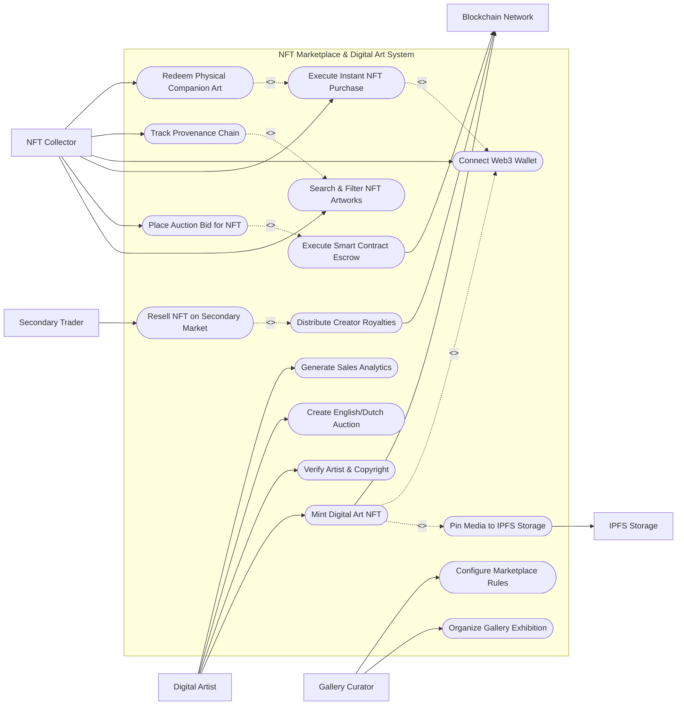

# Use Case Diagram — NFT Marketplace & Digital Art System

## Mermaid Code

## Actor Table | Bảng Actor

| # | Actor | Actor Type | Role Description | Related Use Cases |
|---|-------|------------|------------------|-------------------|
| 1 | Digital Artist | Primary | Creator uploading artwork, setting royalty percentages, minting NFTs, and tracking earnings. | UC01, UC04, UC06, UC15 |
| 2 | NFT Collector | Primary | Art buyer placing bids, instantly purchasing artworks, connecting wallets, and tracking provenance. | UC03, UC05, UC08, UC09, UC13, UC14 |
| 3 | Secondary Trader | Primary | Collector reselling previously purchased NFTs on the secondary marketplace. | UC10 |
| 4 | Gallery Curator | Primary | Art curator organizing themed exhibitions, selecting featured drops, and configuring gallery fees. | UC12, UC16 |
| 5 | Blockchain Network | System | Layer-1/2 blockchain executing NFT minting smart contracts, bids, and token transfers. | UC01, UC07, UC11 |
| 6 | IPFS Storage | System | Decentralized file network pinning high-res artwork files and JSON metadata URIs. | UC02 |

## Use Case Table | Bảng Use Case

| # | UC ID | Use Case Name | Primary Actor | Secondary Actor | Description | Priority |
|---|-------|---------------|---------------|-----------------|-------------|----------|
| 1 | UC01 | Mint Digital Art NFT | Digital Artist | Blockchain Network | Uploads digital artwork, pins media to IPFS, mints ERC-721/1155 token on-chain, and sets royalties. | High |
| 2 | UC02 | Pin Media to IPFS Storage | Digital Artist | IPFS Storage | Uploads original high-resolution image/video to IPFS decentralized nodes and generates metadata URI. | High |
| 3 | UC03 | Search & Filter NFT Artworks | NFT Collector | None | Searches artworks by medium (3D, Generative, Photography), price, artist, edition size, and popularity. | High |
| 4 | UC04 | Verify Artist & Copyright | Digital Artist | None | Runs reverse image search and social verification to confirm artist identity and prevent copyright plagiarism. | High |
| 5 | UC05 | Place Auction Bid for NFT | NFT Collector | Blockchain Network | Locks crypto bid in smart contract auction escrow for timed English or Dutch auctions. | High |
| 6 | UC06 | Create English/Dutch Auction | Digital Artist | None | Sets up timed auction listing specifying reserve price, duration, minimum bid increment, or price decay. | High |
| 7 | UC07 | Execute Smart Contract Escrow | NFT Collector | Blockchain Network | Automates escrow hold of crypto bids and automatic payout/token transfer upon auction conclusion. | High |
| 8 | UC08 | Execute Instant NFT Purchase | NFT Collector | Blockchain Network | Executes instant buy-now transaction at fixed price, transferring NFT to buyer wallet immediately. | High |
| 9 | UC09 | Connect Web3 Wallet | NFT Collector | None | Authenticates user using non-custodial crypto wallet signature (MetaMask, WalletConnect) on-chain. | High |
| 10 | UC10 | Resell NFT on Secondary Market | Secondary Trader | Blockchain Network | Lists previously owned NFT for secondary resale with automated EIP-2981 creator royalty deductions. | High |
| 11 | UC11 | Distribute Creator Royalties | Secondary Trader | Blockchain Network | Automatically routes designated percentage (e.g. 10%) of secondary sale price to original creator wallet. | High |
| 12 | UC12 | Organize Gallery Exhibition | Gallery Curator | None | Curates thematic virtual exhibition drops, setting featured homepage banners and drop schedules. | Medium |
| 13 | UC13 | Track Provenance Chain | NFT Collector | None | Inspects complete immutable history of artwork creation, past sales, price history, and owner wallet addresses. | Medium |
| 14 | UC14 | Redeem Physical Companion Art | NFT Collector | None | Burns or signs NFT token to claim physical signed art print or canvas sculpture companion. | Medium |
| 15 | UC15 | Generate Sales Analytics | Digital Artist | None | Exports creator earnings, total primary/secondary volume, collector follower counts, and gas fee logs. | Medium |
| 16 | UC16 | Configure Marketplace Rules | Gallery Curator | None | Configures platform marketplace fee percentage (e.g. 2.5%), approved token currencies, and gas optimization rules. | Low |

## Use Case Specification | Đặc tả Use Case

---

### UC01 — Mint Digital Art NFT

| Field | Detail |
|-------|--------|
| **UC ID** | UC01 |
| **Use Case Name** | Mint Digital Art NFT |
| **Actor(s)** | Primary: Digital Artist / Secondary: Blockchain Network, IPFS Storage |
| **Description** | Allows a verified digital artist to upload artwork media, pin files to IPFS (UC02), specify token standard (ERC-721 1-of-1 or ERC-1155 Edition), define EIP-2981 creator royalties, and mint the NFT on-chain. |
| **Precondition** | 1. Artist has connected Web3 wallet (UC09) and completed copyright verification (UC04).   2. Artist has sufficient crypto for gas fees (or lazy minting is enabled). |
| **Main Flow** | 1. Actor selects "Create / Mint NFT".   2. System presents artwork creation form requesting Title, Description, Collection Name, Edition Type (Single 1/1 vs Multiple Edition), and Attribute Tags.   3. Actor uploads digital art file (PNG, MP4, GIF, GLTF up to 100MB).   4. System triggers UC02 (Pin Media to IPFS Storage) to generate ipfs:// content hash for artwork media and JSON metadata.   5. Actor specifies Creator Royalty Percentage (e.g. 10%) and payout wallet address.   6. Actor selects minting method: Immediate On-Chain Minting vs. Lazy Minting (minted upon first purchase).   7. If Immediate Minting, System prepares ERC-721/1155 smart contract call and prompts Web3 wallet signature.   8. Actor signs transaction in wallet; System transmits transaction to Blockchain Network.   9. System receives block transaction receipt, creates NFT_Artwork entity, and sets status to "Minted - Ready for Sale". |
| **Alternative Flow** | **AF1** — Lazy Minting (Gasless): Artist signs off-chain EIP-712 voucher; System stores signed voucher in database, deferring on-chain gas fees until buyer purchases the NFT.   **AF2** — Generative Art Series Minting: Artist uploads generative code script (p5.js); System configures generative mint engine where collectors generate unique seed outputs upon minting. |
| **Exception Flow** | **EX1** — Duplicate / Plagiarized Image Flagged: If reverse image check detects matching artwork on another platform, System halts minting with alert "Potential copyright infringement detected."   **EX2** — IPFS Pinning Timeout: If IPFS gateway fails to pin artwork within 60 seconds, System retries using fallback Arweave gateway. |
| **Postcondition** | An NFT_Artwork record is persisted, linked to IPFS metadata URIs, and minted on-chain with immutable creator royalty rules. |
| **Business Rule** | **BR1**: Creator royalties are capped at a maximum of 15% per secondary sale to maintain market liquidity. |

---

### UC03 — Search & Filter NFT Artworks

| Field | Detail |
|-------|--------|
| **UC ID** | UC03 |
| **Use Case Name** | Search & Filter NFT Artworks |
| **Actor(s)** | Primary: NFT Collector / Secondary: None |
| **Description** | Enables collectors to browse digital artwork listings, filter by medium, price, collection, auction status, and artist, and inspect 3D preview renders and provenance history. |
| **Precondition** | 1. Artwork listings are active in the marketplace index.   2. Search engine indexing service is online. |
| **Main Flow** | 1. Actor opens Marketplace Explore page.   2. System displays grid of featured digital artworks with thumbnail previews, current bid/price, artist name, and edition count.   3. Actor applies filter parameters: Medium (3D Animation, Generative, Pixel Art, Photography), Sale Type (Buy Now, Live Auction, Accepting Offers), Price Range (in ETH/USD), and Artist Verification Status.   4. System updates displayed artwork grid in real-time.   5. Actor clicks an artwork card (e.g. "Cosmic Reflections #1").   6. System displays detailed Artwork Detail page featuring high-res media player, IPFS metadata link, EIP-2981 royalty terms, full Provenance Chain (UC13), and action buttons ("Buy Now" / "Place Bid"). |
| **Alternative Flow** | **AF1** — Filter by Collection Floor Price: Collector filters multi-edition collection items sorted from lowest to highest price.   **AF2** — Visual Similarity Search: Collector uploads sample image; System searches marketplace for visually similar digital art styles using vector embedding models. |
| **Exception Flow** | **EX1** — Delisted Artwork: If seller cancels listing while collector is viewing, System updates button to "Not For Sale".   **EX2** — Slow Media Load: System displays progressive low-res blurred thumbnail while high-resolution 4K video or 3D GLTF model streams. |
| **Postcondition** | Collector inspects artwork details and selects instant purchase or auction bidding options. |
| **Business Rule** | **BR1**: Search results must clearly label verified artist badges vs. unverified creators to protect buyers against impersonation. |

---

### UC05 — Place Auction Bid for NFT

| Field | Detail |
|-------|--------|
| **UC ID** | UC05 |
| **Use Case Name** | Place Auction Bid for NFT |
| **Actor(s)** | Primary: NFT Collector / Secondary: Blockchain Network |
| **Description** | Allows a collector to place a competitive crypto bid on an active English or Dutch auction, locking bid funds in smart contract escrow until outbid or auction conclusion. |
| **Precondition** | 1. Target NFT is listed in an active timed auction (UC06).   2. Collector's Web3 wallet is connected (UC09) with sufficient WETH / ETH balance. |
| **Main Flow** | 1. Actor views active auction page displaying Current High Bid, Reserve Price status, and Time Remaining countdown timer.   2. Actor enters bid amount (must exceed current high bid by at least minimum bid increment, e.g. +5%).   3. System checks bid validity and prepares WETH approval / escrow contract call (UC07).   4. Actor approves transaction in Web3 wallet.   5. System submits transaction to Blockchain Network.   6. Blockchain Network locks bid crypto in auction escrow contract and records new high bidder on-chain.   7. System updates auction UI in real-time, displays "Highest Bidder: [Collector Wallet]", and sends automated refund + outbid alert email to previous high bidder. |
| **Alternative Flow** | **AF1** — Dutch Auction Price Decay Purchase: In a Dutch auction where price declines over time, Collector clicks "Buy at Current Price"; Smart contract executes instant sale at current decaying price.   **AF2** — Reserve Price Met Trigger: First bid meets reserve price; System automatically starts 24-hour countdown timer on auction. |
| **Exception Flow** | **EX1** — Last-Second Anti-Snipe Extension: If a bid is placed within the final 5 minutes of auction, System automatically extends auction clock by 15 minutes.   **EX2** — Insufficient Escrow Funds: If collector's WETH balance is insufficient for bid amount, System prompts user to wrap ETH to WETH. |
| **Postcondition** | Bid offer is locked in smart contract escrow, updating high bid status and alerting outbid collectors. |
| **Business Rule** | **BR1**: Bids placed within the final 5 minutes of an auction must automatically extend the auction clock by 15 minutes to prevent front-running sniping bots. |

---

### UC08 — Execute Instant NFT Purchase

| Field | Detail |
|-------|--------|
| **UC ID** | UC08 |
| **Use Case Name** | Execute Instant NFT Purchase |
| **Actor(s)** | Primary: NFT Collector / Secondary: Blockchain Network |
| **Description** | Executes instant fixed-price NFT purchase (Buy Now), processing token payment, platform fee deduction, seller payout, creator royalty distribution, and instant NFT token transfer. |
| **Precondition** | 1. Target NFT is listed for fixed-price sale.   2. Buyer wallet is connected and funded with required crypto or credit card authorization. |
| **Main Flow** | 1. Actor selects "Buy Now" on target fixed-price artwork listing.   2. System displays checkout summary: Item Price (e.g. 2.0 ETH), Platform Marketplace Fee (2.5%), Estimated Gas Fee, and Total Cost.   3. Actor selects payment currency (ETH, USDC, or Credit Card via Fiat Gateway).   4. System generates marketplace contract fulfillment payload and prompts Web3 wallet signature.   5. Actor signs transaction in wallet.   6. System transmits transaction to Blockchain Network.   7. Blockchain Network smart contract executes atomic swap: transfers payment to seller (and royalties to creator via UC11), transfers marketplace fee to platform, and transfers NFT token to buyer wallet.   8. System receives transaction receipt, updates NFT owner record, sets listing status to "Sold", and displays purchase confirmation. |
| **Alternative Flow** | **AF1** — Credit Card / Fiat Purchase: Buyer opts for credit card; System routes payment through Fiat Gateway, buys ETH on backend, and executes atomic NFT transfer to buyer's non-custodial wallet.   **AF2** — Physical Companion Redemption Included: Purchase includes physical art canvas; System opens shipping address form for physical delivery. |
| **Exception Flow** | **EX1** — Listing Cancelled Concurrently: If seller cancels listing during checkout, System halts transaction with alert "Item no longer listed for sale."   **EX2** — Gas Limit Out-of-Gas Failure: If transaction fails on-chain, System alerts "Transaction failed due to out-of-gas error. Re-try with higher gas limit." |
| **Postcondition** | NFT token ownership is transferred on-chain to buyer's wallet, seller receives net proceeds, and original creator receives automated royalty payout. |
| **Business Rule** | **BR1**: All primary and secondary fixed-price sales must execute via non-custodial atomic smart contracts ensuring instant token delivery upon payment. |

---

### UC11 — Distribute Creator Royalties

| Field | Detail |
|-------|--------|
| **UC ID** | UC11 |
| **Use Case Name** | Distribute Creator Royalties |
| **Actor(s)** | Primary: Secondary Trader / Secondary: Blockchain Network |
| **Description** | Automatically calculates and routes perpetual creator royalty payouts (EIP-2981) to the original artist's wallet address upon every secondary market resale. |
| **Precondition** | 1. NFT artwork has EIP-2981 royalty metadata configured during minting (UC01).   2. A secondary market sale (UC10/UC08) is executed on-chain. |
| **Main Flow** | 1. Secondary Trader lists an NFT for resale and a buyer executes purchase (UC08).   2. Smart contract queries NFT token's `royaltyInfo()` function (EIP-2981 standard) passing sale price and token ID.   3. Smart contract reads designated Creator Receiver Wallet Address and Royalty Basis Points (e.g. 1000 BPS = 10%).   4. Smart contract calculates exact royalty amount (e.g. 10% of 5.0 ETH sale = 0.5 ETH).   5. Smart contract splits settlement transaction: Net Proceed to Reseller (4.375 ETH), Royalty to Artist Wallet (0.5 ETH), Platform Fee (0.125 ETH).   6. Blockchain Network executes atomic crypto payouts in the same settlement block.   7. System records Royalty_Rule transaction, updates artist cumulative royalty earnings dashboard (UC15), and sends royalty receipt email to the artist. |
| **Alternative Flow** | **AF1** — Multi-Creator Split Royalties: EIP-2981 metadata specifies multiple co-creators (e.g. 60% Artist, 40% Musician); Smart contract splits royalty payment proportionally across co-creator wallets.   **AF2** — Zero Royalty Collection: If artist set royalty to 0% during minting, Smart contract routes 100% of net proceeds to reseller. |
| **Exception Flow** | **EX1** — Unset Royalty Receiver Wallet: If creator wallet address is invalid or contract receiver fails ETH transfer, Smart contract falls back to sending royalty to contract creator fallback address.   **EX2** — Non-Compliant Marketplace Bypass Attempt: If secondary trade occurs on royalty-bypassing protocol, System flags collection with warning banner "Trade occurred off royalty-enforced contract." |
| **Postcondition** | Perpetual creator royalty is automatically routed on-chain to the original artist's wallet upon secondary sale execution. |
| **Business Rule** | **BR1**: EIP-2981 royalty standards must be strictly enforced on all primary smart contracts to guarantee perpetual passive income for digital artists. |
