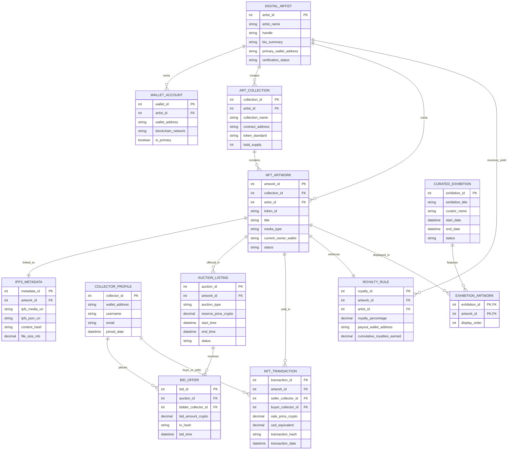

# Conceptual ERD — NFT Marketplace & Digital Art System

## Mermaid Code

## Entity Description Table | Bảng mô tả Entity

| # | Entity Name | Vietnamese Name | Description | Key Attributes | Main Relationships |
|---|-------------|-----------------|-------------|----------------|-------------------|
| 1 | DIGITAL_ARTIST | Tác giả Nghệ thuật Số | Digital artist, animator, or 3D creator minting and selling NFT artworks. | artist_id (PK), artist_name, handle, primary_wallet_address, verification_status | Owns Wallet Accounts, creates Collections, mints Artworks, receives Royalties |
| 2 | WALLET_ACCOUNT | Tài khoản Ví Web3 | Non-custodial Web3 crypto wallet address (0x...) linked to an artist or collector profile. | wallet_id (PK), artist_id (FK), wallet_address, blockchain_network | Belongs to Digital Artist |
| 3 | ART_COLLECTION | Bộ sưu tập NFT | Smart contract collection grouping individual NFT artworks under a common contract address. | collection_id (PK), artist_id (FK), collection_name, contract_address, token_standard | Created by Digital Artist, contains NFT Artworks |
| 4 | NFT_ARTWORK | Tác phẩm Nghệ thuật NFT | Individual digital artwork tokenized as an ERC-721/1155 NFT on the blockchain. | artwork_id (PK), collection_id (FK), artist_id (FK), token_id, title, current_owner_wallet | Belongs to Collection & Artist, linked to IPFS Metadata, offered in Auctions, sold in Transactions |
| 5 | IPFS_METADATA | Metadata Đã Pin IPFS | Decentralized IPFS storage hashes hosting original high-res media files and JSON metadata URIs. | metadata_id (PK), artwork_id (FK), ipfs_media_uri, ipfs_json_uri, content_hash | Linked to NFT Artwork |
| 6 | COLLECTOR_PROFILE | Hồ sơ Nhà Sưu tập | Profile of an NFT buyer or secondary trader holding crypto assets and managing collections. | collector_id (PK), wallet_address, username, email | Places Bid Offers, buys/sells in NFT Transactions |
| 7 | AUCTION_LISTING | Niêm yết Đấu giá | Timed English or Dutch auction listing specifying reserve price, duration, and bidding status. | auction_id (PK), artwork_id (FK), auction_type, reserve_price_crypto, start_time, status | Offers NFT Artwork, receives Bid Offers |
| 8 | BID_OFFER | Lượt Đặt giá Bid | Competitive crypto bid placed by a collector on an active auction listing. | bid_id (PK), auction_id (FK), bidder_collector_id (FK), bid_amount_crypto, tx_hash | Placed by Collector Profile, placed on Auction Listing |
| 9 | NFT_TRANSACTION | Giao dịch Mua bán NFT | On-chain settlement transaction recording primary sale or secondary resale of an NFT. | transaction_id (PK), artwork_id (FK), seller_collector_id (FK), buyer_collector_id (FK), sale_price_crypto, transaction_hash | Records sale of NFT Artwork, involves Collector Profiles |
| 10 | ROYALTY_RULE | Quy tắc Nhuận bút (EIP-2981) | Creator royalty configuration percentage and payout wallet address enforced on secondary sales. | royalty_id (PK), artwork_id (FK), artist_id (FK), royalty_percentage, payout_wallet_address | Enforced on NFT Artwork, pays Digital Artist |
| 11 | CURATED_EXHIBITION | Triển lãm Nghệ thuật Số | Curated virtual gallery exhibition highlighting selected thematic NFT artworks and artist drops. | exhibition_id (PK), exhibition_title, curator_name, start_date, end_date | Features NFT Artworks (via EXHIBITION_ARTWORK) |

## Relationship Description | Mô tả Quan hệ

| # | From Entity | Cardinality | To Entity | Relationship Label | Business Explanation |
|---|-------------|-------------|-----------|-------------------|----------------------|
| 1 | DIGITAL_ARTIST | one-to-many | WALLET_ACCOUNT | owns | A Digital Artist owns one or more Web3 Wallet Accounts. |
| 2 | DIGITAL_ARTIST | one-to-many | ART_COLLECTION | creates | A Digital Artist creates multiple Art Collections. |
| 3 | DIGITAL_ARTIST | one-to-many | NFT_ARTWORK | mints | A Digital Artist mints multiple NFT Artworks. |
| 4 | ART_COLLECTION | one-to-many | NFT_ARTWORK | contains | An Art Collection contains multiple individual NFT Artworks. |
| 5 | NFT_ARTWORK | one-to-one | IPFS_METADATA | linked_to | An NFT Artwork is linked to a unique IPFS Metadata URI. |
| 6 | NFT_ARTWORK | one-to-many | AUCTION_LISTING | offered_in | An NFT Artwork can be offered in multiple timed Auction Listings over time. |
| 7 | AUCTION_LISTING | one-to-many | BID_OFFER | receives | An Auction Listing receives multiple competitive Bid Offers. |
| 8 | COLLECTOR_PROFILE | one-to-many | BID_OFFER | places | A Collector Profile places multiple Bid Offers. |
| 9 | NFT_ARTWORK | one-to-many | NFT_TRANSACTION | sold_in | An NFT Artwork is sold across multiple primary/secondary NFT Transactions. |
| 10 | COLLECTOR_PROFILE | one-to-many | NFT_TRANSACTION | buys_or_sells | A Collector Profile buys or sells in multiple NFT Transactions. |
| 11 | NFT_ARTWORK | one-to-one | ROYALTY_RULE | enforces | An NFT Artwork enforces an EIP-2981 Royalty Rule. |
| 12 | DIGITAL_ARTIST | one-to-many | ROYALTY_RULE | receives_yield | A Digital Artist receives secondary royalty yield from Royalty Rules. |
| 13 | CURATED_EXHIBITION | many-to-many | NFT_ARTWORK | features | Curated Exhibitions feature multiple NFT Artworks (via EXHIBITION_ARTWORK). |
