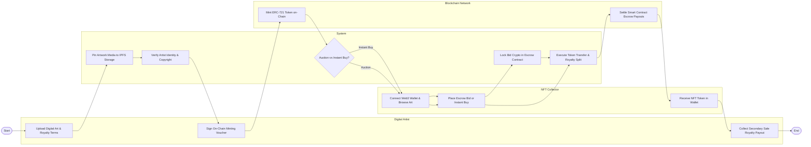

# Swimlane Diagram — NFT Marketplace & Digital Art System

## Mermaid Code

## Flow Description | Mô tả luồng

| Lane | Actor | Role in Flow |
|------|-------|-------------|
| 1 | Digital Artist | Uploads digital artwork files, configures EIP-2981 creator royalty percentages, signs minting vouchers, and collects secondary sales royalties. |
| 2 | System | Pins media and metadata to IPFS storage, runs copyright verification checks, manages auction vs fixed-price routes, locks escrow funds, and routes payments. |
| 3 | NFT Collector | Connects non-custodial Web3 crypto wallet, browses curated marketplace, places escrow bids or instant buys, and receives NFT tokens. |
| 4 | Blockchain Network | Executes on-chain ERC-721/1155 token minting contracts, enforces EIP-2981 royalty splits, and settles atomic token swaps. |
