# Action Tree — NFT Marketplace & Digital Art System

## Mermaid Code

```mermaid
graph TD
    Root["NFT Marketplace & Digital Art System"]

    Root --> M1["Digital Art Minting & Tokenization"]
    Root --> M2["NFT Marketplace & Auction Engine"]
    Root --> M3["Web3 Wallet & Authentication"]
    Root --> M4["IPFS Metadata & Provenance"]
    Root --> M5["Royalty & Secondary Sales"]
    Root --> M6["Gallery Curation & Analytics"]

    M1 --> A11["Mint ERC-721/1155 NFT Token"]
    M1 --> A12["Execute Lazy Minting Voucher"]
    M1 --> A13["Set EIP-2981 Royalty Percentage"]
    M1 --> A14["Verify Artist Identity & Copyright"]

    M2 --> A21["Create Fixed-Price Buy Listing"]
    M2 --> A22["Create English/Dutch Timed Auction"]
    M2 --> A23["Place Escrow Auction Bid"]
    M2 --> A24["Execute Instant Buy-Now Purchase"]

    M3 --> A31["Connect Web3 Wallet (MetaMask)"]
    M3 --> A32["Verify EIP-712 Signature Nonce"]
    M3 --> A33["Switch Layer-1/2 Blockchain Network"]
    M3 --> A34["Manage Payout Wallet Addresses"]

    M4 --> A41["Pin Media Files to IPFS Storage"]
    M4 --> A42["Generate IPFS JSON Metadata URI"]
    M4 --> A43["Inspect Immutable Provenance Chain"]
    M4 --> A44["Redeem Physical Companion Art"]

    M5 --> A51["Resell NFT on Secondary Market"]
    M5 --> A52["Calculate EIP-2981 Royalty Split"]
    M5 --> A53["Distribute Secondary Sales Revenue"]
    M5 --> A54["Track Floor Prices & Resale History"]

    M6 --> A61["Curate Virtual Gallery Exhibition"]
    M6 --> A62["Set Featured Homepage Art Drops"]
    M6 --> A63["Export Creator Sales Analytics"]
    M6 --> A64["Configure Marketplace Gas Rules"]
```

## Module Description | Mô tả Module

| # | Module | Description | Actions |
|---|--------|-------------|---------|
| 1 | Digital Art Minting & Tokenization | Handles ERC-721/1155 smart contract minting, gasless lazy minting vouchers, EIP-2981 royalty setup, and AI copyright verification. | Mint ERC-721/1155 NFT Token, Execute Lazy Minting Voucher, Set EIP-2981 Royalty Percentage, Verify Artist Identity & Copyright |
| 2 | NFT Marketplace & Auction Engine | Manages fixed-price buy-now listings, timed English/Dutch auctions, smart contract escrow bids, and instant checkout. | Create Fixed-Price Buy Listing, Create English/Dutch Timed Auction, Place Escrow Auction Bid, Execute Instant Buy-Now Purchase |
| 3 | Web3 Wallet & Authentication | Coordinates non-custodial crypto wallet connections, EIP-712 signature authentication, multi-chain network switching, and payout wallet management. | Connect Web3 Wallet (MetaMask), Verify EIP-712 Signature Nonce, Switch Layer-1/2 Blockchain Network, Manage Payout Wallet Addresses |
| 4 | IPFS Metadata & Provenance | Pins high-resolution artwork media and JSON metadata schemas to decentralized IPFS/Arweave storage, tracking full provenance history. | Pin Media Files to IPFS Storage, Generate IPFS JSON Metadata URI, Inspect Immutable Provenance Chain, Redeem Physical Companion Art |
| 5 | Royalty & Secondary Sales | Controls secondary market resales, calculates automated EIP-2981 royalty splits, distributes seller/creator payouts, and tracks floor prices. | Resell NFT on Secondary Market, Calculate EIP-2981 Royalty Split, Distribute Secondary Sales Revenue, Track Floor Prices & Resale History |
| 6 | Gallery Curation & Analytics | Manages virtual gallery drops, homepage exhibition curation, creator earnings analytics, and platform gas fee settings. | Curate Virtual Gallery Exhibition, Set Featured Homepage Art Drops, Export Creator Sales Analytics, Configure Marketplace Gas Rules |
