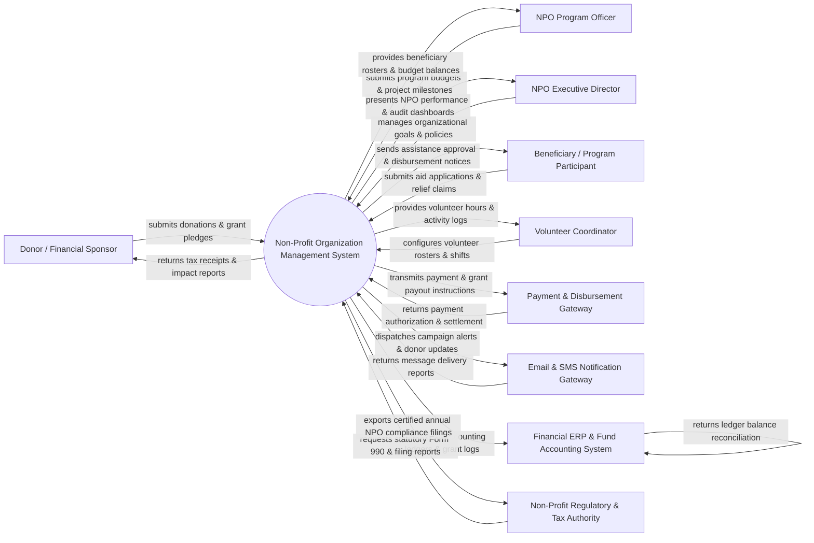

# Context Diagram — Non-Profit Organization Management System

## Mermaid Code

## Actor & Interaction Table | Bảng Actor & Tương tác

| # | Actor | Actor Type | Data Sent TO System | Data Received FROM System | Notes |
|---|-------|------------|---------------------|---------------------------|-------|
| 1 | Donor / Financial Sponsor | Primary | Financial donations, recurring pledges, restricted fund preferences, donor profile data | Official tax receipts, campaign impact reports, donor engagement updates | Individuals, corporations, or philanthropic trusts contributing funds to the NPO. |
| 2 | NPO Program Officer | Primary | Community project plans, relief budget allocations, beneficiary verification data, project milestones | Beneficiary eligibility lists, program expenditure metrics, milestone progress status | Staff managing specific NPO social programs, field operations, and aid projects. |
| 3 | NPO Executive Director | Primary | Strategic annual goals, organizational budget limits, governance rules, board policies | Executive performance dashboards, fund reserve balances, compliance audit logs | Senior NPO leadership governing overall organization strategy and transparency. |
| 4 | Beneficiary / Program Participant | Primary | Relief aid applications, hardship proof, identity documents, feedback surveys | Aid distribution notices, scheduled grant disbursements, program enrollment status | Individuals or community groups receiving material, medical, or educational support. |
| 5 | Volunteer Coordinator | Primary | Volunteer recruitment listings, shift schedules, skill requirements, team assignments | Volunteer roster lists, logged service hours, attendance summaries | NPO staff overseeing volunteer onboarding, scheduling, and hour verification. |
| 6 | Payment & Disbursement Gateway | Supporting System | Payment settlement codes, credit card authorization tokens, bank transfer receipts | Encrypted donation charges, beneficiary bank payout instructions, tranche requests | Third-party payment processor executing online donations and beneficiary aid payouts. |
| 7 | Email & SMS Notification Gateway | Supporting System | Delivery receipts, SMS response codes, carrier bounce notices | Campaign emails, donor thank-you notes, emergency relief alerts, OTP codes | Messaging gateway delivering donor communication, campaign drives, and alerts. |
| 8 | Financial ERP & Fund Accounting System | Supporting System | General ledger reconciliation codes, account balance updates, chart of accounts | Fund accounting ledgers, restricted vs unrestricted balance files, audit trails | Core accounting software managing non-profit fund ledgers and financial audits. |
| 9 | Non-Profit Regulatory & Tax Authority | Regulatory System | Statutory reporting guidelines, 501(c)(3) compliance rules, tax inspection inquiries | Form 990 annual tax returns, charitable status filings, audit transparency logs | Government tax and non-profit regulators enforcing charity financial compliance. |

## System Boundary Description | Mô tả Phạm vi Hệ thống

The **Non-Profit Organization Management System (NPO-MS)** is a specialized enterprise platform built for managing non-governmental and charitable organizations. Inside the system boundary, NPO-MS handles donor relationship management (CRM), fundraising campaign execution, community program delivery, beneficiary vetting, aid grant disbursement, volunteer management, fund accounting, and statutory compliance. External to the system boundary are commercial credit card processors (Payment & Disbursement Gateway), notification delivery infrastructure (Notification Gateway), enterprise accounting platforms (Fund Accounting ERP System), and statutory government tax agencies (Non-Profit Regulatory & Tax Authority).
