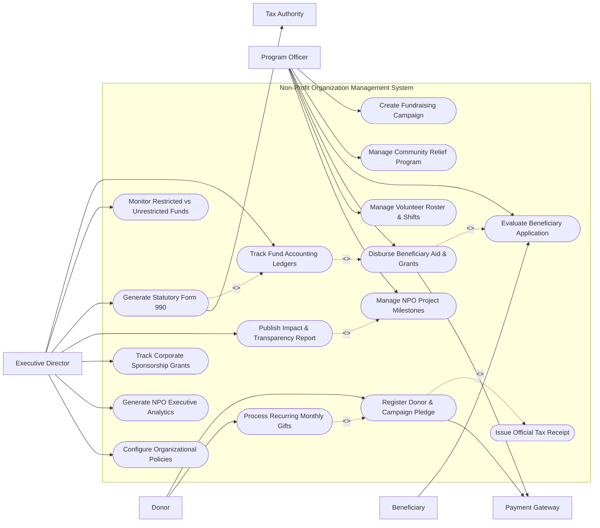

# Use Case Diagram — Non-Profit Organization Management System

## Mermaid Code

## Actor Table | Bảng Actor

| # | Actor | Actor Type | Role Description | Related Use Cases |
|---|-------|------------|------------------|-------------------|
| 1 | Donor | Primary | Individual, corporation, or foundation contributing financial gifts, pledges, or recurring donations. | UC01, UC13 |
| 2 | Program Officer | Primary | NPO staff officer managing social projects, evaluating beneficiary applications, and disbursing aid. | UC02, UC03, UC04, UC05, UC07, UC10 |
| 3 | Executive Director | Primary | Senior leader overseeing fund accounting, statutory compliance, corporate grants, and analytics. | UC08, UC09, UC11, UC12, UC14, UC15, UC16 |
| 4 | Beneficiary | Primary | Individual or community group applying for and receiving NPO financial or material aid. | UC04 |
| 5 | Payment Gateway | System | Commercial processor executing credit card, e-wallet, and direct bank transfer payments. | UC01, UC05 |
| 6 | Tax Authority | System | Government tax agency (e.g., IRS / Ministry of Finance) receiving statutory Form 990 tax filings. | UC11 |

## Use Case Table | Bảng Use Case

| # | UC ID | Use Case Name | Primary Actor | Secondary Actor | Description | Priority |
|---|-------|---------------|---------------|-----------------|-------------|----------|
| 1 | UC01 | Register Donor & Campaign Pledge | Donor | Payment Gateway | Captures donor profile, pledge commitment, processes donation, and issues tax receipt. | High |
| 2 | UC02 | Create Fundraising Campaign | Program Officer | None | Sets up a public fundraising campaign with financial target, category, and impact stories. | High |
| 3 | UC03 | Manage Community Relief Program | Program Officer | None | Configures NPO social programs (e.g., Education Aid, Medical Relief) and budget allocations. | High |
| 4 | UC04 | Evaluate Beneficiary Application | Program Officer | Beneficiary | Vets beneficiary aid applications, checks eligibility proof, and approves aid amounts. | High |
| 5 | UC05 | Disburse Beneficiary Aid & Grants | Program Officer | Payment Gateway | Executes financial grant or material aid disbursements to approved beneficiaries. | High |
| 6 | UC06 | Issue Official Tax Receipt | Donor | None | Generates and dispatches official tax-deductible donation receipt PDF to donors. | High |
| 7 | UC07 | Manage Volunteer Roster & Shifts | Program Officer | None | Schedules volunteer shifts, tracks attendance, and logs volunteer service hours. | Medium |
| 8 | UC08 | Track Fund Accounting Ledgers | Executive Director | None | Records non-profit fund accounting transactions in compliance with FASB/GASB rules. | High |
| 9 | UC09 | Monitor Restricted vs Unrestricted Funds | Executive Director | None | Tracks donor-restricted funds vs general operating funds to ensure legal usage. | High |
| 10 | UC10 | Manage NPO Project Milestones | Program Officer | None | Tracks field project execution steps, deliverable completion, and expenditure metrics. | Medium |
| 11 | UC11 | Generate Statutory Form 990 | Executive Director | Tax Authority | Compiles and exports annual non-profit statutory tax return (Form 990 / Form 990-EZ). | High |
| 12 | UC12 | Publish Impact & Transparency Report | Executive Director | None | Generates public annual report detailing total donations received, aid disbursed, and outcomes. | Medium |
| 13 | UC13 | Process Recurring Monthly Gifts | Donor | Payment Gateway | Automates monthly recurring credit card or ACH bank gift deductions for registered donors. | High |
| 14 | UC14 | Track Corporate Sponsorship Grants | Executive Director | None | Manages multi-year corporate sponsorship contracts, matching gifts, and corporate reporting. | Medium |
| 15 | UC15 | Generate NPO Executive Analytics | Executive Director | None | Exports donor retention rates, fundraising ROI, program efficiency ratios, and cash reserves. | Medium |
| 16 | UC16 | Configure Organizational Policies | Executive Director | None | Defines internal financial controls, approval hierarchies, and user security permissions. | Low |

## Use Case Specification | Đặc tả Use Case

---

### UC01 — Register Donor & Campaign Pledge

| Field | Detail |
|-------|--------|
| **UC ID** | UC01 |
| **Use Case Name** | Register Donor & Campaign Pledge |
| **Actor(s)** | Primary: Donor / Secondary: Payment Gateway |
| **Description** | Allows an individual or corporate donor to select a fundraising campaign, pledge a donation amount, complete payment processing, and receive an instant tax receipt. |
| **Precondition** | 1. The target fundraising campaign is active and open for donations.   2. Payment Gateway API is operational. |
| **Main Flow** | 1. Donor accesses NPO Giving Portal and selects a fundraising campaign (UC02).   2. System presents donation checkout form with options for One-Time Gift, Recurring Monthly Gift (UC13), or Corporate Pledge.   3. Donor inputs donation amount, selects fund designation (e.g., Emergency Relief Fund), and enters contact details.   4. Donor chooses payment method (Credit Card, PayPal, Direct Bank Transfer) and enters card/account info.   5. Donor submits donation.   6. System transmits payment request to Payment Gateway and receives authorization token.   7. System updates campaign total raised, posts entry to Fund Accounting Ledger (UC08), and generates/emails an official tax receipt PDF (UC06) to the donor. |
| **Alternative Flow** | **AF1** — Corporate Matching Gift: Donor checks "Employer Matches Gift", selects employer from database, and System dispatches matching gift instructions.   **AF2** — In-Kind Donation Registration: Donor registers non-monetary gift (e.g. food supplies, vehicle); System creates In-Kind Receipt for approval. |
| **Exception Flow** | **EX1** — Payment Transaction Declined: If payment card is declined, System alerts "Transaction declined by issuing bank. Please check details or use alternative card."   **EX2** — Anonymous Donation: If donor selects "Anonymous", System records transaction privately without publishing donor name to campaign leaderboard. |
| **Postcondition** | A Donation_Record is persisted, updating campaign financial totals, posting to fund ledgers, and issuing a tax receipt. |
| **Business Rule** | **BR1**: All donations exceeding $250 must automatically trigger an official written tax acknowledgment letter as required by tax regulations. |

---

### UC03 — Manage Community Relief Program

| Field | Detail |
|-------|--------|
| **UC ID** | UC03 |
| **Use Case Name** | Manage Community Relief Program |
| **Actor(s)** | Primary: NPO Program Officer / Secondary: None |
| **Description** | Enables Program Officers to configure new social welfare initiatives, establish program budget limits, set beneficiary eligibility criteria, and track program progress. |
| **Precondition** | 1. User is logged in as an authorized NPO Program Officer.   2. Program funding allocation is approved by the Executive Director. |
| **Main Flow** | 1. Actor selects "Create New Social Program".   2. System presents program setup editor requesting Program Name, Category (e.g., Education, Medical, Disaster Relief), Start/End Dates, and Total Allocated Budget.   3. Actor defines target beneficiary criteria (e.g., income threshold, geographic region, household size).   4. Actor specifies aid disbursement types (e.g. Cash Transfer, Food Vouchers, Educational Scholarships).   5. Actor assigns field team members and project milestones (UC10).   6. Actor submits program setup.   7. System validates budget availability in Fund Accounting (UC08), creates NPO_Program record in status "Active", and opens beneficiary application portal. |
| **Alternative Flow** | **AF1** — Multi-Partner Joint Program: Program Officer links co-funding partner non-profits; System configures shared budget tracking pools.   **AF2** — Emergency Rapid Response Program: Program Officer checks "Emergency Rapid Response"; System waives standard pre-approval steps for immediate aid deployment. |
| **Exception Flow** | **EX1** — Insufficient Unrestricted Fund Balance: If program budget exceeds available unrestricted funds, System alerts "Budget allocation exceeds available fund balance by $12,000."   **EX2** — Missing Eligibility Criteria: If no beneficiary eligibility rules are defined, System blocks submission with error "Eligibility rules required." |
| **Postcondition** | An NPO_Program entity is activated, allocating budget funds and opening application workflows for beneficiaries. |
| **Business Rule** | **BR1**: Administrative overhead allocated to any program must not exceed 15% of total program budget to maintain non-profit rating compliance. |

---

### UC05 — Disburse Beneficiary Aid & Grants

| Field | Detail |
|-------|--------|
| **UC ID** | UC05 |
| **Use Case Name** | Disburse Beneficiary Aid & Grants |
| **Actor(s)** | Primary: NPO Program Officer / Secondary: Payment Gateway |
| **Description** | Executes formal financial or material aid disbursements to verified beneficiaries following application review and officer approval. |
| **Precondition** | 1. Beneficiary application (UC04) is approved by the Program Officer.   2. Program budget has sufficient remaining funds for disbursement. |
| **Main Flow** | 1. Actor opens Approved Beneficiary Aid Queue.   2. System lists approved applications showing Beneficiary Name, Aid Type, Approved Amount, and Disbursement Channel (Direct Bank Transfer, E-Wallet, Physical Check).   3. Actor inspects applicant verification documents and clicks "Execute Aid Disbursement".   4. System checks remaining program budget pool (UC03).   5. System transmits payment disbursement payload to Payment Gateway / Bank API.   6. Payment Gateway returns settlement confirmation code (e.g., TRN-99402).   7. System records Grant_Disbursement entity, updates program budget ledger (UC08), and sends SMS/email notification to beneficiary. |
| **Alternative Flow** | **AF1** — Physical Goods / Voucher Distribution: For in-kind aid (e.g. food packages, medical kits), System generates QR code pickup vouchers sent to beneficiary mobile phones.   **AF2** — Tranche-Based Grant Payout: For multi-month educational scholarships, System schedules recurring monthly milestone disbursements. |
| **Exception Flow** | **EX1** — Disbursement Bank API Failure: If bank transfer fails due to invalid account details, System flags transaction as "Failed Payout" and alerts officer to verify bank details.   **EX2** — Over-Budget Disbursement: If payout exceeds remaining program budget balance, System blocks execution with error "Program budget depleted." |
| **Postcondition** | Grant_Disbursement record is created, reducing program budget balance and executing fund transfer to beneficiary. |
| **Business Rule** | **BR1**: Cash disbursements exceeding $1,000 require dual authorization signatures from both Program Officer and Finance Manager. |

---

### UC08 — Track Fund Accounting Ledgers

| Field | Detail |
|-------|--------|
| **UC ID** | UC08 |
| **Use Case Name** | Track Fund Accounting Ledgers |
| **Actor(s)** | Primary: Executive Director / Secondary: None |
| **Description** | Manages non-profit fund accounting ledgers, segregating donor-restricted funds from unrestricted operating funds in compliance with FASB/GASB standards. |
| **Precondition** | 1. Chart of accounts and fund accounting structure are configured.   2. Financial transactions (donations, aid payouts, operating expenses) have occurred. |
| **Main Flow** | 1. Actor opens Fund Accounting module.   2. System displays Chart of Funds categorized by Unrestricted Operating Funds, Temporarily Restricted Funds (e.g. specific project grants), and Permanently Restricted Endowments.   3. Actor selects a specific fund ledger to inspect debit/credit postings, donation inputs (UC01), and program disbursements (UC05).   4. System calculates real-time net asset balances for each fund category.   5. Actor executes fund release transaction (e.g. releasing $50,000 from Temporarily Restricted to Unrestricted upon achieving project milestones).   6. System validates milestone completion proof and records fund reclassification entry.   7. System updates general ledger balances and generates fund accounting trial balance. |
| **Alternative Flow** | **AF1** — Automated Expense Allocation: System automatically allocates overhead expenses across programs based on direct labor hours or square footage ratios.   **AF2** — Endowment Interest Calculation: System calculates quarterly interest earned on permanently restricted endowment principal. |
| **Exception Flow** | **EX1** — Unbalanced Journal Entry: If manual journal entry debits do not equal credits, System alerts "Journal entry out of balance by $450."   **EX2** — Unauthorized Restricted Fund Misuse: If user attempts to pay operating expenses from restricted fund without milestone clearance, System blocks entry with alert "Restricted fund violation." |
| **Postcondition** | Fund_Account ledgers are updated in real-time, enforcing legal fund restrictions and maintaining audit compliance. |
| **Business Rule** | **BR1**: Donor-restricted funds cannot be reclassified as unrestricted without verified written documentation of restriction fulfillment. |

---

### UC11 — Generate Statutory Form 990 & Tax Audit

| Field | Detail |
|-------|--------|
| **UC ID** | UC11 |
| **Use Case Name** | Generate Statutory Form 990 & Tax Audit |
| **Actor(s)** | Primary: Executive Director / Secondary: Tax Authority |
| **Description** | Compiles non-profit annual financial data, program accomplishment reports, executive compensation, and fund ledgers into statutory Form 990 tax return filings. |
| **Precondition** | 1. Fiscal year financial ledgers (UC08) are closed and audited.   2. Executive Director has administrator tax filing authority. |
| **Main Flow** | 1. Actor selects "Tax Compliance & Form 990 Generator".   2. System prompts for Fiscal Tax Year selection (e.g., FY2025).   3. System aggregates revenue items (contributions, grants, program service revenue), functional expenses (program, management, fundraising), and net asset balances from fund ledgers.   4. System populates Form 990 schedules: Part I Summary, Part III Program Accomplishments, Part VII Compensation, and Schedule A (Public Charity Status).   5. Actor reviews auto-populated tax figures, adds officer signatures, and attaches audited financial statements.   6. Actor submits Form 990 package to Tax Authority API.   7. System transmits electronic filing payload, receives IRS/Tax Authority acceptance confirmation code (e.g. ACK-2026-990-881), and archives filed tax return. |
| **Alternative Flow** | **AF1** — Form 990-EZ / 990-N Short Form Generation: If annual gross receipts are below $200,000, System automatically selects simplified Form 990-EZ template.   **AF2** — Tax Filing Extension Request: Actor selects "Request 6-Month Extension (Form 8868)"; System generates and files automated extension request. |
| **Exception Flow** | **EX1** — Functional Expense Mismatch: If sum of Program + Admin + Fundraising expenses does not equal Total Functional Expenses, System flags "Calculation error in Part IX".   **EX2** — Filing Rejected by Tax Authority: If e-filing is rejected due to missing EIN or signature code, System alerts "Tax Filing Rejected: Invalid Officer Signature Token". |
| **Postcondition** | Form 990 tax return is successfully filed with the Tax Authority and archived in NPO compliance records for public transparency. |
| **Business Rule** | **BR1**: Form 990 filings must be completed and submitted by the 15th day of the 5th month after the end of the organization's fiscal year. |
