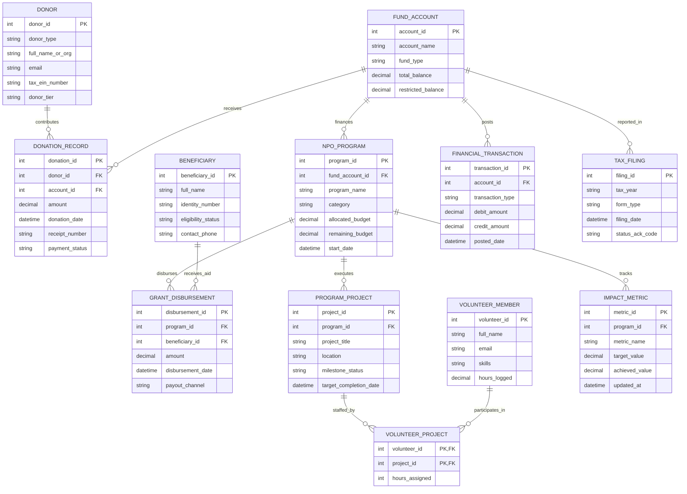

# Conceptual ERD — Non-Profit Organization Management System

## Mermaid Code

## Entity Description Table | Bảng mô tả Entity

| # | Entity Name | Vietnamese Name | Description | Key Attributes | Main Relationships |
|---|-------------|-----------------|-------------|----------------|-------------------|
| 1 | DONOR | Nhà Tài trợ | Individual, corporate, or foundation donor contributing financial gifts or grants to the NPO. | donor_id (PK), donor_type, full_name_or_org, email, donor_tier | Contributes Donation Records |
| 2 | FUND_ACCOUNT | Tài khoản Quỹ | Fund accounting entity separating unrestricted operating funds from restricted project funds. | account_id (PK), account_name, fund_type, total_balance, restricted_balance | Receives Donation Records, finances Programs, posts Financial Transactions, reported in Tax Filings |
| 3 | DONATION_RECORD | Hồ sơ Quyên góp | Individual financial donation, gift transaction, tax receipt reference, and payment status. | donation_id (PK), donor_id (FK), account_id (FK), amount, receipt_number | Contributed by Donor, received into Fund Account |
| 4 | NPO_PROGRAM | Chương trình NPO | Core social, educational, or humanitarian program operated by the NPO with allocated budget. | program_id (PK), fund_account_id (FK), program_name, category, allocated_budget | Financed by Fund Account, disburses Grant Disbursements, executes Projects, tracks Impact Metrics |
| 5 | BENEFICIARY | Người Thụ hưởng | Individual or community group vetted and approved to receive aid, vouchers, or grants. | beneficiary_id (PK), full_name, identity_number, eligibility_status | Receives Grant Disbursements |
| 6 | GRANT_DISBURSEMENT | Cấp vốn / Hỗ trợ | Financial aid disbursement transaction transferring funds to an approved beneficiary. | disbursement_id (PK), program_id (FK), beneficiary_id (FK), amount, payout_channel | Disbursed by NPO Program, received by Beneficiary |
| 7 | PROGRAM_PROJECT | Dự án Thành phần | Specific field project, building effort, or campaign initiative under an overarching program. | project_id (PK), program_id (FK), project_title, location, milestone_status | Executed under NPO Program, staffed by Volunteer Projects |
| 8 | VOLUNTEER_MEMBER | Tình nguyện viên | Individual offering unpaid service hours, skills, and labor for NPO projects. | volunteer_id (PK), full_name, email, skills, hours_logged | Participates in Program Projects (via VOLUNTEER_PROJECT) |
| 9 | FINANCIAL_TRANSACTION | Giao dịch Kế toán | Fund accounting ledger entry recording debit/credit postings across fund accounts. | transaction_id (PK), account_id (FK), transaction_type, debit_amount, credit_amount | Posted to Fund Account |
| 10 | TAX_FILING | Hồ sơ Khai Thuế | Statutory annual Form 990 tax return filing submitted to government tax regulatory bodies. | filing_id (PK), tax_year, form_type, filing_date, status_ack_code | Reports Fund Accounts |
| 11 | IMPACT_METRIC | Chỉ số Tác động | Quantitative KPI metric tracking program social outcomes (e.g. 500 students educated). | metric_id (PK), program_id (FK), metric_name, target_value, achieved_value | Tracked by NPO Program |

## Relationship Description | Mô tả Quan hệ

| # | From Entity | Cardinality | To Entity | Relationship Label | Business Explanation |
|---|-------------|-------------|-----------|-------------------|----------------------|
| 1 | DONOR | one-to-many | DONATION_RECORD | contributes | A Donor contributes multiple Donation Records over time. |
| 2 | FUND_ACCOUNT | one-to-many | DONATION_RECORD | receives | A Fund Account receives multiple Donation Records. |
| 3 | FUND_ACCOUNT | one-to-many | NPO_PROGRAM | finances | A Fund Account finances one or more NPO Programs. |
| 4 | NPO_PROGRAM | one-to-many | GRANT_DISBURSEMENT | disburses | An NPO Program disburses multiple Grant Disbursements to beneficiaries. |
| 5 | BENEFICIARY | one-to-many | GRANT_DISBURSEMENT | receives_aid | A Beneficiary receives one or multiple Grant Disbursements. |
| 6 | NPO_PROGRAM | one-to-many | PROGRAM_PROJECT | executes | An NPO Program executes multiple field Program Projects. |
| 7 | NPO_PROGRAM | one-to-many | IMPACT_METRIC | tracks | An NPO Program tracks multiple Impact Metrics. |
| 8 | FUND_ACCOUNT | one-to-many | FINANCIAL_TRANSACTION | posts | A Fund Account records multiple financial accounting Transactions. |
| 9 | PROGRAM_PROJECT | many-to-many | VOLUNTEER_MEMBER | staffed_by | Projects are staffed by multiple Volunteers (via VOLUNTEER_PROJECT). |
| 10 | FUND_ACCOUNT | one-to-many | TAX_FILING | reported_in | Fund Accounts are reported in statutory annual Tax Filings. |
