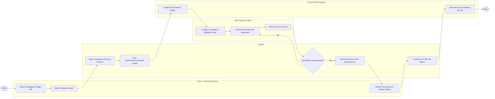

# Swimlane Diagram — Non-Profit Organization Management System

## Mermaid Code

## Flow Description | Mô tả luồng

| Lane | Actor | Role in Flow |
|------|-------|-------------|
| 1 | Donor / Financial Sponsor | Selects fundraising campaign, pledges monetary gift, submits credit card or bank details, and receives tax-deductible receipts and impact reports. |
| 2 | System | Automates payment processing, posts fund accounting ledger entries, executes electronic aid payouts to beneficiaries, and compiles annual tax return files. |
| 3 | NPO Program Officer | Defines social program budgets, establishes eligibility rules, evaluates beneficiary aid applications, and authorizes grant disbursements. |
| 4 | Financial ERP System | Maintains fund accounting general ledgers, enforces restricted vs unrestricted fund rules, and generates statutory Form 990 tax files. |
