# Action Tree — Non-Profit Organization Management System

## Mermaid Code

```mermaid
graph TD
    Root["Non-Profit Organization Management System"]

    Root --> M1["Donor & Fundraising Management"]
    Root --> M2["Program & Beneficiary Operations"]
    Root --> M3["Fund Accounting & Grant Tracking"]
    Root --> M4["Volunteer & Community Roster"]
    Root --> M5["Impact Analytics & Reporting"]
    Root --> M6["Governance & Compliance"]

    M1 --> A11["Register Donor Profile & Pledges"]
    M1 --> A12["Create Fundraising Campaign"]
    M1 --> A13["Process Monthly Recurring Gifts"]
    M1 --> A14["Issue Official Tax Receipts"]

    M2 --> A21["Configure Community Relief Program"]
    M2 --> A22["Evaluate Beneficiary Applications"]
    M2 --> A23["Disburse Aid & Grant Payouts"]
    M2 --> A24["Track Field Project Milestones"]

    M3 --> A31["Record Fund Accounting Ledgers"]
    M3 --> A32["Monitor Restricted vs Unrestricted Funds"]
    M3 --> A33["Reclassify Fund Balances"]
    M3 --> A34["Reconcile General Ledger Balances"]

    M4 --> A41["Recruit & Onboard Volunteers"]
    M4 --> A42["Schedule Shifts & Rosters"]
    M4 --> A43["Log Volunteer Service Hours"]
    M4 --> A44["Issue Volunteer Certificates"]

    M5 --> A51["Track Social Impact KPIs"]
    M5 --> A52["Publish Annual Transparency Report"]
    M5 --> A53["Export Executive Performance Dashboard"]
    M5 --> A54["Analyze Donor Retention & ROI"]

    M6 --> A61["Generate Statutory Form 990"]
    M6 --> A62["Export Tax Audit Records"]
    M6 --> A63["Configure Internal Financial Controls"]
    M6 --> A64["Manage Governance Role Permissions"]
```

## Module Description | Mô tả Module

| # | Module | Description | Actions |
|---|--------|-------------|---------|
| 1 | Donor & Fundraising Management | Manages donor relationships, fundraising campaigns, recurring gift automations, and official tax receipt dispatches. | Register Donor Profile & Pledges, Create Fundraising Campaign, Process Monthly Recurring Gifts, Issue Official Tax Receipts |
| 2 | Program & Beneficiary Operations | Handles social relief program setup, beneficiary eligibility vetting, aid grant payouts, and field project milestone tracking. | Configure Community Relief Program, Evaluate Beneficiary Applications, Disburse Aid & Grant Payouts, Track Field Project Milestones |
| 3 | Fund Accounting & Grant Tracking | Controls FASB/GASB non-profit fund accounting, restricted vs unrestricted fund monitoring, balance reclassifications, and ledger reconciliations. | Record Fund Accounting Ledgers, Monitor Restricted vs Unrestricted Funds, Reclassify Fund Balances, Reconcile General Ledger Balances |
| 4 | Volunteer & Community Roster | Oversees volunteer onboarding, shift scheduling, service hour logging, and volunteer appreciation certificates. | Recruit & Onboard Volunteers, Schedule Shifts & Rosters, Log Volunteer Service Hours, Issue Volunteer Certificates |
| 5 | Impact Analytics & Reporting | Calculates social impact metrics, publishes annual transparency reports, exports executive dashboards, and analyzes donor retention. | Track Social Impact KPIs, Publish Annual Transparency Report, Export Executive Performance Dashboard, Analyze Donor Retention & ROI |
| 6 | Governance & Compliance | Compiles annual statutory Form 990 tax filings, exports audit ledgers, configures internal financial controls, and manages user roles. | Generate Statutory Form 990, Export Tax Audit Records, Configure Internal Financial Controls, Manage Governance Role Permissions |
