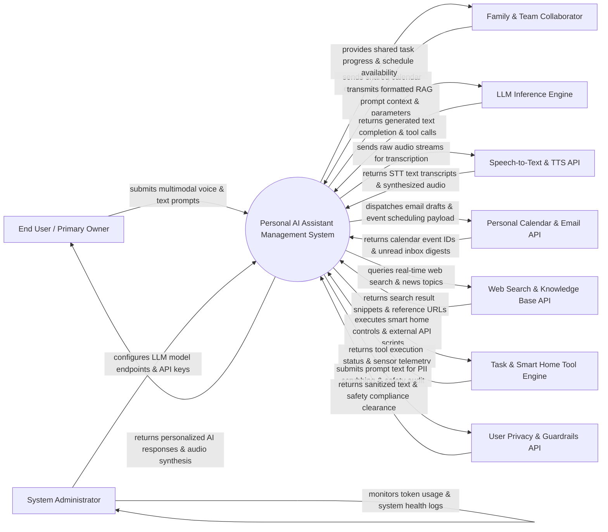

# Context Diagram — Personal AI Assistant Management System

## Mermaid Code

## Actor & Interaction Table | Bảng Actor & Tương tác

| # | Actor | Actor Type | Data Sent TO System | Data Received FROM System | Notes |
|---|-------|------------|---------------------|---------------------------|-------|
| 1 | End User / Primary Owner | Primary | Multimodal prompts (voice, text, uploaded PDFs/images), persona customization settings, memory management commands, feedback ratings | Personalized conversational responses, audio speech synthesis, proactive reminder notifications, daily briefing digests | Primary owner interacting with their personalized AI assistant across devices (phone, watch, desktop). |
| 2 | Family & Team Collaborator | Primary | Shared calendar invites, collaborative task assignments, group chat queries, shared list updates | Shared schedule availability, joint task status updates, delegated action confirmations | Household members or colleagues sharing specific assistant workspace permissions. |
| 3 | System Administrator | Primary | LLM model endpoint configurations (OpenAI, Anthropic, Local Llama), API key management, vector DB settings | Token consumption metrics, API latency graphs, system error logs, vector index health | Technical administrator configuring AI models, hosting infrastructure, and system security. |
| 4 | Large Language Model Inference Engine | Supporting System | Generated text completions, JSON tool call definitions, structured output schemas, logit confidence scores | Formatted system prompt instructions, user query context, RAG vector memory snippets | Frontier cloud LLM APIs (GPT-4o, Claude 3.5, Gemini) or self-hosted local LLM inference engines (vLLM, Ollama). |
| 5 | Speech-to-Text & Text-to-Speech API | Supporting System | Transcribed text strings, speaker ID tokens, audio duration metrics, synthesized audio MP3 buffers | Raw microphone audio stream bytes, TTS voice selection parameters, speech speed settings | Speech recognition and voice synthesis engines (Whisper, ElevenLabs, Azure Speech) for voice interaction. |
| 6 | Personal Calendar & Email API | Supporting System | Calendar event confirmation IDs, unread email digests, contact lookup results, draft status | Event creation payloads (Title, Time, Attendees), email draft bodies, meeting rescheduling requests | Third-party calendar and email APIs (Google Workspace, Microsoft Outlook API) for personal scheduling. |
| 7 | External Web Search & Knowledge Base API | Supporting System | Real-time web search snippets, Wikipedia summaries, financial market data, news articles | Search query keywords, domain filter parameters, web scraping requests | Real-time search engine APIs (Tavily, Google Search API, Perplexity) providing up-to-date information. |
| 8 | Automated Task & Smart Home Tool Engine | Supporting System | Tool execution receipts, HTTP status codes, smart home device state updates, web scraping output | Script execution triggers, smart home CLI commands (Home Assistant), web automation payloads | Automation platforms (Zapier, N8N, Home Assistant API, Python Interpreter) executing real-world actions. |
| 9 | User Privacy & Data Guardrails API | Supporting System | Sanitized text payloads, PII redaction tokens, content safety scores (Hate, Self-Harm, Jailbreak detection) | Raw user prompt text, PII masking rules, content filtering policy settings | Guardrail security service (NeMo Guardrails, Llama Guard, Presidio) enforcing privacy and safety limits. |

## System Boundary Description | Mô tả Phạm vi Hệ thống

The **Personal AI Assistant Management System (PAAMS)** is an intelligent agentic software platform that serves as a hyper-personalized, multimodal digital assistant. Inside the system boundary, PAAMS manages user persona configuration, multimodal prompt processing, Speech-to-Text / Text-to-Speech routing, Retrieval-Augmented Generation (RAG) vector memory indexing, conversation session tracking, autonomous multi-step tool execution, proactive notification scheduling, and local PII data guardrails. External to the system boundary are commercial and local LLM inference providers (LLM Inference Engine), speech processing services (STT/TTS Provider), personal productivity APIs (Calendar & Email API), live web search providers (Web Search API), smart home automation tools (Task & Smart Home Engine), and content safety guardrail engines (User Privacy Guardrails API).
