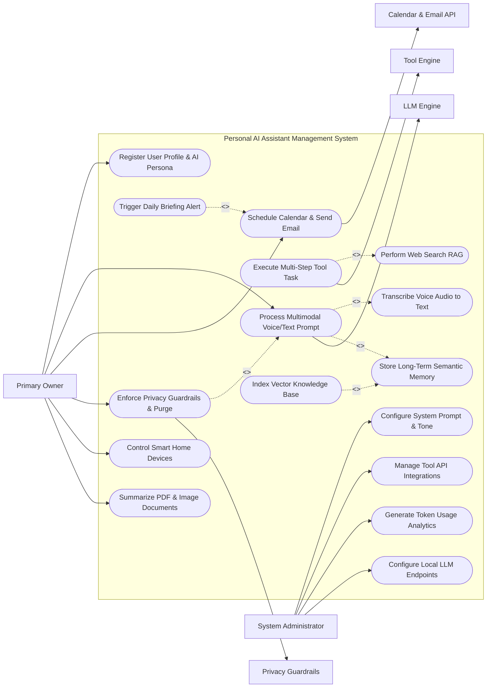

# Use Case Diagram — Personal AI Assistant Management System

## Mermaid Code

## Actor Table | Bảng Actor

| # | Actor | Actor Type | Role Description | Related Use Cases |
|---|-------|------------|------------------|-------------------|
| 1 | Primary Owner | Primary | End-user customizing AI persona, submitting multimodal prompts, scheduling tasks, and managing personal memory. | UC01, UC03, UC07, UC11, UC12, UC13 |
| 2 | System Administrator | Primary | System admin configuring LLM models, system prompts, API keys, and analyzing token consumption. | UC02, UC14, UC15, UC16 |
| 3 | LLM Engine | System | Frontier cloud or local LLM engine generating completions, reasoning, and tool calls. | UC03 |
| 4 | Calendar & Email API | System | External Google/Microsoft API scheduling events, searching inboxes, and sending emails. | UC07 |
| 5 | Tool Engine | System | Execution sandbox running Python scripts, Zapier webhooks, and Smart Home commands. | UC05 |
| 6 | Privacy Guardrails | System | Security guardrail service redacting PII and filtering inappropriate content. | UC11 |

## Use Case Table | Bảng Use Case

| # | UC ID | Use Case Name | Primary Actor | Secondary Actor | Description | Priority |
|---|-------|---------------|---------------|-----------------|-------------|----------|
| 1 | UC01 | Register User Profile & AI Persona | Primary Owner | None | Registers user account, defines AI assistant name, avatar, personality traits, and preferred response length. | High |
| 2 | UC02 | Configure System Prompt & Tone | System Administrator | None | Configures core system prompt instructions, safety boundaries, reasoning style (Chain-of-Thought), and tone. | High |
| 3 | UC03 | Process Multimodal Voice/Text Prompt | Primary Owner | LLM Engine | Ingests voice or text query, retrieves RAG context, and streams generated AI response back to user. | High |
| 4 | UC04 | Transcribe Voice Audio to Text | Primary Owner | None | Converts raw microphone speech stream into formatted text transcript using Whisper STT engine. | High |
| 5 | UC05 | Execute Multi-Step Tool Task | Primary Owner | Tool Engine | Autonomously executes multi-step agentic plan using external tools (Calendar, Web Search, Code Execution). | High |
| 6 | UC06 | Perform Web Search RAG | Primary Owner | None | Queries live web search engines, extracts relevant search snippets, and injects up-to-date facts into LLM context. | High |
| 7 | UC07 | Schedule Calendar & Send Email | Primary Owner | Calendar & Email API | Creates Google/Outlook calendar events, checks attendee availability, and composes/sends email messages. | High |
| 8 | UC08 | Index Vector Knowledge Base | Primary Owner | None | Parses uploaded PDF documents, notes, and web pages, generating vector embeddings stored in vector database. | High |
| 9 | UC09 | Store Long-Term Semantic Memory | Primary Owner | None | Extracts user facts (family names, preferences, projects) from chat logs and stores them in long-term memory. | High |
| 10 | UC10 | Trigger Daily Briefing Alert | Primary Owner | None | Compiles weather, calendar agenda, unread emails, and task lists into a proactive morning voice briefing. | Medium |
| 11 | UC11 | Enforce Privacy Guardrails & Purge | Primary Owner | Privacy Guardrails | Scrubs PII (passwords, SSNs) from prompts and allows user to inspect or permanently purge stored memories. | High |
| 12 | UC12 | Control Smart Home Devices | Primary Owner | None | Translates natural language requests ("I'm leaving home") into Home Assistant smart home execution commands. | Medium |
| 13 | UC13 | Summarize PDF & Image Documents | Primary Owner | None | Processes uploaded PDF reports or image screenshots using vision LLMs, returning key summaries and action items. | Medium |
| 14 | UC14 | Manage Tool API Integrations | System Administrator | None | Configures API credentials, OAuth connections, and webhook permissions for third-party tools (Zapier, GitHub). | Medium |
| 15 | UC15 | Generate Token Usage Analytics | System Administrator | None | Exports daily LLM token consumption, API cost breakdowns per model, average latency, and response ratings. | Medium |
| 16 | UC16 | Configure Local LLM Endpoints | System Administrator | None | Connects system to local offline LLM inference servers (Ollama, vLLM) for zero-cloud data privacy. | Low |

## Use Case Specification | Đặc tả Use Case

---

### UC01 — Register User Profile & AI Persona

| Field | Detail |
|-------|--------|
| **UC ID** | UC01 |
| **Use Case Name** | Register User Profile & AI Persona |
| **Actor(s)** | Primary: Primary Owner / Secondary: None |
| **Description** | Registers user account, defines AI assistant name, avatar, personality traits (Professional, Friendly, Concise), and establishes initial user preferences. |
| **Precondition** | 1. User has accessed the AI Assistant onboarding page.   2. System database is connected. |
| **Main Flow** | 1. Actor selects "Create New AI Assistant Profile".   2. System presents onboarding form requesting User Name, Email, Password, and Timezone.   3. Actor configures AI Persona: Assistant Name (e.g. "Jarvis"), Gender/Voice Style (Female, Male, Neutral), Avatar Icon, and Communication Style (Concise, Detailed, Sarcastic, Academic).   4. Actor selects default LLM model preference (e.g., GPT-4o, Claude 3.5 Sonnet, Local Llama-3).   5. Actor specifies primary interests (Software Engineering, Finance, Health) to seed initial memory.   6. System validates inputs, creates AI_User_Profile and AI_Persona_Config records, and displays welcome dashboard. |
| **Alternative Flow** | **AF1** — Preset Persona Import: User selects a pre-built persona template (e.g., "Executive Assistant", "Coding Mentor", "Fitness Coach"); System auto-fills persona parameters.   **AF2** — Voice Cloning Setup: User records a 30-second audio sample; System generates a custom cloned TTS voice profile. |
| **Exception Flow** | **EX1** — Reserved Assistant Name: If chosen name conflicts with system reserved commands, System prompts "Name unavailable. Please select another name."   **EX2** — Model API Unreachable: If selected LLM model endpoint fails connection test, System defaults to fallback model and alerts user. |
| **Postcondition** | AI_User_Profile and AI_Persona_Config entities are saved, establishing system prompt rules for future conversations. |
| **Business Rule** | **BR1**: AI Persona system prompts must explicitly mandate truthful responses and prohibit generating unauthorized financial or medical advice. |

---

### UC03 — Process Multimodal Voice/Text Prompt

| Field | Detail |
|-------|--------|
| **UC ID** | UC03 |
| **Use Case Name** | Process Multimodal Voice/Text Prompt |
| **Actor(s)** | Primary: Primary Owner / Secondary: LLM Engine |
| **Description** | Ingests text, speech audio (UC04), or uploaded images/PDFs, retrieves relevant long-term memory (UC09) and vector knowledge (UC08), and streams LLM response text/voice. |
| **Precondition** | 1. User profile and AI persona are configured (UC01).   2. LLM Inference Engine API key is active. |
| **Main Flow** | 1. Actor submits prompt via text chatbox or microphone voice input (e.g., "Summarize my meetings today and check if I have time for a gym workout").   2. If voice input, System executes UC04 (Transcribe Voice Audio to Text) to generate text transcript.   3. System checks prompt text against Privacy Guardrails (UC11) for PII scrubbing.   4. System executes RAG retrieval (UC08/UC09): queries Vector Database to retrieve top-3 relevant memory facts and user calendar context.   5. System constructs full System Prompt combining Persona System Instructions + Long-Term Memory Context + User Query.   6. System dispatches request to LLM Inference Engine API with streaming enabled.   7. System streams generated text response chunks in real-time to the chat interface.   8. If voice mode enabled, System feeds text chunks into Text-to-Speech (TTS) engine, playing synthesized audio response.   9. System saves conversation turn in Prompt_Message entity. |
| **Alternative Flow** | **AF1** — Multimodal Vision Analysis: User uploads photo of handwritten whiteboard notes + prompt "Extract tasks"; System sends image to vision-capable LLM and extracts task bullet points.   **AF2** — Tool Call Detected: LLM determines user request requires scheduling a meeting; System routes control flow to UC05 (Execute Multi-Step Tool Task). |
| **Exception Flow** | **EX1** — LLM Rate Limit Exceeded: If LLM API returns 429 Rate Limit error, System retries with exponential backoff or switches to backup local LLM model.   **EX2** — Guardrail Safety Violation: If prompt contains dangerous or illegal content, System halts processing and displays "Response blocked by safety guardrails." |
| **Postcondition** | Conversation turn is persisted in database, updating session context and streaming response to user interface. |
| **Business Rule** | **BR1**: First-token streaming latency must remain under 800 milliseconds for text prompts and under 1.2 seconds for voice interactions. |

---

### UC05 — Execute Multi-Step Tool Task

| Field | Detail |
|-------|--------|
| **UC ID** | UC05 |
| **Use Case Name** | Execute Multi-Step Tool Task |
| **Actor(s)** | Primary: Primary Owner / Secondary: Tool Engine |
| **Description** | Autonomously executes multi-step agentic plans involving external APIs (Calendar, Email, Web Search, Code Execution, Smart Home) based on LLM function calls. |
| **Precondition** | 1. User query requires external real-world action or factual lookup.   2. Required Tool Integrations (UC14) are authorized with OAuth tokens. |
| **Main Flow** | 1. LLM Engine evaluates user prompt (UC03) and returns structured Tool Call JSON payload (e.g. `tool: "google_calendar_create_event", args: {title: "Team Sync", time: "14:00"}`).   2. System pauses user response stream and validates tool function parameters against schema.   3. System checks tool permission policy: if tool action is high-risk (e.g. sending external email, deleting file), System prompts user for explicit confirmation ("Approve sending email to john@example.com?").   4. Upon approval, System dispatches tool execution request to Tool Engine / External API (UC07/UC12).   5. Tool Engine executes action and returns Tool Execution Receipt payload (e.g. `status: "success", event_id: "evt_9918"`).   6. System feeds tool execution result back to LLM Engine as a function response role message.   7. LLM Engine generates final natural language response summarizing the executed action ("I've scheduled your Team Sync meeting for 2:00 PM today").   8. System logs event in Task_Execution_Log database. |
| **Alternative Flow** | **AF1** — Multi-Tool Re-Act Loop: LLM executes Tool 1 (Web Search) -> reads output -> executes Tool 2 (Python Code Interpreter) to plot graph -> returns graph image to user.   **AF2** — Smart Home Tool Trigger: User says "Turn off living room lights"; System executes Home Assistant tool call (UC12). |
| **Exception Flow** | **EX1** — Tool API Authentication Failure: If tool returns 401 Unauthorized, System alerts user "Calendar integration expired. Please re-authenticate in Settings."   **EX2** — User Denies Tool Execution: User clicks "Deny" on confirmation prompt; System informs LLM that tool action was canceled by user. |
| **Postcondition** | Task_Execution_Log entity is saved, external tool action is executed, and outcome is communicated to the user. |
| **Business Rule** | **BR1**: High-risk tool actions (deleting files, sending external emails, financial transactions) require mandatory user confirmation prior to execution. |

---

### UC08 — Index Personal Vector Knowledge Base

| Field | Detail |
|-------|--------|
| **UC ID** | UC08 |
| **Use Case Name** | Index Personal Vector Knowledge Base |
| **Actor(s)** | Primary: Primary Owner / Secondary: None |
| **Description** | Ingests uploaded personal documents (PDFs, Word docs, Markdown notes, web links), chunks text, generates vector embeddings, and indexes them in a vector database for RAG retrieval. |
| **Precondition** | 1. User has uploaded a document file or submitted a web URL.   2. Vector database (ChromaDB, Pinecone, Qdrant) is initialized. |
| **Main Flow** | 1. Actor uploads document file (e.g. `Project_Architecture_2026.pdf`) or pastes web page URL.   2. System ingests file, extracts raw text content, and parses document structure (Headings, Paragraphs, Code Blocks).   3. System splits text into overlapping semantic chunks (e.g. 500 tokens per chunk with 50-token overlap).   4. System dispatches text chunks to Embedding Model API (e.g. `text-embedding-3-small` or `bge-m3`) to generate 1536-dimensional dense vector embeddings.   5. System inserts vector embeddings, raw text chunks, and metadata (File Name, Page Number, Date Uploaded) into the Vector Database index.   6. System creates Knowledge_Document record, sets status to "Indexed", and notifies user ("Document indexed: 42 chunks ready for search"). |
| **Alternative Flow** | **AF1** — Automatic Notion / Obsidian Sync: System periodically syncs user Markdown notes folder; updates modified chunks in vector index automatically.   **AF2** — Web Page Scraping Indexing: User submits URL; System scrapes HTML, removes navigation boilerplate, and indexes body text. |
| **Exception Flow** | **EX1** — Scanned PDF (No Text Layer): Uploaded PDF contains images of text; System routes document through OCR (Optical Character Recognition) engine before chunking.   **EX2** — Vector Index Capacity Full: System alerts user "Vector storage limit reached. Upgrade storage plan or delete old documents." |
| **Postcondition** | Document text is chunked, embedded, and indexed in the vector database, enabling precise RAG retrieval during user queries (UC03). |
| **Business Rule** | **BR1**: All indexed document vector embeddings must be strictly scoped to the individual user ID to prevent cross-user data leakage. |

---

### UC11 — Enforce Privacy Guardrails & Memory Purge

| Field | Detail |
|-------|--------|
| **UC ID** | UC11 |
| **Use Case Name** | Enforce Privacy Guardrails & Memory Purge |
| **Actor(s)** | Primary: Primary Owner / Secondary: Privacy Guardrails |
| **Description** | Scrubs Personally Identifiable Information (PII) from prompts, blocks dangerous content, and allows the user to inspect, edit, or permanently purge stored memories and chat history. |
| **Precondition** | 1. User accesses Memory & Privacy Settings dashboard (or submits a prompt). |
| **Main Flow** | 1. During prompt processing (UC03), System passes prompt text to Privacy Guardrails engine (UC11).   2. Guardrails engine scans text for sensitive PII patterns: Credit Card Numbers, SSNs, Passwords, API Keys.   3. System automatically redacts or masks detected PII (e.g. replacing `4111-xxxx` with `[REDACTED_CREDIT_CARD]`) before sending to cloud LLM APIs.   4. In Privacy Dashboard, Actor selects "Manage Personal Memories".   5. System displays list of all long-term semantic memories stored about the user (e.g., "User's daughter is named Emma", "User is allergic to peanuts").   6. Actor edits or selects specific memory items and clicks "Delete Memory" (or selects "Purge Entire Memory & Chat Logs").   7. System permanently deletes selected records from Personal_Memory_Vector and Prompt_Message tables, and clears vector DB indexes.   8. System displays confirmation message ("Selected memories permanently purged from database"). |
| **Alternative Flow** | **AF1** — Zero-Data-Retention Mode: User enables "Incognito Mode"; System processes conversation in RAM without saving chat logs or updating long-term memory.   **AF2** — Local Model Auto-Switch for PII: System detects sensitive financial query; automatically routes prompt to local offline LLM (UC16) so data never leaves device. |
| **Exception Flow** | **EX1** — Accidental Full Purge Request: System requires secondary password confirmation before executing a full database purge.   **EX2** — PII Scrubbing Failure: If guardrail fails to parse obfuscated PII, System defaults to local processing fallback. |
| **Postcondition** | Sensitive PII is masked from external APIs, and targeted memory records are permanently erased from system databases. |
| **Business Rule** | **BR1**: Users must retain absolute ownership of their personal memory data, with mandatory single-click hard deletion functionality. |
