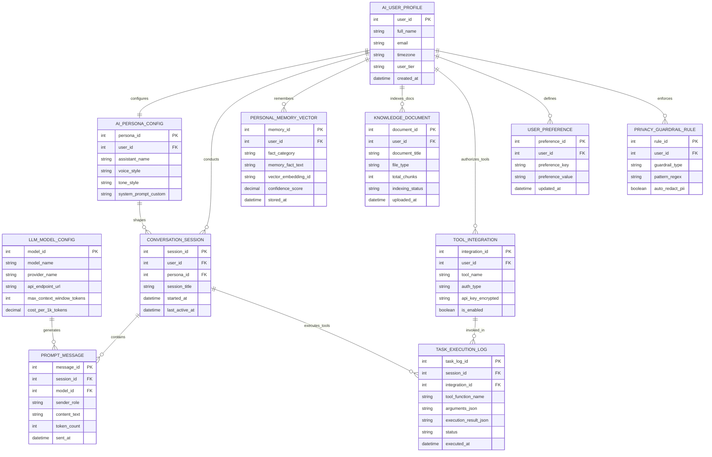

# Conceptual ERD — Personal AI Assistant Management System

## Mermaid Code

## Entity Description Table | Bảng mô tả Entity

| # | Entity Name | Vietnamese Name | Description | Key Attributes | Main Relationships |
|---|-------------|-----------------|-------------|----------------|-------------------|
| 1 | AI_USER_PROFILE | Hồ sơ Người dùng AI | Primary user account profile managing tier, timezone, and personal preferences. | user_id (PK), full_name, email, timezone, user_tier | Configures Persona, conducts Sessions, remembers Memory Vectors, owns Documents |
| 2 | AI_PERSONA_CONFIG | Cấu hình Persona AI | Customized AI assistant personality (Name, Tone, System Prompt, Voice Clone). | persona_id (PK), user_id (FK), assistant_name, voice_style, system_prompt_custom | Configured by User Profile, shapes Conversation Sessions |
| 3 | LLM_MODEL_CONFIG | Cấu hình Model LLM | LLM model endpoint configuration (OpenAI, Anthropic, Ollama, vLLM) and pricing specs. | model_id (PK), model_name, provider_name, api_endpoint_url, max_context_window_tokens | Generates Prompt Messages |
| 4 | CONVERSATION_SESSION | Phiên Trò chuyện AI | Active or archived chat session grouping turns between user and AI assistant. | session_id (PK), user_id (FK), persona_id (FK), session_title, started_at | Conducted by User Profile, shaped by Persona, contains Prompt Messages |
| 5 | PROMPT_MESSAGE | Message Lượt Trò chuyện | Individual conversation message turn storing text, role (user/assistant/system), and tokens. | message_id (PK), session_id (FK), model_id (FK), sender_role, content_text, token_count | Belongs to Conversation Session, generated by LLM Model |
| 6 | PERSONAL_MEMORY_VECTOR | Vector Bộ nhớ Cá nhân | Extracted personal user memory fact (preferences, family, goals) stored as vector embeddings. | memory_id (PK), user_id (FK), fact_category, memory_fact_text, vector_embedding_id | Remembered by AI User Profile |
| 7 | KNOWLEDGE_DOCUMENT | Tài liệu Knowledge Base | Personal document (PDF, Markdown, Web Page) chunked and indexed in vector database for RAG. | document_id (PK), user_id (FK), document_title, file_type, total_chunks, indexing_status | Indexed by AI User Profile |
| 8 | TOOL_INTEGRATION | Tích hợp Công cụ API | Authorized third-party tool API credential (Google Calendar, Outlook, Home Assistant, Zapier). | integration_id (PK), user_id (FK), tool_name, auth_type, is_enabled | Authorized by User Profile, invoked in Task Execution Logs |
| 9 | TASK_EXECUTION_LOG | Nhật ký Thực thi Tool | Audit log capturing autonomous tool function calls, arguments, and return receipts. | task_log_id (PK), session_id (FK), integration_id (FK), tool_function_name, status | Executed in Conversation Session, invoked via Tool Integration |
| 10 | USER_PREFERENCE | Tùy chọn Cá nhân | Key-value store of explicit user preferences (e.g. Temperature Units, Favorite News Categories). | preference_id (PK), user_id (FK), preference_key, preference_value | Defined by AI User Profile |
| 11 | PRIVACY_GUARDRAIL_RULE | Quy tắc Bảo mật PII | Security guardrail rule defining PII regex patterns and auto-redaction settings. | rule_id (PK), user_id (FK), guardrail_type, pattern_regex, auto_redact_pii | Enforced by AI User Profile |

## Relationship Description | Mô tả Quan hệ

| # | From Entity | Cardinality | To Entity | Relationship Label | Business Explanation |
|---|-------------|-------------|-----------|-------------------|----------------------|
| 1 | AI_USER_PROFILE | one-to-one | AI_PERSONA_CONFIG | configures | An AI User Profile configures an AI Persona Config. |
| 2 | AI_USER_PROFILE | one-to-many | CONVERSATION_SESSION | conducts | An AI User Profile conducts multiple Conversation Sessions. |
| 3 | AI_USER_PROFILE | one-to-many | PERSONAL_MEMORY_VECTOR | remembers | An AI User Profile remembers multiple Personal Memory Vectors. |
| 4 | AI_USER_PROFILE | one-to-many | KNOWLEDGE_DOCUMENT | indexes_docs | An AI User Profile indexes multiple Knowledge Documents for RAG. |
| 5 | AI_USER_PROFILE | one-to-many | TOOL_INTEGRATION | authorizes_tools | An AI User Profile authorizes multiple Tool Integrations. |
| 6 | AI_USER_PROFILE | one-to-many | USER_PREFERENCE | defines | An AI User Profile defines multiple User Preferences. |
| 7 | AI_USER_PROFILE | one-to-many | PRIVACY_GUARDRAIL_RULE | enforces | An AI User Profile enforces Privacy Guardrail Rules. |
| 8 | AI_PERSONA_CONFIG | one-to-many | CONVERSATION_SESSION | shapes | An AI Persona Config shapes multiple Conversation Sessions. |
| 9 | CONVERSATION_SESSION | one-to-many | PROMPT_MESSAGE | contains | A Conversation Session contains multiple Prompt Messages. |
| 10 | LLM_MODEL_CONFIG | one-to-many | PROMPT_MESSAGE | generates | An LLM Model Config generates assistant Prompt Messages. |
| 11 | CONVERSATION_SESSION | one-to-many | TASK_EXECUTION_LOG | executes_tools | A Conversation Session executes tools logged in Task Execution Logs. |
| 12 | TOOL_INTEGRATION | one-to-many | TASK_EXECUTION_LOG | invoked_in | A Tool Integration is invoked in multiple Task Execution Logs. |
