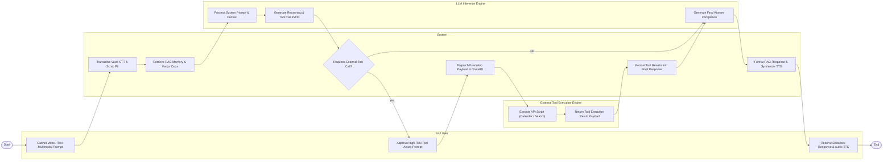

# Swimlane Diagram — Personal AI Assistant Management System

## Mermaid Code

## Flow Description | Mô tả luồng

| Lane | Actor | Role in Flow |
|------|-------|-------------|
| 1 | End User | Submits voice/text multimodal prompts (e.g. "Schedule team sync and check email"), approves high-risk tool execution prompts, and listens to synthesized TTS voice responses. |
| 2 | System | Transcribes speech to text, scrubs PII, retrieves RAG memory vectors, checks for tool calls, prompts user for confirmation, dispatches tool payloads, and synthesizes audio responses. |
| 3 | LLM Inference Engine | Ingests system prompt instructions + memory context, computes reasoning tokens, generates tool call JSON payloads, and produces final natural language completions. |
| 4 | External Tool Execution Engine | Receives authorized tool payloads, executes third-party API scripts (Google Calendar, Web Search, Home Assistant), and returns execution receipts. |
