# Action Tree — Personal AI Assistant Management System

## Mermaid Code

```mermaid
graph TD
    Root["Personal AI Assistant Management System"]

    Root --> M1["User Profile & Persona Customization"]
    Root --> M2["Multimodal Prompt & Conversation Control"]
    Root --> M3["RAG Memory & Knowledge Vector Index"]
    Root --> M4["Autonomous Agent Tool Execution"]
    Root --> M5["Privacy, Security & Ethics Guardrails"]
    Root --> M6["Usage Analytics & Model Management"]

    M1 --> A11["Register AI User Profile & Preferences"]
    M1 --> A12["Configure AI Persona System Prompts"]
    M1 --> A13["Select Custom Voice Clone TTS Style"]
    M1 --> A14["Set Tone & Response Length Rules"]

    M2 --> A21["Transcribe Microphone Audio to Text"]
    M2 --> A22["Stream Real-Time LLM Response Chunks"]
    M2 --> A23["Synthesize Text-to-Speech Audio Output"]
    M2 --> A24["Process Multimodal Vision PDF & Images"]

    M3 --> A31["Chunk & Embed Personal PDF Documents"]
    M3 --> A32["Extract Long-Term User Semantic Facts"]
    M3 --> A33["Query Vector DB for Context Ingestion"]
    M3 --> A34["Sync Notion/Obsidian Markdown Notes"]

    M4 --> A41["Schedule Calendar Events & Send Emails"]
    M4 --> A42["Execute Live Web Search Queries"]
    M4 --> A43["Control Smart Home Devices via API"]
    M4 --> A44["Run Python Code Interpreter Scripts"]

    M5 --> A51["Scrub & Redact PII Passwords/SSNs"]
    M5 --> A52["Enforce Content Safety Guardrails"]
    M5 --> A53["Inspect & Delete Stored Memory Items"]
    M5 --> A54["Execute Single-Click Hard Database Purge"]

    M6 --> A61["Track Daily LLM Token Consumption"]
    M6 --> A62["Monitor API Latency & Model Costs"]
    M6 --> A63["Configure Local Offline LLM Endpoints"]
    M6 --> A64["Manage Third-Party Tool OAuth Keys"]
```

## Module Description | Mô tả Module

| # | Module | Description | Actions |
|---|--------|-------------|---------|
| 1 | User Profile & Persona Customization | Manages user account registration, AI persona system prompt instructions, custom TTS voice style selection, and tone rules. | Register AI User Profile & Preferences, Configure AI Persona System Prompts, Select Custom Voice Clone TTS Style, Set Tone & Response Length Rules |
| 2 | Multimodal Prompt & Conversation Control | Handles voice STT transcription, real-time token streaming, speech TTS audio synthesis, and multimodal image/PDF vision analysis. | Transcribe Microphone Audio to Text, Stream Real-Time LLM Response Chunks, Synthesize Text-to-Speech Audio Output, Process Multimodal Vision PDF & Images |
| 3 | RAG Memory & Knowledge Vector Index | Chunks and embeds personal documents (PDFs, Markdown notes), extracts semantic user memory facts, and performs vector RAG retrieval. | Chunk & Embed Personal PDF Documents, Extract Long-Term User Semantic Facts, Query Vector DB for Context Ingestion, Sync Notion/Obsidian Markdown Notes |
| 4 | Autonomous Agent Tool Execution | Executes autonomous tool actions including Google/Outlook calendar events, web searches, smart home controls, and Python code interpretation. | Schedule Calendar Events & Send Emails, Execute Live Web Search Queries, Control Smart Home Devices via API, Run Python Code Interpreter Scripts |
| 5 | Privacy, Security & Ethics Guardrails | Scrubs PII from prompts, enforces content safety guardrails, allows inspection of stored memories, and executes hard database purges. | Scrub & Redact PII Passwords/SSNs, Enforce Content Safety Guardrails, Inspect & Delete Stored Memory Items, Execute Single-Click Hard Database Purge |
| 6 | Usage Analytics & Model Management | Tracks token consumption, monitors API latency and cost, connects local offline LLM endpoints (Ollama/vLLM), and manages OAuth keys. | Track Daily LLM Token Consumption, Monitor API Latency & Model Costs, Configure Local Offline LLM Endpoints, Manage Third-Party Tool OAuth Keys |
