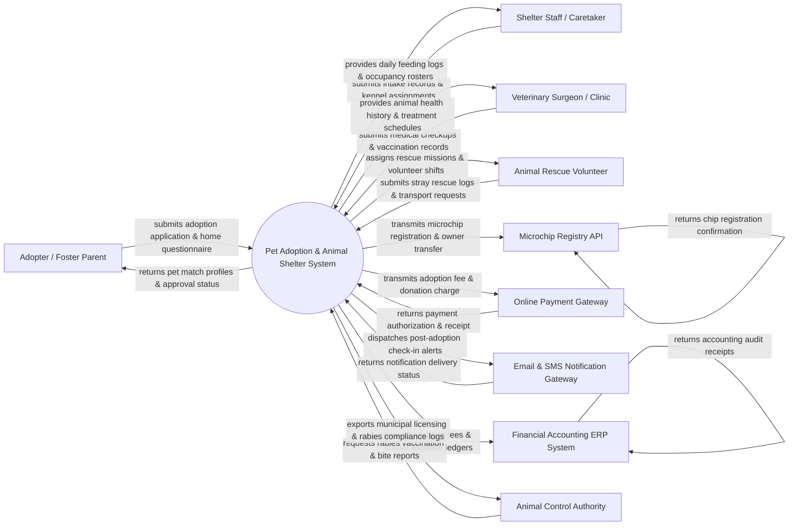

# Context Diagram — Pet Adoption & Animal Shelter System

## Mermaid Code

## Actor & Interaction Table | Bảng Actor & Tương tác

| # | Actor | Actor Type | Data Sent TO System | Data Received FROM System | Notes |
|---|-------|------------|---------------------|---------------------------|-------|
| 1 | Adopter / Foster Parent | Primary | Adoption applications, household environment details, pet preferences, foster availability, adoption fee payments | Pet profiles, application status, adoption contracts, post-adoption care guides | Individuals applying to adopt or temporarily foster rescue animals. |
| 2 | Shelter Staff / Caretaker | Primary | Animal intake data, kennel assignments, behavioral assessment notes, adoption approvals, feeding logs | Daily kennel rosters, adoption queue, feeding/exercise tasks, animal status dashboards | Staff managing day-to-day shelter operations, animal care, and adoption vetting. |
| 3 | Veterinary Surgeon / Clinic | Primary | Medical exam results, spay/neuter status, vaccination records, surgery notes, medication logs | Animal medical history, scheduled vet appointments, rabies status, treatment plans | In-house or affiliated veterinarians providing medical care to shelter animals. |
| 4 | Animal Rescue Volunteer | Primary | Stray animal sighting reports, rescue dispatch logs, animal transport updates, volunteer hours | Volunteer shift schedules, rescue pickup locations, foster assignment tasks | Volunteers assisting with field rescue, animal transport, and adoption events. |
| 5 | Microchip Registry API | Supporting System | Microchip lookup results, registration confirmation codes, chip manufacturer data | Microchip ID numbers, owner contact updates, pet description payloads | National pet microchip databases (e.g. HomeAgain, 24PetWatch) registering pet ownership. |
| 6 | Online Payment Gateway | Supporting System | Payment settlement tokens, card authorization codes, transaction status | Adoption fee payloads, shelter donation charges, spay/neuter deposit fees | Payment processor handling online adoption fees, surrender fees, and public donations. |
| 7 | Email & SMS Notification Gateway | Supporting System | Delivery receipts, SMS response codes, carrier bounce notices | Post-adoption check-in reminders, vaccination alerts, adoption drive notices | Messaging service sending adoption updates, vet reminders, and foster check-in alerts. |
| 8 | Financial Accounting ERP System | Supporting System | Chart of accounts sync, ledger audit receipts, financial reconciliation | Adoption fee revenue, vet medical expense ledgers, donation income files | Enterprise ERP or accounting software recording shelter finances and donations. |
| 9 | Animal Control Authority | Regulatory System | Rabies ordinance rules, stray hold policies, municipal license regulations | Rabies vaccination logs, bite Incident reports, municipal license exports | Municipal animal control agencies enforcing rabies licensing and stray hold laws. |

## System Boundary Description | Mô tả Phạm vi Hệ thống

The **Pet Adoption & Animal Shelter System (PAASS)** is an all-in-one software platform designed to manage animal shelter operations, pet adoption workflows, and rescue logistics. Inside the system boundary, PAASS manages animal intake records, kennel location tracking, veterinary medical histories, behavioral evaluations, adoption applications, foster care placements, microchip registration, and adoption fee intake. External to the system boundary are commercial credit card processors (Online Payment Gateway), national pet registries (Microchip Registry API), message carriers (Email & SMS Gateway), enterprise accounting platforms (Financial Accounting ERP System), and municipal regulatory bodies (Animal Control & Rabies Authority).
