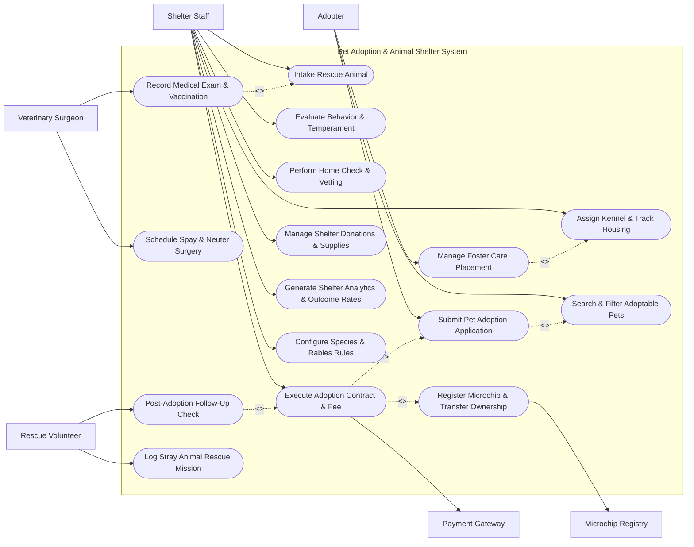

# Use Case Diagram — Pet Adoption & Animal Shelter System

## Mermaid Code

## Actor Table | Bảng Actor

| # | Actor | Actor Type | Role Description | Related Use Cases |
|---|-------|------------|------------------|-------------------|
| 1 | Shelter Staff | Primary | Caretaker or adoption counselor processing animal intake, kennel assignment, behavior checks, and adoption contracts. | UC01, UC02, UC04, UC06, UC07, UC14, UC15, UC16 |
| 2 | Adopter | Primary | Member of public searching for pets, submitting adoption applications, or applying for foster placements. | UC03, UC05, UC10 |
| 3 | Veterinary Surgeon | Primary | Medical professional conducting health exams, administering vaccinations, and performing spay/neuter surgeries. | UC08, UC09 |
| 4 | Rescue Volunteer | Primary | Volunteer field worker logging stray rescues and conducting post-adoption welfare check-ins. | UC12, UC13 |
| 5 | Microchip Registry | System | External national database registering microchip IDs and owner contact details. | UC11 |
| 6 | Payment Gateway | System | Commercial processor executing adoption fee, surrender fee, and donation transactions. | UC07 |

## Use Case Table | Bảng Use Case

| # | UC ID | Use Case Name | Primary Actor | Secondary Actor | Description | Priority |
|---|-------|---------------|---------------|-----------------|-------------|----------|
| 1 | UC01 | Intake Rescue Animal | Shelter Staff | Veterinary Surgeon | Registers new stray, surrendered, or transferred animal into shelter database with intake photos and origin. | High |
| 2 | UC02 | Assign Kennel & Track Housing | Shelter Staff | None | Assigns animal to specific kennel run, isolation ward, or cattery room based on medical/temperament status. | High |
| 3 | UC03 | Search & Filter Adoptable Pets | Adopter | None | Searches active shelter pets by species, breed, age, size, gender, temperament, and special needs. | High |
| 4 | UC04 | Evaluate Behavior & Temperament | Shelter Staff | None | Assesses animal behavior with dogs, cats, children, energy levels, and training needs. | Medium |
| 5 | UC05 | Submit Pet Adoption Application | Adopter | Shelter Staff | Completes online adoption application, home environment questionnaire, landlord approval, and household pet list. | High |
| 6 | UC06 | Perform Home Check & Vetting | Shelter Staff | Adopter | Reviews adoption application, conducts landlord verification, and performs home visit or video walkthrough. | High |
| 7 | UC07 | Execute Adoption Contract & Fee | Shelter Staff | Payment Gateway | Signs legally binding adoption contract, collects adoption fee, and releases pet to new owner. | High |
| 8 | UC08 | Record Medical Exam & Vaccination | Veterinary Surgeon | Shelter Staff | Logs intake health exam, rabies/core vaccinations, deworming, flea treatment, and medical conditions. | High |
| 9 | UC09 | Schedule Spay & Neuter Surgery | Veterinary Surgeon | Shelter Staff | Schedules and records sterilization surgery to ensure animal is altered prior to adoption. | High |
| 10 | UC10 | Manage Foster Care Placement | Adopter | Shelter Staff | Places vulnerable animals (nursing litters, medical recovery) into temporary foster homes. | Medium |
| 11 | UC11 | Register Microchip & Transfer Ownership | Shelter Staff | Microchip Registry | Scans or implants microchip ID and registers pet ownership details with national microchip database. | High |
| 12 | UC12 | Post-Adoption Follow-Up Check | Rescue Volunteer | Adopter | Conducts 30-day post-adoption welfare check-in, gathers pet adjustment updates, and provides support. | Medium |
| 13 | UC13 | Log Stray Animal Rescue Mission | Rescue Volunteer | Shelter Staff | Logs field rescue calls, stray capture location GPS coordinates, condition upon rescue, and transport status. | Medium |
| 14 | UC14 | Manage Shelter Donations & Supplies | Shelter Staff | None | Tracks pet food inventory, medical supply stock, cleaning materials, and public supply donations. | Medium |
| 15 | UC15 | Generate Shelter Analytics & Outcome Rates | Shelter Staff | None | Exports live intake vs adoption rates, Save Rate (Asilomar Accords / Live Release Rate), and average length of stay. | Medium |
| 16 | UC16 | Configure Species & Rabies Rules | Shelter Staff | None | Configures species/breed taxonomies, stray hold duration policies (e.g. 72-hour hold), and quarantine protocols. | Low |

## Use Case Specification | Đặc tả Use Case

---

### UC01 — Intake Rescue Animal

| Field | Detail |
|-------|--------|
| **UC ID** | UC01 |
| **Use Case Name** | Intake Rescue Animal |
| **Actor(s)** | Primary: Shelter Staff / Secondary: Veterinary Surgeon |
| **Description** | Processes new animal intake into the shelter system (Stray, Owner Surrender, Confiscated, Inter-Shelter Transfer), generates Animal ID, tags microchip, and queues medical exam. |
| **Precondition** | 1. Staff user is logged into Shelter Operations module.   2. Kennel space is available or intake holding area configured. |
| **Main Flow** | 1. Actor selects "New Animal Intake".   2. System presents intake form requesting Intake Type (Stray, Owner Surrender, Transfer, Legal Hold), Source Location, and Intake Date.   3. Actor inputs animal details: Species (Dog, Cat, Rabbit, etc.), Estimated Age, Primary Breed, Gender, Coat Color, and Weight.   4. Actor scans for existing microchip; if found, inputs chip number; if not found, flags for microchip implantation (UC11).   5. Actor uploads intake photographs and records physical condition (e.g. Injured, Healthy, Malnourished).   6. Actor assigns temporary holding kennel (UC02).   7. System validates data, assigns unique Animal ID (e.g. PET-2026-0891), sets status to "Stray Hold" (or "Medical Intake"), and queues initial vet exam (UC08). |
| **Alternative Flow** | **AF1** — Owner Surrender Form: If Intake Type is "Owner Surrender", Actor attaches signed owner relinquishment waiver and records surrender reason.   **AF2** — Microchip Match Returned: If scanned microchip matches existing registered owner, System alerts "Microchip Owner Match Found" and initiates owner notification workflow. |
| **Exception Flow** | **EX1** — Mandatory Stray Hold Active: For stray intakes, System enforces mandatory 72-hour stray hold period before pet can be made available for adoption.   **EX2** — Critical Medical Condition: If animal is critically injured upon intake, System sets status to "Emergency Vet Care Required" and sends urgent alert to Veterinary Surgeon. |
| **Postcondition** | An Animal_Rescue entity is created, setting initial shelter status, assigning holding kennel, and queuing medical assessment. |
| **Business Rule** | **BR1**: All stray intakes must undergo a mandatory minimum 72-hour stray hold search period prior to adoption placement. |

---

### UC03 — Search & Filter Adoptable Pets

| Field | Detail |
|-------|--------|
| **UC ID** | UC03 |
| **Use Case Name** | Search & Filter Adoptable Pets |
| **Actor(s)** | Primary: Adopter / Secondary: None |
| **Description** | Allows prospective adopters to browse public pet listings, filter by species, breed, age, size, gender, and temperament, and view detailed pet profiles and video clips. |
| **Precondition** | 1. Animals have completed stray hold, medical clearance, and spay/neuter surgery.   2. Animal status is set to "Available for Adoption". |
| **Main Flow** | 1. Actor opens Public Pet Adoption Portal.   2. System displays gallery of available pets with high-resolution photos, names, species icons, ages, and location tags.   3. Actor applies search filters: Species (Dog, Cat), Age Group (Puppy/Kitten, Adult, Senior), Size (Small, Medium, Large), Good with Kids/Dogs/Cats, and Special Needs.   4. System filters adoption catalog in real-time and updates display gallery.   5. Actor clicks a pet profile card (e.g., "Max - 2yo Golden Retriever Mix").   6. System displays detailed pet profile: personality description, medical history summary, spay/neuter status, microchip ID, video clips, and adoption fee.   7. Actor clicks "Apply to Adopt [Pet Name]" to launch UC05. |
| **Alternative Flow** | **AF1** — Favorite Pets List: Adopter clicks "Save to Favorites", and System stores pet list in user session for comparison.   **AF2** — Pet Matching Quiz: Adopter completes 5-question lifestyle quiz; System calculates compatibility percentage match for each pet. |
| **Exception Flow** | **EX1** — Pet Adoption Pending: If pet has a pending approved application, System displays banner "Adoption Pending" on profile.   **EX2** — No Matching Pets: If filters yield 0 matches, System displays "No pets found matching criteria" and suggests expanding search filters. |
| **Postcondition** | Adopter views detailed pet profile and initiates formal adoption application process. |
| **Business Rule** | **BR1**: Only animals with status "Available for Adoption" and verified spay/neuter clearance can be displayed on the public adoption search portal. |

---

### UC05 — Submit Pet Adoption Application

| Field | Detail |
|-------|--------|
| **UC ID** | UC05 |
| **Use Case Name** | Submit Pet Adoption Application |
| **Actor(s)** | Primary: Adopter / Secondary: Shelter Staff |
| **Description** | Enables a prospective adopter to complete an online adoption questionnaire detailing housing type, landlord authorization, existing pets, and pet care experience. |
| **Precondition** | 1. Adopter has selected an available pet (UC03).   2. Adopter is logged into adoption portal or applying as a guest. |
| **Main Flow** | 1. Actor selects "Apply to Adopt" on chosen pet's profile.   2. System opens Adoption Application form.   3. Actor inputs personal details: Full Name, Address, Phone, Email, ID Number.   4. Actor completes housing section: Residence Type (Own House, Rent Apartment, Condo), Yard Fencing status, and Landlord Contact Info (if renting).   5. Actor completes household section: Adults count, Children ages, and list of Current Household Pets (Species, Vaccination status, Spay/Neuter status).   6. Actor enters Primary Veterinarian reference details.   7. Actor submits application.   8. System validates required fields, assigns Application ID (e.g. ADP-2026-0391), links application to Pet ID, sets status to "Pending Staff Vetting", and alerts Shelter Staff. |
| **Alternative Flow** | **AF1** — General Pre-Approval Application: Adopter submits application without selecting a specific pet; System stores application as "General Pre-Approved Adopter".   **AF2** — Foster-to-Adopt Application: Adopter applies for temporary foster care placement (UC10) with option to permanently adopt. |
| **Exception Flow** | **EX1** — Landlord Permission Missing: If applicant rents and leaves landlord contact empty, System blocks submission with error "Landlord contact required for renters."   **EX2** — Multiple Applications Submitted: If 3 applications already exist for the same pet, System alerts "High Interest Pet: Your application will be placed in review queue." |
| **Postcondition** | An Adoption_Application entity is created in status "Under Review", queuing the application for staff vetting (UC06). |
| **Business Rule** | **BR1**: Applicants renting their residence must provide verified landlord approval for pet ownership prior to application approval. |

---

### UC08 — Record Medical Exam & Vaccination

| Field | Detail |
|-------|--------|
| **UC ID** | UC08 |
| **Use Case Name** | Record Medical Exam & Vaccination |
| **Actor(s)** | Primary: Veterinary Surgeon / Secondary: Shelter Staff |
| **Description** | Logs clinical health examinations, rabies and core vaccinations (DHPP, FVRCP), deworming treatments, heartworm/FeLV testing, and prescription medications. |
| **Precondition** | 1. Animal intake (UC01) is registered.   2. User is logged in as a licensed Veterinary Surgeon or Vet Tech. |
| **Main Flow** | 1. Actor opens Animal Medical Records module and selects target Animal ID.   2. System displays animal health history and current medical status.   3. Actor selects "Record Clinical Exam".   4. Actor records physical findings: Weight, Body Condition Score (1-9), Dental Health, Eye/Ear condition, Heart/Lung auscultation.   5. Actor enters administered vaccinations: Rabies vaccine serial/lot number, Core Vaccine (DHPP/FVRCP), Administered Date, and Next Due Date.   6. Actor records diagnostic test results (e.g. Heartworm Negative, FeLV/FIV Negative) and deworming treatments.   7. Actor submits medical log.   8. System updates Vet_Medical_Record and Vaccination_Log entities, recalculates rabies compliance status, and generates official Rabies Certificate PDF. |
| **Alternative Flow** | **AF1** — Medical Quarantine Flag: If infectious disease is detected (e.g. Parvovirus, Ringworm), Vet sets medical status to "Quarantine", and System updates kennel status (UC02) to isolation ward.   **AF2** — Prescription Order: Vet prescribes medication (e.g. Antibiotics); System queues daily medication tasks for Shelter Staff. |
| **Exception Flow** | **EX1** — Missing Vaccine Lot Number: If Rabies vaccine lot number is omitted, System alerts "Vaccine serial/lot number mandatory for legal rabies certificate."   **EX2** — Animal Too Young for Rabies: If animal age is under 12 weeks, System defers rabies vaccination and schedules alert for 16-week mark. |
| **Postcondition** | Vet_Medical_Record and Vaccination_Log entries are updated, certifying medical readiness for adoption or foster placement. |
| **Business Rule** | **BR1**: Every adopted animal must possess a legally valid Rabies Vaccination Certificate administered by a licensed veterinarian. |

---

### UC11 — Register Microchip & Transfer Ownership

| Field | Detail |
|-------|--------|
| **UC ID** | UC11 |
| **Use Case Name** | Register Microchip & Transfer Ownership |
| **Actor(s)** | Primary: Shelter Staff / Secondary: Microchip Registry |
| **Description** | Implants or verifies a 15-digit ISO pet microchip, registers chip details, and transfers official pet ownership records to the adopter in national microchip databases. |
| **Precondition** | 1. Adoption contract (UC07) is signed and fee paid.   2. Animal has a 15-digit microchip implanted or assigned. |
| **Main Flow** | 1. Actor scans animal microchip to verify 15-digit ISO chip number (e.g. 985141002349012).   2. Actor selects "Execute Microchip Ownership Transfer" from finalized adoption screen.   3. System populates transfer payload: Microchip ID, Pet Name, Species, Breed, Color, New Owner Full Name, Address, Phone, and Email.   4. System transmits registration request API payload to Microchip Registry API.   5. Microchip Registry processes payload and returns registration confirmation code (e.g. REG-HOME-883902).   6. System stores Microchip_Registration record, marks microchip status as "Registered to Adopter", and emails registration certificate to adopter. |
| **Alternative Flow** | **AF1** — Microchip Implantation at Shelter: Vet tech implants chip prior to adoption, scans number into system, and flags chip as "Implanted - Pending Transfer".   **AF2** — Dual Registry Registration: System simultaneously registers chip with secondary municipal animal licensing database. |
| **Exception Flow** | **EX1** — Registry API Connection Error: If Microchip Registry API is unreachable, System saves registration in "Pending Registry Queue" and auto-retries every hour.   **EX2** — Invalid Microchip Format: If scanned chip number is not 15 digits, System displays error "Invalid ISO Microchip format (Must be 15 digits)." |
| **Postcondition** | Microchip_Registration is recorded, legally linking the microchip ID to the new adopter across national pet registries. |
| **Business Rule** | **BR1**: No animal may leave the shelter upon adoption without a verified implanted 15-digit ISO microchip registered to the adopter. |
