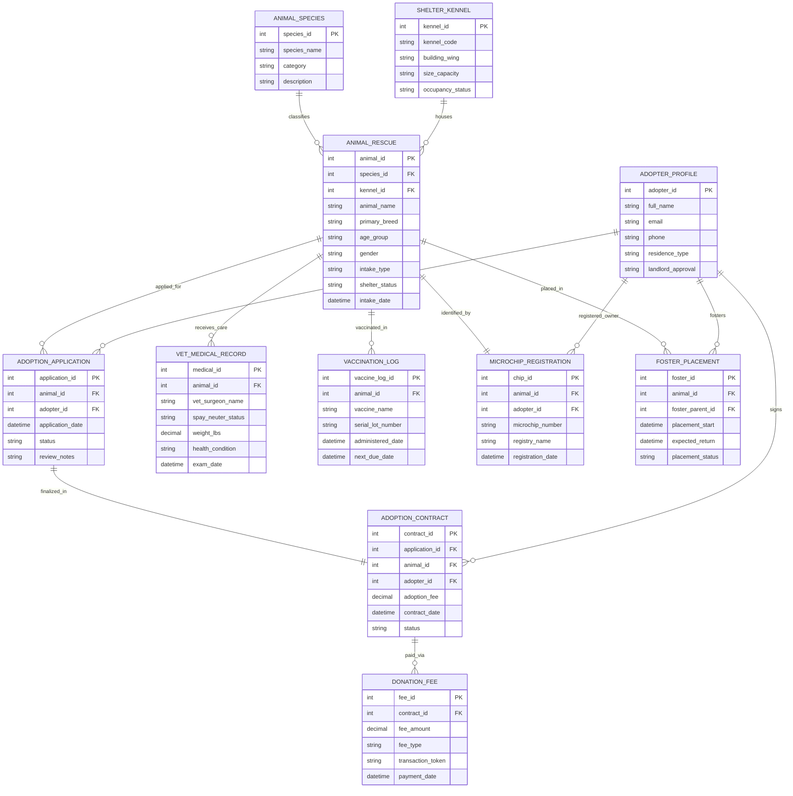

# Conceptual ERD — Pet Adoption & Animal Shelter System

## Mermaid Code

## Entity Description Table | Bảng mô tả Entity

| # | Entity Name | Vietnamese Name | Description | Key Attributes | Main Relationships |
|---|-------------|-----------------|-------------|----------------|-------------------|
| 1 | ANIMAL_SPECIES | Phân loại Loài | Species classification taxonomy (Dog, Cat, Rabbit, Bird, Exotic). | species_id (PK), species_name, category | Classifies Animal Rescues |
| 2 | SHELTER_KENNEL | Chuồng / Kennel | Physical kennel run, cattery condo, or isolation ward housing an animal inside the shelter. | kennel_id (PK), kennel_code, building_wing, occupancy_status | Houses Animal Rescues |
| 3 | ANIMAL_RESCUE | Thú cưng Cứu hộ | Primary rescue animal profile including intake details, species, breed, age, and shelter status. | animal_id (PK), species_id (FK), kennel_id (FK), animal_name, primary_breed, shelter_status | Classed by Species, housed in Kennel, applied for in Applications, receives Medical Records |
| 4 | ADOPTER_PROFILE | Hồ sơ Người Nhận nuôi | Profile of registered adopter or foster parent including residence details and vetting status. | adopter_id (PK), full_name, email, residence_type, landlord_approval | Submits Adoption Applications, signs Contracts, fosters Pets, registered in Microchips |
| 5 | ADOPTION_APPLICATION | Đơn Xin Nhận nuôi | Formal application submitted by an adopter for a specific rescue pet, including housing details. | application_id (PK), animal_id (FK), adopter_id (FK), status, application_date | Applied for Animal Rescue, submitted by Adopter, finalized in Adoption Contract |
| 6 | ADOPTION_CONTRACT | Hợp đồng Nhận nuôi | Legal contract executing adoption ownership transfer, fee payment, and post-care terms. | contract_id (PK), application_id (FK), animal_id (FK), adopter_id (FK), adoption_fee | Finalizes Adoption Application, signed by Adopter, paid via Donation Fees |
| 7 | VET_MEDICAL_RECORD | Hồ sơ Y tế Thú y | Clinical health checkup findings, weight tracking, medical treatments, and spay/neuter status. | medical_id (PK), animal_id (FK), vet_surgeon_name, spay_neuter_status, exam_date | Receives care for Animal Rescue |
| 8 | VACCINATION_LOG | Nhật ký Tiêm phòng | Immunization log tracking rabies, core vaccines, lot serial numbers, and expiration dates. | vaccine_log_id (PK), animal_id (FK), vaccine_name, serial_lot_number, administered_date | Vaccinated in for Animal Rescue |
| 9 | MICROCHIP_REGISTRATION | Đăng ký Microchip | National pet microchip registration record linking 15-digit ISO chip number to adopter. | chip_id (PK), animal_id (FK), adopter_id (FK), microchip_number, registry_name | Identifies Animal Rescue, registered to Adopter |
| 10 | FOSTER_PLACEMENT | Nhận Trông nuôi Foster | Temporary placement record for animals staying with approved foster care families. | foster_id (PK), animal_id (FK), foster_parent_id (FK), placement_start, placement_status | Placed in for Animal Rescue, fostered by Adopter |
| 11 | DONATION_FEE | Phí Nhận nuôi / Quyên góp | Financial fee payment or shelter donation transaction processing. | fee_id (PK), contract_id (FK), fee_amount, fee_type, transaction_token | Pays Adoption Contract |

## Relationship Description | Mô tả Quan hệ

| # | From Entity | Cardinality | To Entity | Relationship Label | Business Explanation |
|---|-------------|-------------|-----------|-------------------|----------------------|
| 1 | ANIMAL_SPECIES | one-to-many | ANIMAL_RESCUE | classifies | An Animal Species classifies multiple Animal Rescues. |
| 2 | SHELTER_KENNEL | one-to-many | ANIMAL_RESCUE | houses | A Shelter Kennel houses one or more Animal Rescues over time. |
| 3 | ANIMAL_RESCUE | one-to-many | ADOPTION_APPLICATION | applied_for | An Animal Rescue receives multiple Adoption Applications. |
| 4 | ADOPTER_PROFILE | one-to-many | ADOPTION_APPLICATION | submits | An Adopter Profile submits multiple Adoption Applications. |
| 5 | ADOPTION_APPLICATION | one-to-one | ADOPTION_CONTRACT | finalized_in | An approved Application is finalized in an Adoption Contract. |
| 6 | ADOPTER_PROFILE | one-to-many | ADOPTION_CONTRACT | signs | An Adopter Profile signs multiple Adoption Contracts. |
| 7 | ANIMAL_RESCUE | one-to-many | VET_MEDICAL_RECORD | receives_care | An Animal Rescue receives care recorded in Vet Medical Records. |
| 8 | ANIMAL_RESCUE | one-to-many | VACCINATION_LOG | vaccinated_in | An Animal Rescue receives vaccinations logged in Vaccination Logs. |
| 9 | ANIMAL_RESCUE | one-to-one | MICROCHIP_REGISTRATION | identified_by | An Animal Rescue is identified by a unique Microchip Registration. |
| 10 | ADOPTER_PROFILE | one-to-many | MICROCHIP_REGISTRATION | registered_owner | An Adopter Profile is the registered owner in Microchip Registrations. |
| 11 | ANIMAL_RESCUE | one-to-many | FOSTER_PLACEMENT | placed_in | An Animal Rescue is placed in multiple Foster Placements. |
| 12 | ADOPTER_PROFILE | one-to-many | FOSTER_PLACEMENT | fosters | An Adopter Profile fosters multiple animals via Foster Placements. |
| 13 | ADOPTION_CONTRACT | one-to-many | DONATION_FEE | paid_via | An Adoption Contract is paid via Donation Fees. |
