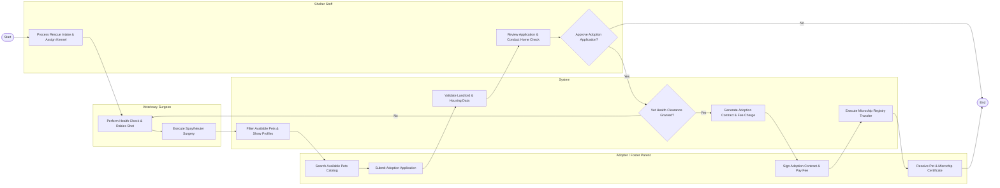

# Swimlane Diagram — Pet Adoption & Animal Shelter System

## Mermaid Code

## Flow Description | Mô tả luồng

| Lane | Actor | Role in Flow |
|------|-------|-------------|
| 1 | Adopter / Foster Parent | Searches adoption catalog, submits application with housing information, signs adoption agreement, pays fees, and receives pet with microchip certificate. |
| 2 | System | Filters pet profiles, verifies application housing rules, validates medical readiness, generates adoption agreements, and transfers microchip registration via API. |
| 3 | Shelter Staff | Registers animal intake, assigns kennels, evaluates adoption applications, conducts landlord/home vetting, and authorizes adoption approvals. |
| 4 | Veterinary Surgeon | Performs health examinations, administers rabies and core vaccinations, executes spay/neuter surgeries, and grants medical release. |
