# Action Tree — Pet Adoption & Animal Shelter System

## Mermaid Code

```mermaid
graph TD
    Root["Pet Adoption & Animal Shelter System"]

    Root --> M1["Animal Intake & Kennel Management"]
    Root --> M2["Medical & Veterinary Care"]
    Root --> M3["Adoption & Matchmaking"]
    Root --> M4["Foster Care Management"]
    Root --> M5["Volunteer & Rescue Operations"]
    Root --> M6["Licensing & Municipal Compliance"]

    M1 --> A11["Register Animal Intake Record"]
    M1 --> A12["Assign Kennel & Housing Ward"]
    M1 --> A13["Track Stray Hold Countdown"]
    M1 --> A14["Evaluate Behavior & Temperament"]

    M2 --> A21["Log Clinical Examination Results"]
    M2 --> A22["Administer Rabies & Core Vaccines"]
    M2 --> A23["Schedule Spay/Neuter Surgery"]
    M2 --> A24["Track Quarantine & Medical Isolation"]

    M3 --> A31["Search & Filter Adoptable Pets"]
    M3 --> A32["Submit Pet Adoption Application"]
    M3 --> A33["Perform Landlord & Home Vetting"]
    M3 --> A34["Execute Contract & Fee Payment"]

    M4 --> A41["Recruit & Onboard Foster Families"]
    M4 --> A42["Place Vulnerable Pets in Foster"]
    M4 --> A43["Track Foster Check-Ins & Supplies"]
    M4 --> A44["Convert Foster to Permanent Adoption"]

    M5 --> A51["Log Field Rescue Missions"]
    M5 --> A52["Schedule Volunteer Feeding Shifts"]
    M5 --> A53["Organize Public Adoption Drives"]
    M5 --> A54["Conduct Post-Adoption Follow-Ups"]

    M6 --> A61["Register Microchip ID with API"]
    M6 --> A62["Export Municipal Rabies Records"]
    M6 --> A63["Calculate Shelter Save Rates"]
    M6 --> A64["Generate Financial Audit Reports"]
```

## Module Description | Mô tả Module

| # | Module | Description | Actions |
|---|--------|-------------|---------|
| 1 | Animal Intake & Kennel Management | Manages stray/surrender intake registrations, kennel housing assignments, stray hold tracking, and behavioral evaluations. | Register Animal Intake Record, Assign Kennel & Housing Ward, Track Stray Hold Countdown, Evaluate Behavior & Temperament |
| 2 | Medical & Veterinary Care | Controls clinical health checkups, rabies and core immunizations, spay/neuter surgery scheduling, and medical quarantine logs. | Log Clinical Examination Results, Administer Rabies & Core Vaccines, Schedule Spay/Neuter Surgery, Track Quarantine & Medical Isolation |
| 3 | Adoption & Matchmaking | Facilitates public pet searches, online adoption applications, landlord/home vetting checks, and adoption contract execution. | Search & Filter Adoptable Pets, Submit Pet Adoption Application, Perform Landlord & Home Vetting, Execute Contract & Fee Payment |
| 4 | Foster Care Management | Coordinates foster family recruitment, places nursing litters and recovering pets in foster homes, and tracks foster supplies. | Recruit & Onboard Foster Families, Place Vulnerable Pets in Foster, Track Foster Check-Ins & Supplies, Convert Foster to Permanent Adoption |
| 5 | Volunteer & Rescue Operations | Oversees stray rescue field missions, volunteer shift rosters, public adoption events, and 30-day post-adoption check-ins. | Log Field Rescue Missions, Schedule Volunteer Feeding Shifts, Organize Public Adoption Drives, Conduct Post-Adoption Follow-Ups |
| 6 | Licensing & Municipal Compliance | Registers microchip ownership via external APIs, exports municipal rabies licensing reports, and calculates live release save rates. | Register Microchip ID with API, Export Municipal Rabies Records, Calculate Shelter Save Rates, Generate Financial Audit Reports |
