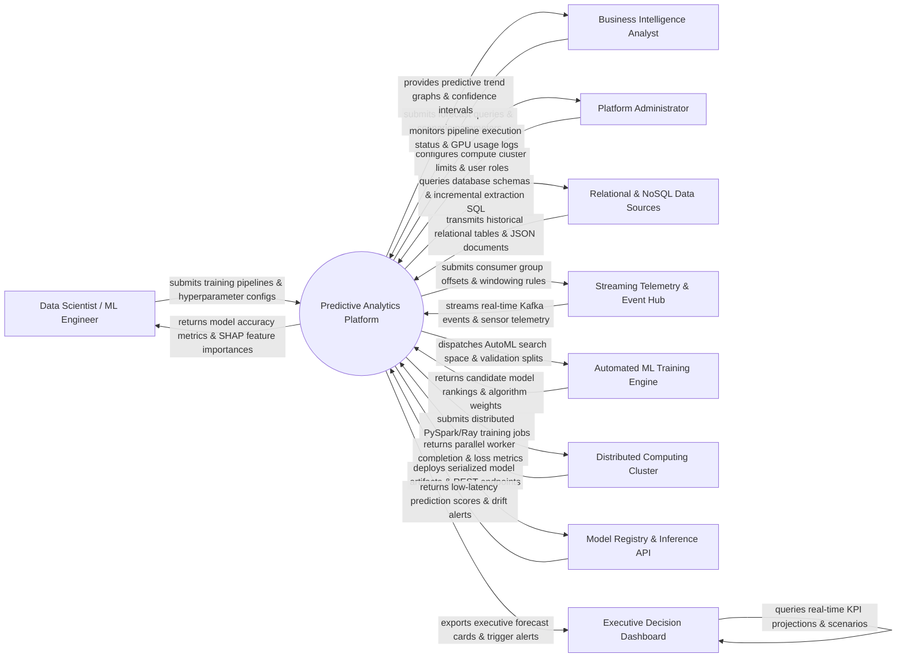

# Context Diagram — Predictive Analytics Platform

## Mermaid Code

## Actor & Interaction Table | Bảng Actor & Tương tác

| # | Actor | Actor Type | Data Sent TO System | Data Received FROM System | Notes |
|---|-------|------------|---------------------|---------------------------|-------|
| 1 | Data Scientist / ML Engineer | Primary | Machine learning pipeline scripts, hyperparameter search grids, feature transformations, cross-validation settings | Model performance metrics (AUC-ROC, RMSE, F1), SHAP/LIME feature importance plots, model evaluation reports | Primary data science professionals building, tuning, and deploying predictive machine learning models. |
| 2 | Business Intelligence Analyst | Primary | What-if scenario parameters, forecast time-horizon queries, business risk thresholds, SQL query templates | Predictive trend forecasts, 95% confidence intervals, automated anomaly alerts, interactive scenario charts | Business analysts consuming predictive insights for demand forecasting, churn prediction, or pricing. |
| 3 | Platform Administrator | Primary | Distributed compute cluster memory/GPU quotas, user access roles, data encryption keys, pipeline retry policies | Infrastructure GPU/CPU utilization graphs, job failure alerts, queue backlog depth, user activity logs | System admin managing platform cluster hardware resources, user permissions, and pipeline security. |
| 4 | Relational & NoSQL Data Sources | Supporting System | Historical transactional tables, customer profile JSON documents, financial ledgers, time-series data | Incremental ETL extraction queries, database schema metadata requests, connector heartbeats | Enterprise data stores (Snowflake, PostgreSQL, MongoDB, BigQuery) supplying historical training data. |
| 5 | Streaming Telemetry & Event Hub | Supporting System | Real-time Kafka event streams, IoT sensor telemetry, clickstream web logs, financial trade feeds | Consumer group offset commits, sliding time-window partition definitions, stream filter rules | Distributed messaging systems (Apache Kafka, AWS Kinesis) providing real-time data for online prediction. |
| 6 | Automated ML Training Engine | Supporting System | Ranked candidate model architectures, hyperparameter optimization results (Bayesian Opt), AutoML weights | Automated feature engineering pipelines, cross-validation splits, target optimization metrics (Loss, Accuracy) | AutoML engine (H2O.ai, Auto-Sklearn, FLAML) automating model selection and hyperparameter tuning. |
| 7 | Distributed Computing Cluster | Supporting System | Parallel worker node execution receipts, distributed gradient descent loss logs, memory state | Distributed training job DAGs (PySpark, Ray, Dask), tensor batch distributions, worker allocation | Distributed cluster infrastructure executing large-scale data transformation and model training. |
| 8 | Model Registry & Inference API | Supporting System | Low-latency inference prediction scores, prediction latencies (ms), model drift metric vectors | Serialized model artifacts (ONNX, Pickle, MLflow), REST/gRPC container deployment manifests | ML model registry (MLflow) and low-latency inference serving engine (Triton, TorchServe) returning predictions. |
| 9 | Executive Decision Support Dashboard | Supporting System | Executive query payloads, decision trigger threshold overrides, report filter selections | Real-time predictive KPI projections, automated anomaly alerts, business action recommendations | Executive BI dashboard (Tableau, PowerBI, custom web UI) displaying high-level predictive insights. |

## System Boundary Description | Mô tả Phạm vi Hệ thống

The **Predictive Analytics Platform (PAP)** is an enterprise machine learning and predictive intelligence engine. Inside the system boundary, PAP manages automated feature engineering, feature store indexing, AutoML algorithm candidate search, distributed model training, ML model registry governance, low-latency prediction endpoint serving, data/concept drift monitoring, and executive scenario forecasting. External to the system boundary are enterprise databases (Relational & NoSQL Data Sources), streaming event buses (Streaming Telemetry & Event Hub), automated ML tools (AutoML Engine), distributed compute clusters (Distributed Computing Cluster), low-latency inference servers (Model Registry & Inference API), and executive dashboards (Executive Decision Support Dashboard).
