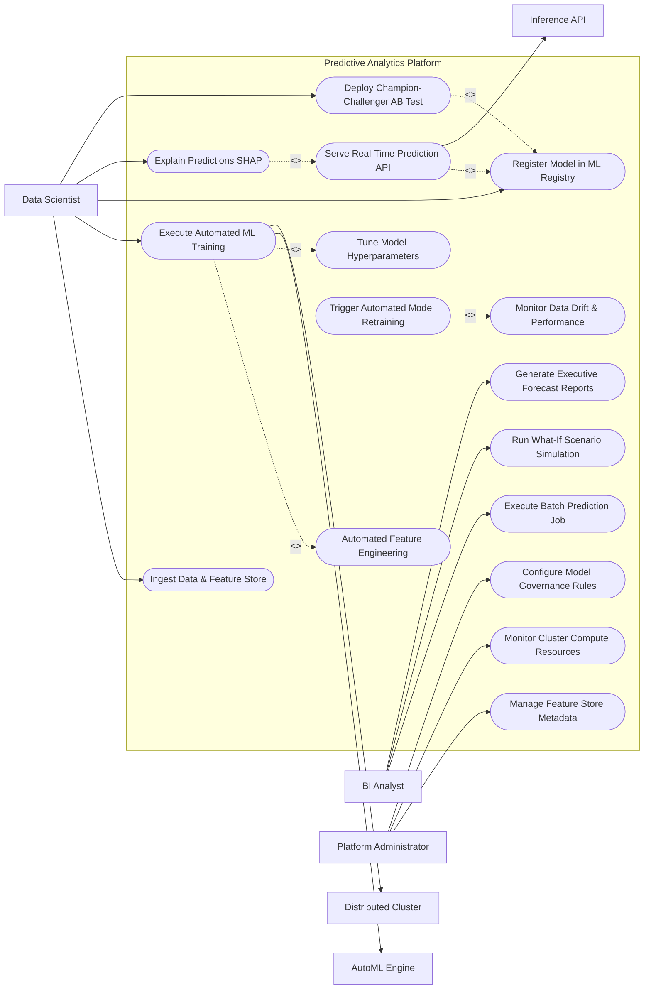

# Use Case Diagram — Predictive Analytics Platform

## Mermaid Code

## Actor Table | Bảng Actor

| # | Actor | Actor Type | Role Description | Related Use Cases |
|---|-------|------------|------------------|-------------------|
| 1 | Data Scientist | Primary | Data scientist constructing feature stores, training ML models, registering model artifacts, and explaining predictions. | UC01, UC03, UC07, UC09, UC11 |
| 2 | BI Analyst | Primary | Business intelligence analyst running batch predictions, executing what-if scenario simulations, and reading forecast reports. | UC06, UC10, UC13 |
| 3 | Platform Administrator | Primary | System administrator managing feature store metadata, monitoring cluster compute quotas, and configuring security rules. | UC14, UC15, UC16 |
| 4 | AutoML Engine | System | Automated machine learning engine performing algorithm candidate search and hyperparameter optimization. | UC03 |
| 5 | Distributed Cluster | System | Apache Spark or Ray distributed computing cluster executing parallel training jobs across GPU nodes. | UC03 |
| 6 | Inference API | System | Model serving REST/gRPC endpoint serving low-latency prediction scores to consuming systems. | UC05 |

## Use Case Table | Bảng Use Case

| # | UC ID | Use Case Name | Primary Actor | Secondary Actor | Description | Priority |
|---|-------|---------------|---------------|-----------------|-------------|----------|
| 1 | UC01 | Ingest Data & Feature Store | Data Scientist | None | Ingests data from relational/NoSQL data sources, applies feature transformations, and indexes features in the Feature Store. | High |
| 2 | UC02 | Automated Feature Engineering | Data Scientist | None | Generates automated polynomial features, time-series lag variables, frequency encodings, and missing value imputations. | High |
| 3 | UC03 | Execute Automated ML Training | Data Scientist | AutoML Engine | Runs automated machine learning search across XGBoost, LightGBM, Random Forest, and Neural Nets to select top models. | High |
| 4 | UC04 | Tune Model Hyperparameters | Data Scientist | None | Executes Bayesian optimization or grid search to fine-tune learning rates, tree depth, and regularization hyperparameters. | High |
| 5 | UC05 | Serve Real-Time Prediction API | Data Scientist | Inference API | Serves low-latency (<20ms) prediction REST/gRPC API requests for online scoring applications. | High |
| 6 | UC06 | Execute Batch Prediction Job | BI Analyst | None | Runs scheduled batch inference jobs scoring large datasets (millions of rows) stored in data warehouses. | High |
| 7 | UC07 | Register Model in ML Registry | Data Scientist | None | Version-controls trained model artifacts (Pickle/ONNX), logging training parameters, metrics, and environment dependencies. | High |
| 8 | UC08 | Monitor Data Drift & Performance | Data Scientist | None | Tracks population stability index (PSI), Kolmogorov-Smirnov (KS) drift, and prediction error degradation over time. | High |
| 9 | UC09 | Explain Predictions SHAP | Data Scientist | None | Computes SHAP (SHapley Additive exPlanations) and LIME feature attribution values for individual model predictions. | High |
| 10 | UC10 | Run What-If Scenario Simulation | BI Analyst | None | Simulates business outcomes by adjusting input feature variables (e.g., price increase +10%) to predict revenue impact. | High |
| 11 | UC11 | Deploy Champion-Challenger AB Test | Data Scientist | None | Routes live prediction traffic split (e.g. 90% Champion / 10% Challenger) to compare online model performance. | High |
| 12 | UC12 | Trigger Automated Model Retraining | Data Scientist | None | Automatically triggers pipeline execution to retrain model when performance drift exceeds threshold. | Medium |
| 13 | UC13 | Generate Executive Forecast Reports | BI Analyst | None | Generates executive predictive trend reports, confidence bounds, and business action recommendations. | Medium |
| 14 | UC14 | Manage Feature Store Metadata | Platform Administrator | None | Manages feature definitions, feature lineage tracking, time-travel point-in-time joins, and feature access rights. | Medium |
| 15 | UC15 | Monitor Cluster Compute Resources | Platform Administrator | None | Monitors distributed Spark/Ray cluster CPU, GPU, memory utilization, and pipeline execution queue depths. | Medium |
| 16 | UC16 | Configure Model Governance Rules | Platform Administrator | None | Enforces model auditability compliance, PII data masking, and model deployment sign-off approval workflows. | Low |

## Use Case Specification | Đặc tả Use Case

---

### UC01 — Ingest Data & Feature Store

| Field | Detail |
|-------|--------|
| **UC ID** | UC01 |
| **Use Case Name** | Ingest Data & Feature Store |
| **Actor(s)** | Primary: Data Scientist / Secondary: None |
| **Description** | Connects to enterprise databases, ingests raw tabular/time-series datasets, computes feature transformations, and indexes features into the Feature Store for training and online serving. |
| **Precondition** | 1. Data Scientist has access to the Predictive Analytics Platform console.   2. Source database credentials (Snowflake, BigQuery, PostgreSQL) are configured. |
| **Main Flow** | 1. Actor selects "Create Feature Group & Ingest Data".   2. System presents data connector setup: selects Data Source (e.g. `Snowflake_Customer_DB`), enters SQL Query or Table Name (`customer_transactions_view`), and sets Primary Entity Key (`customer_id`) and Event Timestamp (`transaction_time`).   3. System executes data schema discovery, validating data types (Numerical, Categorical, Datetime).   4. Actor configures feature transformations: time-series rolling aggregations (e.g., `avg_spend_30d`, `transaction_count_7d`), categorical one-hot encodings, and log transforms.   5. System computes features on distributed engine, indexes feature values in Offline Store (Parquet/Delta Lake for training) and Online Store (Redis for real-time inference).   6. System validates point-in-time correctness to prevent data leakage.   7. System stores Feature_Store_Record metadata and updates Feature Registry. |
| **Alternative Flow** | **AF1** — Streaming Event Feature Ingestion: System connects to Kafka streaming topic; computes real-time sliding window features (e.g., `login_attempts_last_5min`) directly into Redis online feature store.   **AF2** — Automated Feature Store Import: System auto-imports pre-computed feature definitions from Feast or Hopsworks feature store registry. |
| **Exception Flow** | **EX1** — Source Database Connection Failure: If database connection times out, System alerts "Database Connection Error: Verify host and VPN access."   **EX2** — High Null Value Percentage: If target column contains >40% missing values, System warns "High Null Ratio: Apply imputation transformer before saving feature." |
| **Postcondition** | Features are computed, version-controlled, and indexed in both offline storage (for model training) and online storage (for low-latency prediction serving). |
| **Business Rule** | **BR1**: Feature store joins must strictly enforce point-in-time correctness to prevent future data leakage into historical training datasets. |

---

### UC03 — Execute Automated ML Model Training

| Field | Detail |
|-------|--------|
| **UC ID** | UC03 |
| **Use Case Name** | Execute Automated ML Model Training |
| **Actor(s)** | Primary: Data Scientist / Secondary: AutoML Engine, Distributed Cluster |
| **Description** | Automatically trains, evaluates, and ranks multiple machine learning algorithm candidates (XGBoost, LightGBM, Random Forest, Neural Networks) on a target dataset. |
| **Precondition** | 1. Training dataset is ingested and features are available in the Feature Store (UC01).   2. Data Scientist has specified the target variable (e.g. `churn_flag` or `future_revenue`). |
| **Main Flow** | 1. Actor selects "New AutoML Training Run".   2. System prompts training parameters: selects Dataset (`customer_churn_v2`), Target Variable (`churn_flag`), Problem Type (Binary Classification, Multi-class, Regression, Time-Series Forecasting), Evaluation Metric (AUC-ROC, F1-Score, RMSE), and Training Time Budget (e.g. 60 minutes).   3. System splits dataset into Stratified Train (70%), Validation (15%), and Test (15%) sets.   4. System dispatches training job to AutoML Engine and Distributed Cluster (Spark/Ray GPU nodes).   5. AutoML Engine executes parallel search across multiple algorithm families (XGBoost, LightGBM, CatBoost, Logistic Regression, Deep Learning MLP).   6. AutoML Engine performs Bayesian hyperparameter optimization (UC04) tuning learning rates, tree depth, and regularization parameters per candidate.   7. System evaluates candidate models on validation set, ranks top 10 models by evaluation metric, and selects the Leader Model.   8. System generates confusion matrices, ROC curves, feature importance charts (UC09), and logs run in ML_Experiment_Run table. |
| **Alternative Flow** | **AF1** — Custom Script PyTorch Training: Data Scientist submits custom Python script defining a custom PyTorch Neural Network architecture instead of AutoML.   **AF2** — Automated Ensemble Model Stacking: AutoML Engine combines top 5 candidate models into a Stacked Ensemble model, improving predictive accuracy by 3.5%. |
| **Exception Flow** | **EX1** — Class Imbalance Warning: Target variable has extreme 99:1 class imbalance; System automatically applies SMOTE oversampling or class-weight adjustments.   **EX2** — Distributed Memory OOM Error: Worker node runs out of RAM; System automatically enables gradient accumulation and disk-swapping memory. |
| **Postcondition** | An ML_Experiment_Run record is created, ranking model candidates, generating validation metrics, and producing a serialized Leader Model ready for registration (UC07). |
| **Business Rule** | **BR1**: All automated ML training runs must perform 5-fold cross-validation to ensure model generalization and prevent overfitting on training data. |

---

### UC05 — Serve Real-Time Prediction API

| Field | Detail |
|-------|--------|
| **UC ID** | UC05 |
| **Use Case Name** | Serve Real-Time Prediction API |
| **Actor(s)** | Primary: Data Scientist / Secondary: Inference API |
| **Description** | Deploys a registered machine learning model to a high-availability REST/gRPC inference endpoint, serving sub-20ms real-time prediction requests to consuming applications. |
| **Precondition** | 1. Model artifact is registered and approved in the ML Registry (UC07).   2. Model deployment endpoint cluster is provisioned. |
| **Main Flow** | 1. Actor (or automated deployment pipeline) selects "Deploy Model to Real-Time Endpoint".   2. System configures Deployment Endpoint: Endpoint Name (`api.predict.churn.v1`), Target Model Version (`v2.4.1`), Instance Type (CPU/GPU), Auto-Scaling Limits (Min 2 / Max 20 instances), and Target Latency SLA (<20 ms).   3. System packages model artifact (ONNX/Pickle) into a lightweight Docker container with Triton or TorchServe runtime.   4. System deploys container to Kubernetes inference cluster, configures load balancer, and performs health check ping.   5. Consuming application (e.g. Web App / CRM System) dispatches HTTP POST REST request containing Entity ID payload: `{"customer_id": "CUST-9921"}`.   6. Inference API fetches real-time features from Online Feature Store (Redis via UC01), constructs feature vector, and passes vector into model.   7. Model computes prediction score (`churn_probability: 0.87`) and return payload (`prediction: 1, confidence: 0.87, high_risk: true`).   8. Inference API returns HTTP 200 JSON response to consuming application in 14 milliseconds.   9. System logs request and prediction in Prediction_Request_Log for drift tracking (UC08). |
| **Alternative Flow** | **AF1** — Direct Feature Payload Input: Consuming application passes full feature payload in JSON body instead of querying Online Feature Store.   **AF2** — Asynchronous gRPC Streaming: High-throughput application streams predictions over bidirectional gRPC connection for 100,000 predictions/sec. |
| **Exception Flow** | **EX1** — Online Feature Missing: If required feature is missing from Redis online store, System applies model default fallback value and logs "Imputed Feature Warning".   **EX2** — Inference Latency Spike (>100ms): System auto-scales additional pod instances and sends latency warning to Platform Admin. |
| **Postcondition** | Real-time prediction REST/gRPC endpoint is active, serving low-latency predictions and logging requests for drift monitoring. |
| **Business Rule** | **BR1**: Real-time prediction endpoints must maintain sub-20 millisecond p99 latency SLA and 99.99% service availability. |

---

### UC08 — Monitor Model Data Drift & Performance

| Field | Detail |
|-------|--------|
| **UC ID** | UC08 |
| **Use Case Name** | Monitor Model Data Drift & Performance |
| **Actor(s)** | Primary: Data Scientist / Secondary: None |
| **Description** | Continuously monitors deployed model inputs and outputs, computing Population Stability Index (PSI), Kolmogorov-Smirnov (KS) feature drift, and accuracy degradation alerts. |
| **Precondition** | 1. Model is deployed and actively serving batch or real-time predictions (UC05/UC06).   2. Prediction request logs are ingested into observability pipeline. |
| **Main Flow** | 1. System automatically ingests daily prediction request logs (UC05) and production feature distributions.   2. System compares production feature distributions against baseline training dataset distributions.   3. System computes statistical drift metrics per feature: Population Stability Index (PSI), Kolmogorov-Smirnov (KS) test p-values, and Jensen-Shannon divergence.   4. System computes target prediction drift (comparing distribution of predicted probabilities over time).   5. If ground truth outcome labels arrive (e.g., actual customer churn after 30 days), System computes live Accuracy, Precision, Recall, and F1-score.   6. System updates Model Observability Dashboard, rendering feature drift heatmaps and metric decay line graphs.   7. If feature PSI exceeds drift threshold (>0.25) or accuracy drops by >5%, System triggers automated UC12 (Trigger Automated Model Retraining) and alerts Data Scientist. |
| **Alternative Flow** | **AF1** — Concept Drift Detection: Feature distributions remain constant but ground truth relationship changes; System flags "Concept Drift Detected - Retraining Recommended."   **AF2** — Outlier Data Warning: System detects sudden 300% spike in anomalous feature values (e.g. data pipeline corruption) and alerts data engineering. |
| **Exception Flow** | **EX1** — Delayed Ground Truth Labels: Ground truth outcomes take 6 months to mature (e.g. loan defaults); System relies exclusively on input feature drift (PSI) for early warning alerts.   **EX2** — False Drift Alarm: Data Scientist inspects alert, confirms seasonality (e.g. Black Friday traffic spike), and adjusts baseline drift threshold. |
| **Postcondition** | Model data drift and accuracy decay metrics are continuously computed, alerting data scientists and triggering automated model retraining when thresholds breach. |
| **Business Rule** | **BR1**: Any production feature exhibiting a Population Stability Index (PSI) greater than 0.25 must automatically trigger a model drift alert. |

---

### UC11 — Deploy Champion-Challenger A/B Test

| Field | Detail |
|-------|--------|
| **UC ID** | UC11 |
| **Use Case Name** | Deploy Champion-Challenger A/B Test |
| **Actor(s)** | Primary: Data Scientist / Secondary: None |
| **Description** | Deploys a new candidate model ("Challenger") alongside the active production model ("Champion"), splitting live traffic to compare online predictive accuracy and business ROI. |
| **Precondition** | 1. Active Champion model is deployed in production (UC05).   2. New Challenger model is registered and passed offline validation (UC07). |
| **Main Flow** | 1. Actor selects "Deploy Champion-Challenger A/B Test".   2. System prompts A/B test setup: selects Active Champion Model (`v1.2`), Challenger Model (`v2.0`), Traffic Split Ratio (e.g. 90% Champion / 10% Challenger), Evaluation Metric (Conversion Rate, Revenue Lift, RMSE), and Test Duration (e.g. 14 days).   3. System updates Inference API load balancer routing rules: randomly routes incoming prediction requests according to 90/10 split based on hashed Entity ID.   4. Both models compute predictions in parallel; Inference API returns the assigned model's score to consuming application while logging both prediction scores.   5. System tracks online business outcomes (e.g., click-throughs, purchases, loan repayments) attributed to each model version.   6. System updates A/B Test Dashboard, displaying p-value statistical significance tests and conversion rate comparisons.   7. If Challenger model demonstrates statistically significant improvement (p < 0.05, +4.2% revenue lift), System prompts "Promote Challenger to Champion".   8. Actor approves promotion; System routes 100% traffic to Model v2.0 and archives Model v1.2. |
| **Alternative Flow** | **AF1** — Shadow Deployment (0% Live Traffic Impact): System routes 100% of live traffic to Champion model for application output, but simultaneously sends duplicate requests to Challenger model in background to log predictions without user risk.   **AF2** — Multi-Armed Bandit Auto-Routing: System uses Thompson Sampling algorithm to dynamically increase traffic split to whichever model delivers higher conversion rate. |
| **Exception Flow** | **EX1** — Challenger High Error Rate: Challenger model throws 500 errors on 2% of requests; System automatically halts A/B test and reverts 100% traffic to Champion.   **EX2** — Negative Business Lift: Challenger model performs worse than Champion; System alerts Data Scientist and terminates A/B test. |
| **Postcondition** | Live prediction traffic is split between Champion and Challenger models, measuring online performance and facilitating risk-free model upgrades. |
| **Business Rule** | **BR1**: Challenger models must achieve statistically significant superiority (p < 0.05) over minimum 10,000 live requests before automated promotion to Champion status. |
