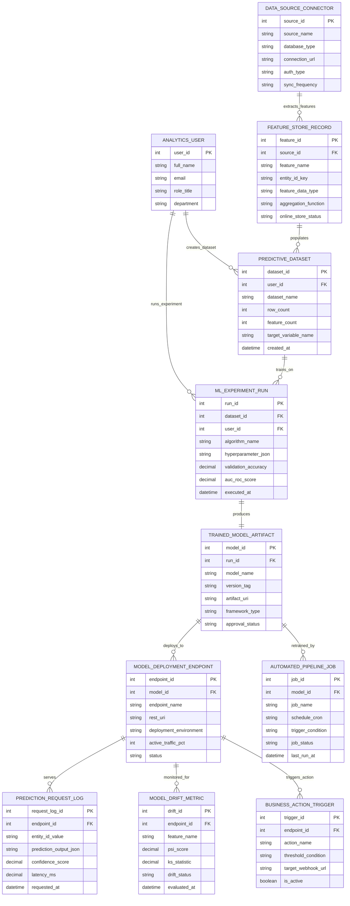

# Conceptual ERD — Predictive Analytics Platform

## Mermaid Code

## Entity Description Table | Bảng mô tả Entity

| # | Entity Name | Vietnamese Name | Description | Key Attributes | Main Relationships |
|---|-------------|-----------------|-------------|----------------|-------------------|
| 1 | ANALYTICS_USER | Người dùng Phân tích | User profile for data scientists, BI analysts, and platform admins using the platform. | user_id (PK), full_name, email, role_title, department | Creates Datasets, runs Experiment Runs |
| 2 | DATA_SOURCE_CONNECTOR | Connector Nguồn Dữ liệu | Connection descriptor to enterprise databases (Snowflake, BigQuery, PostgreSQL, Kafka). | source_id (PK), source_name, database_type, connection_url, sync_frequency | Extracts Feature Store Records |
| 3 | FEATURE_STORE_RECORD | Bản ghi Feature Store | Feature definition and transformation stored in offline (Parquet) and online (Redis) feature stores. | feature_id (PK), source_id (FK), feature_name, entity_id_key, feature_data_type | Extracted from Data Source, populates Predictive Datasets |
| 4 | PREDICTIVE_DATASET | Dataset Phân tích Dự báo | Prepared tabular dataset used for ML model training, validation, and testing. | dataset_id (PK), user_id (FK), dataset_name, row_count, target_variable_name | Created by Analytics User, populated by Features, trains Experiments |
| 5 | ML_EXPERIMENT_RUN | Lần Chạy Thử nghiệm ML | Machine learning training run execution tracking algorithm, hyperparameters, and accuracy scores. | run_id (PK), dataset_id (FK), user_id (FK), algorithm_name, validation_accuracy, auc_roc_score | Run by Analytics User, trained on Dataset, produces Model Artifact |
| 6 | TRAINED_MODEL_ARTIFACT | Artifact Model Đã Huấn luyện | Version-controlled serialized machine learning model binary (ONNX/Pickle) and metadata. | model_id (PK), run_id (FK), model_name, version_tag, artifact_uri, approval_status | Produced by Experiment Run, deploys to Endpoints, retrained by Pipeline |
| 7 | MODEL_DEPLOYMENT_ENDPOINT | Endpoint Triển khai Model | Production REST/gRPC inference endpoint serving real-time or batch prediction scores. | endpoint_id (PK), model_id (FK), endpoint_name, rest_uri, active_traffic_pct, status | Deployed from Model Artifact, serves Requests, monitored for Drift |
| 8 | PREDICTION_REQUEST_LOG | Nhật ký Yêu cầu Dự báo | High-volume log recording production prediction requests, input feature vectors, and output scores. | request_log_id (PK), endpoint_id (FK), entity_id_value, prediction_output_json, confidence_score | Served by Model Deployment Endpoint |
| 9 | MODEL_DRIFT_METRIC | Chỉ số Drift Model | Statistical metrics tracking input feature drift (PSI, KS) and accuracy degradation over time. | drift_id (PK), endpoint_id (FK), feature_name, psi_score, ks_statistic, drift_status | Monitored for Model Deployment Endpoint |
| 10 | AUTOMATED_PIPELINE_JOB | Pipeline Tự động hóa | Scheduled job running automated feature extraction, model retraining, and evaluation pipelines. | job_id (PK), model_id (FK), job_name, schedule_cron, trigger_condition, job_status | Retrains Trained Model Artifact |
| 11 | BUSINESS_ACTION_TRIGGER | Trigger Hành động Kinh doanh | Business rule trigger dispatching webhook alerts or CRM actions based on prediction scores. | trigger_id (PK), endpoint_id (FK), action_name, threshold_condition, target_webhook_url | Triggered by Model Deployment Endpoint |

## Relationship Description | Mô tả Quan hệ

| # | From Entity | Cardinality | To Entity | Relationship Label | Business Explanation |
|---|-------------|-------------|-----------|-------------------|----------------------|
| 1 | ANALYTICS_USER | one-to-many | PREDICTIVE_DATASET | creates_dataset | An Analytics User creates multiple Predictive Datasets. |
| 2 | ANALYTICS_USER | one-to-many | ML_EXPERIMENT_RUN | runs_experiment | An Analytics User runs multiple ML Experiment Runs. |
| 3 | DATA_SOURCE_CONNECTOR | one-to-many | FEATURE_STORE_RECORD | extracts_features | A Data Source Connector extracts multiple Feature Store Records. |
| 4 | FEATURE_STORE_RECORD | many-to-many | PREDICTIVE_DATASET | populates | Feature Store Records populate multiple Predictive Datasets. |
| 5 | PREDICTIVE_DATASET | one-to-many | ML_EXPERIMENT_RUN | trains_on | A Predictive Dataset is trained on across multiple ML Experiment Runs. |
| 6 | ML_EXPERIMENT_RUN | one-to-one | TRAINED_MODEL_ARTIFACT | produces | An ML Experiment Run produces a single Trained Model Artifact. |
| 7 | TRAINED_MODEL_ARTIFACT | one-to-many | MODEL_DEPLOYMENT_ENDPOINT | deploys_to | A Trained Model Artifact deploys to multiple Model Deployment Endpoints. |
| 8 | MODEL_DEPLOYMENT_ENDPOINT | one-to-many | PREDICTION_REQUEST_LOG | serves | A Model Deployment Endpoint serves continuous Prediction Request Logs. |
| 9 | MODEL_DEPLOYMENT_ENDPOINT | one-to-many | MODEL_DRIFT_METRIC | monitored_for | A Model Deployment Endpoint is monitored for Model Drift Metrics. |
| 10 | TRAINED_MODEL_ARTIFACT | one-to-many | AUTOMATED_PIPELINE_JOB | retrained_by | A Trained Model Artifact is retrained by Automated Pipeline Jobs. |
| 11 | MODEL_DEPLOYMENT_ENDPOINT | one-to-many | BUSINESS_ACTION_TRIGGER | triggers_action | A Model Deployment Endpoint triggers Business Action Triggers. |
