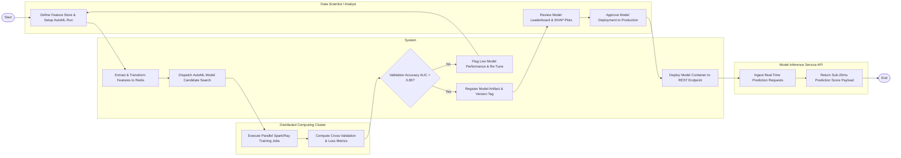

# Swimlane Diagram — Predictive Analytics Platform

## Mermaid Code

## Flow Description | Mô tả luồng

| Lane | Actor | Role in Flow |
|------|-------|-------------|
| 1 | Data Scientist / Analyst | Configures feature store transformations, initiates AutoML training runs, evaluates candidate leaderboard rankings and SHAP feature importance plots, and approves production deployment. |
| 2 | System | Extracts features into offline/online stores, dispatches AutoML candidate searches, checks validation accuracy thresholds, registers model version artifacts, and deploys model containers. |
| 3 | Distributed Computing Cluster | Executes parallel PySpark/Ray training jobs across distributed GPU worker nodes, computing cross-validation accuracy metrics and loss functions. |
| 4 | Model Inference Service API | Ingests real-time prediction REST/gRPC requests, fetches online features, computes model inference, and returns sub-20ms prediction score payloads. |
