# Action Tree — Predictive Analytics Platform

## Mermaid Code

```mermaid
graph TD
    Root["Predictive Analytics Platform"]

    Root --> M1["Data Ingestion & Feature Store Control"]
    Root --> M2["Automated ML Training & Tuning"]
    Root --> M3["Model Governance & Registry Management"]
    Root --> M4["Real-Time & Batch Prediction Inference"]
    Root --> M5["Model Drift & Observability Monitoring"]
    Root --> M6["Executive Visualization & Action Triggers"]

    M1 --> A11["Connect Relational & NoSQL Data Sources"]
    M1 --> A12["Compute Time-Series & Category Features"]
    M1 --> A13["Index Features in Redis Online Store"]
    M1 --> A14["Enforce Point-in-Time Join Correctness"]

    M2 --> A21["Execute AutoML Algorithm Candidate Search"]
    M2 --> A22["Tune Hyperparameters via Bayesian Search"]
    M2 --> A23["Dispatch Jobs to Spark/Ray Cluster"]
    M2 --> A24["Combine Top Models into Stacked Ensembles"]

    M3 --> A31["Version-Control Serialized Model Artifacts"]
    M3 --> A32["Compute SHAP & LIME Feature Attribution"]
    M3 --> A33["Deploy Champion-Challenger AB Testing"]
    M3 --> A34["Enforce Model Sign-Off Approval Workflows"]

    M4 --> A41["Serve Low-Latency REST Prediction APIs"]
    M4 --> A42["Execute Scheduled Batch Scoring Pipelines"]
    M4 --> A43["Auto-Scale Inference Pod Instances"]
    M4 --> A44["Log Prediction Outputs & Confidence"]

    M5 --> A51["Track Population Stability Index PSI Drift"]
    M5 --> A52["Monitor Kolmogorov-Smirnov Feature Drift"]
    M5 --> A53["Measure Online Accuracy & F1 Decay"]
    M5 --> A54["Trigger Automated Model Retraining Jobs"]

    M6 --> A61["Render Interactive What-If Scenario Simulations"]
    M6 --> A62["Export Executive Forecast Trend Reports"]
    M6 --> A63["Dispatch Webhook Alerts on High Risk"]
    M6 --> A64["Monitor Cluster GPU/CPU Resource Quotas"]
```

## Module Description | Mô tả Module

| # | Module | Description | Actions |
|---|--------|-------------|---------|
| 1 | Data Ingestion & Feature Store Control | Connects to enterprise databases, computes time-series/categorical features, indexes features in online Redis stores, and enforces point-in-time joins. | Connect Relational & NoSQL Data Sources, Compute Time-Series & Category Features, Index Features in Redis Online Store, Enforce Point-in-Time Join Correctness |
| 2 | Automated ML Training & Tuning | Executes AutoML candidate searches (XGBoost, LightGBM, Neural Nets), tunes hyperparameters via Bayesian optimization, and builds stacked ensembles. | Execute AutoML Algorithm Candidate Search, Tune Hyperparameters via Bayesian Search, Dispatch Jobs to Spark/Ray Cluster, Combine Top Models into Stacked Ensembles |
| 3 | Model Governance & Registry Management | Version-controls model artifacts, computes SHAP feature attributions, deploys Champion-Challenger A/B tests, and enforces approval workflows. | Version-Control Serialized Model Artifacts, Compute SHAP & LIME Feature Attribution, Deploy Champion-Challenger AB Testing, Enforce Model Sign-Off Approval Workflows |
| 4 | Real-Time & Batch Prediction Inference | Serves sub-20ms REST/gRPC prediction APIs, executes scheduled batch scoring pipelines, auto-scales inference pods, and logs outputs. | Serve Low-Latency REST Prediction APIs, Execute Scheduled Batch Scoring Pipelines, Auto-Scale Inference Pod Instances, Log Prediction Outputs & Confidence |
| 5 | Model Drift & Observability Monitoring | Tracks Population Stability Index (PSI) and Kolmogorov-Smirnov (KS) feature drift, measures F1 decay, and triggers automated retraining. | Track Population Stability Index PSI Drift, Monitor Kolmogorov-Smirnov Feature Drift, Measure Online Accuracy & F1 Decay, Trigger Automated Model Retraining Jobs |
| 6 | Executive Visualization & Action Triggers | Renders What-If scenario simulations, exports executive forecast reports, dispatches webhook alerts on high-risk scores, and tracks cluster quotas. | Render Interactive What-If Scenario Simulations, Export Executive Forecast Trend Reports, Dispatch Webhook Alerts on High Risk, Monitor Cluster GPU/CPU Resource Quotas |
