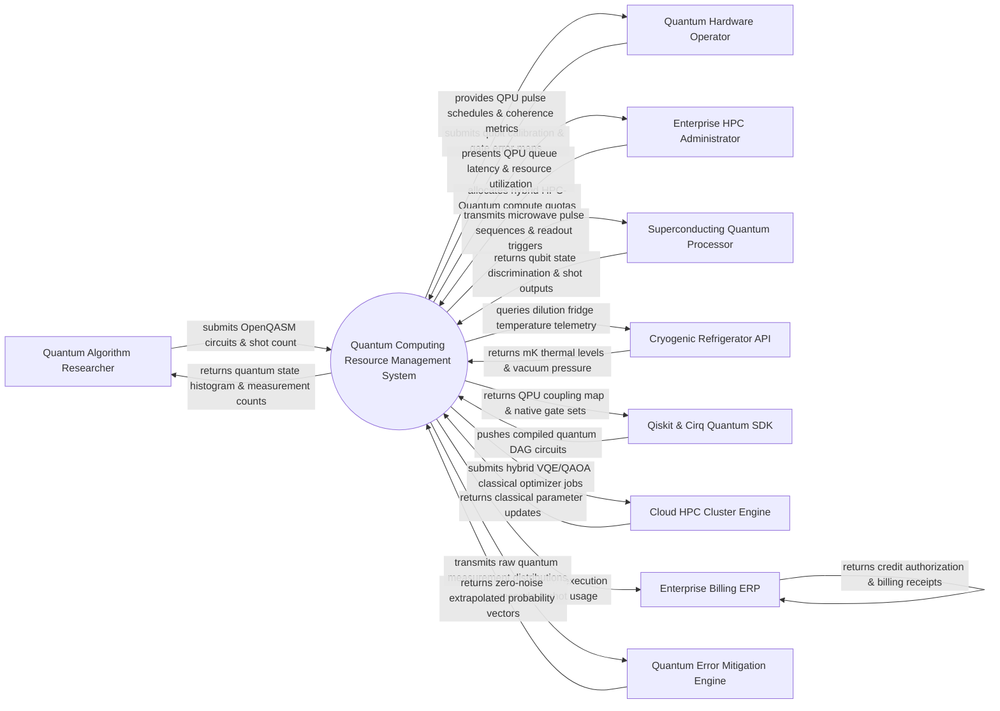

# Context Diagram — Quantum Computing Resource Management System

## Mermaid Code

## Actor & Interaction Table | Bảng Actor & Tương tác

| # | Actor | Actor Type | Data Sent TO System | Data Received FROM System | Notes |
|---|-------|------------|---------------------|---------------------------|-------|
| 1 | Quantum Algorithm Researcher | Primary | OpenQASM 3.0 circuit files, quantum algorithm parameters (VQE, QAOA), requested shot counts (e.g. 8192 shots), error mitigation choices | Quantum measurement state histograms, probability distributions, job execution status, quantum volume metrics | Physicists, data scientists, and developers executing quantum algorithms. |
| 2 | Quantum Hardware Operator | Primary | Qubit coherence times (T1/T2 relaxation), Single/Two-qubit gate error matrices, pulse calibration tables, microwave frequency tunings | Daily QPU calibration status, gate fidelity drift warnings, pulse sequence preview graphs | Quantum hardware engineers managing physical superconducting or trapped-ion QPUs. |
| 3 | Enterprise HPC Administrator | Primary | Hybrid HPC-Quantum user quotas, queue priority policies, maximum circuit depth limits, user access roles | QPU utilization percentages, queue wait-time analytics, thermal safety alerts, credit consumption | Supercomputing facility administrators governing shared classical-quantum HPC clusters. |
| 4 | Superconducting Quantum Processor | Primary / Hardware | Readout discriminator bitstrings (`00`, `01`, `11`), raw IQ voltage signals, qubit reset status, microwave feedback | Microwave control pulse envelopes (Arbitrary Waveform Generators), readout pulse triggers | Physical quantum computing hardware (e.g., 127-qubit IBM Eagle, Google Sycamore, Rigetti QPU). |
| 5 | Cryogenic Refrigerator API | Supporting System | Mixing chamber temperatures (mK kelvin levels), liquid helium pressure, vacuum pump telemetry | Thermal alert thresholds, automated cooldown sequence commands, safety trip queries | Sub-kelvin dilution refrigerator systems (Bluefors, Oxford Instruments) cooling QPUs to 15 mK. |
| 6 | Qiskit & Cirq Quantum SDK | Supporting System | Compiled Quantum DAG (Directed Acyclic Graph) circuits, OpenQASM 3.0 strings, pulse-level schedules | Physical QPU coupling maps, native gate sets (CX, RZ, SX, ECR), basis gate calibrations | Developer frameworks (Qiskit, Cirq, Pennylane, Q#) compiling high-level quantum code. |
| 7 | Cloud HPC Cluster Engine | Supporting System | Classical optimization parameter updates (COBYLA, SPSA), GPU tensor network statevector simulations | Hybrid quantum-classical workflow jobs, parallel variational optimization tasks | High-performance classical supercomputers running hybrid variational algorithm loops. |
| 8 | Quantum Error Mitigation Engine | Supporting System | Zero-noise extrapolation (ZNE) matrices, probabilistic error cancellation (PEC) state vectors | Raw unmitigated quantum measurement bitstring counts, readout error assignment matrices | Software engine applying mathematical error mitigation to noisy intermediate-scale quantum (NISQ) data. |
| 9 | Enterprise Billing ERP | Supporting System | Quantum compute credit balances, budget authorizations, user organization billing codes | Quantum execution seconds, QPU shot counts, transpilation compute usage ledgers | Enterprise ERP or cloud billing software (SAP, AWS Billing) managing quantum usage credits. |

## System Boundary Description | Mô tả Phạm vi Hệ thống

The **Quantum Computing Resource Management System (QCRMS)** is a high-performance quantum cloud orchestration and resource allocation engine. Inside the system boundary, QCRMS manages OpenQASM circuit parsing, QPU topology transpilation, microwave pulse sequence generation, quantum job queue scheduling, qubit coherence monitoring, zero-noise error mitigation, and quantum credit accounting. External to the system boundary are physical quantum processors (Superconducting Quantum Processor), dilution refrigeration hardware (Cryogenic Refrigerator API), quantum software SDKs (Qiskit & Cirq SDK), classical supercomputing clusters (Cloud HPC Cluster), error mitigation mathematical engines (Quantum Error Mitigation Engine), and corporate billing software (Enterprise Billing ERP).
