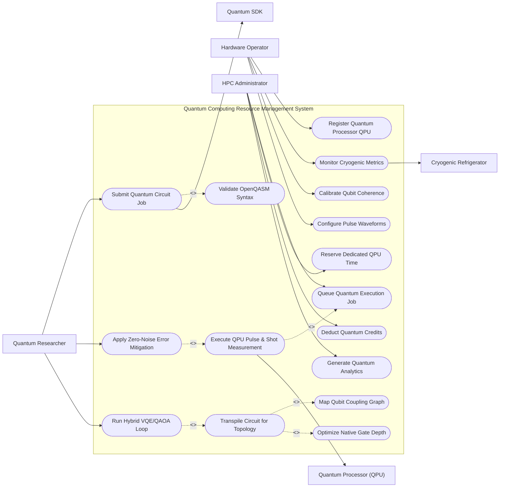

# Use Case Diagram — Quantum Computing Resource Management System

## Mermaid Code

## Actor Table | Bảng Actor

| # | Actor | Actor Type | Role Description | Related Use Cases |
|---|-------|------------|------------------|-------------------|
| 1 | Quantum Researcher | Primary | Physicist or developer submitting OpenQASM quantum circuits, configuring shot counts, and executing algorithms. | UC03, UC09, UC12 |
| 2 | Hardware Operator | Primary | Quantum engineer calibrating physical qubits, monitoring dilution refrigerators, and configuring pulse envelopes. | UC01, UC10, UC11, UC16 |
| 3 | HPC Administrator | Primary | Supercomputing admin managing quantum execution queues, user credit quotas, and dedicated QPU reservations. | UC07, UC13, UC14, UC15 |
| 4 | Quantum Processor (QPU) | Hardware | Physical superconducting QPU chip executing microwave pulse sequences and returning measurement bitstrings. | UC08 |
| 5 | Cryogenic Refrigerator | System | Dilution refrigerator monitoring sub-kelvin thermal levels (mK) and vacuum pressures. | UC10 |
| 6 | Quantum SDK | System | External compiler framework (Qiskit, Cirq) formatting OpenQASM 3.0 circuit specifications. | UC03 |

## Use Case Table | Bảng Use Case

| # | UC ID | Use Case Name | Primary Actor | Secondary Actor | Description | Priority |
|---|-------|---------------|---------------|-----------------|-------------|----------|
| 1 | UC01 | Register Quantum Processor QPU | Hardware Operator | None | Onboards a new QPU hardware backend, configuring qubit count, basis gate sets, and native pulse frequencies. | High |
| 2 | UC02 | Map Qubit Coupling Graph | Hardware Operator | None | Defines physical qubit connectivity topology (e.g. Heavy-Hex, Grid) and directional CNOT/CZ coupling paths. | High |
| 3 | UC03 | Submit Quantum Circuit Job | Quantum Researcher | Quantum SDK | Submits OpenQASM 3.0 or Qiskit quantum circuit payload, defining shot count (e.g., 8192) and target backend QPU. | High |
| 4 | UC04 | Validate OpenQASM Syntax | Quantum Researcher | None | Parses and validates OpenQASM circuit code syntax, checking qubit index bounds and gate definitions. | High |
| 5 | UC05 | Transpile Circuit for Topology | Quantum Researcher | None | Maps abstract logical qubits to physical QPU coupling graph, inserting SWAP gates and decomposing to basis gates. | High |
| 6 | UC06 | Optimize Native Gate Depth | Quantum Researcher | None | Simplifies transpiled circuit by canceling adjacent self-inverse gates (CX-CX) and synthesizing single-qubit rotations. | High |
| 7 | UC07 | Queue Quantum Execution Job | HPC Administrator | None | Manages priority job queueing, scheduling user quantum jobs according to reservation rules and credit status. | High |
| 8 | UC08 | Execute QPU Pulse & Shot Measurement | Hardware Operator | Quantum Processor | Converts transpiled circuit into microwave pulse waveforms, fires 8192 measurement shots, and records bitstrings. | High |
| 9 | UC09 | Apply Zero-Noise Error Mitigation | Quantum Researcher | None | Applies Zero-Noise Extrapolation (ZNE) or Readout Error Mitigation (M3) to raw quantum shot histograms. | High |
| 10 | UC10 | Monitor Cryogenic Metrics | Hardware Operator | Cryogenic Refrigerator | Monitors dilution fridge mixing chamber temperatures (e.g. 15.2 mK), vacuum pressures, and helium levels. | High |
| 11 | UC11 | Calibrate Qubit Coherence | Hardware Operator | None | Runs automated daily Ramsey, T1 relaxation, and Randomized Benchmarking (RB) routines to update gate error maps. | High |
| 12 | UC12 | Run Hybrid VQE/QAOA Loop | Quantum Researcher | None | Executes hybrid variational quantum-classical optimization loop, updating ansatz parameters iteratively on classical HPC. | Medium |
| 13 | UC13 | Reserve Dedicated QPU Time | HPC Administrator | None | Allocates exclusive QPU access time blocks for high-priority enterprise research teams. | Medium |
| 14 | UC14 | Deduct Quantum Credits | HPC Administrator | None | Deducts usage credits from user organization balance based on QPU execution seconds and shot volume. | Medium |
| 15 | UC15 | Generate Quantum Analytics | HPC Administrator | None | Exports QPU benchmark reports, Quantum Volume (QV) scores, median CNOT error rates, and queue utilization. | Medium |
| 16 | UC16 | Configure Pulse Waveforms | Hardware Operator | None | Tunes Drag pulse Gaussian envelopes, microwave frequencies, and readout discriminator thresholds for individual qubits. | Low |

## Use Case Specification | Đặc tả Use Case

---

### UC01 — Register Quantum Processor QPU

| Field | Detail |
|-------|--------|
| **UC ID** | UC01 |
| **Use Case Name** | Register Quantum Processor QPU |
| **Actor(s)** | Primary: Hardware Operator / Secondary: None |
| **Description** | Registers a physical Quantum Processing Unit (QPU) backend in the system, specifying qubit technology (Superconducting, Trapped Ion, Neutral Atom), total qubit count, and native basis gate sets. |
| **Precondition** | 1. Hardware Operator has system administrator permissions.   2. Physical QPU is cooled to operational temperature and control electronics are connected. |
| **Main Flow** | 1. Actor selects "Register New QPU Backend".   2. System displays registration form requesting Backend Name (e.g., `ibm_kyoto`), QPU Technology Type (Superconducting Transmon), Total Qubits (e.g. 127 qubits), and Control Rack IP address.   3. Actor defines Native Basis Gates supported by QPU hardware (e.g. `{RZ, SX, X, ECR, CZ}`).   4. Actor uploads initial Qubit Coupling Graph topology matrix defining physical connectivity between adjacent qubits (UC02).   5. Actor defines default microwave pulse sample rate (e.g. 4.5 GS/s) and readout discriminator settings.   6. System validates backend parameters, creates Quantum_Processor record, initializes qubit calibration tables (UC11), and sets status to "Offline - Calibration Required". |
| **Alternative Flow** | **AF1** — Import QPU Calibration File: Operator imports vendor calibration JSON; System automatically populates qubit frequencies, T1/T2 times, and single-qubit gate error rates.   **AF2** — Simulator Backend Registration: Operator registers a high-performance GPU Statevector Simulator backend (`qasm_simulator`); System configures classical simulation parameters up to 32 qubits. |
| **Exception Flow** | **EX1** — Disconnected Control Electronics: If QPU control rack fails to respond to IP ping, System alerts "Control hardware unreachable at IP address."   **EX2** — Invalid Basis Gate Definition: If entered basis gates lack a universal quantum gate set, System flags "Non-universal gate set specified: Universal set requires at least one 2-qubit entangling gate." |
| **Postcondition** | A Quantum_Processor entity is created, setting up the QPU backend in the system catalog for transpilation and job queueing. |
| **Business Rule** | **BR1**: Every registered physical QPU must possess a defined universal basis gate set capable of arbitrary single-qubit rotations and entangling two-qubit operations. |

---

### UC03 — Submit Quantum Circuit Job

| Field | Detail |
|-------|--------|
| **UC ID** | UC03 |
| **Use Case Name** | Submit Quantum Circuit Job |
| **Actor(s)** | Primary: Quantum Researcher / Secondary: Quantum SDK |
| **Description** | Submits a quantum algorithm encoded in OpenQASM 3.0 or Qiskit JSON format to the system, specifying shot count, target QPU backend, and error mitigation options. |
| **Precondition** | 1. Researcher is authenticated and holds sufficient Quantum Compute Credits (UC14).   2. Target QPU backend is registered and in "Online" status. |
| **Main Flow** | 1. Actor connects via Python SDK (Qiskit / Cirq) or Web Portal and selects "Submit Quantum Job".   2. System presents submission payload interface requesting Target QPU Backend (e.g. `qpu_eagle_127`), Job Name, and OpenQASM 3.0 circuit code string.   3. Actor specifies execution parameters: Number of Shots (e.g., 8192 shots), Optimization Level (0 to 3), and Error Mitigation method (Readout M3, ZNE).   4. System validates OpenQASM syntax (UC04) and checks user credit balance against requested shot volume (UC14).   5. System triggers automatic circuit transpilation (UC05) to map circuit qubits onto target QPU topology.   6. System creates Quantum_Job entity, assigns unique Job ID (e.g. `QJOB-2026-88192`), sets status to "Queued", and passes job to Queue Management (UC07).   7. System returns Job ID token to Researcher. |
| **Alternative Flow** | **AF1** — Multi-Circuit Batch Job Submission: Researcher submits a list of 50 parameterized circuits in a single batch call for variational algorithm iterations (UC12).   **AF2** — Pulse-Level OpenPulse Job Submission: Researcher submits raw microwave pulse waveforms instead of gate-level circuit code. |
| **Exception Flow** | **EX1** — Qubit Count Exceeds QPU Capacity: If circuit requires 150 qubits but target QPU has 127 qubits, System rejects submission with error "Circuit width (150 qubits) exceeds QPU capacity (127 qubits)."   **EX2** — Insufficient Quantum Credits: If user credit balance is lower than job cost, System halts submission with error "Insufficient Quantum Credits. Please top up account." |
| **Postcondition** | A Quantum_Job entry is queued, transpiled for target hardware, and awaiting execution slot allocation. |
| **Business Rule** | **BR1**: Quantum circuit shot counts must be constrained between 1 shot and 100,000 shots per individual job submission. |

---

### UC05 — Transpile Circuit for QPU Topology

| Field | Detail |
|-------|--------|
| **UC ID** | UC05 |
| **Use Case Name** | Transpile Circuit for QPU Topology |
| **Actor(s)** | Primary: Quantum Researcher / Secondary: None |
| **Description** | Transforms an abstract logical quantum circuit into a physical quantum circuit mapped to the exact coupling graph of the target QPU, inserting SWAP gates and decomposing gates to native basis set. |
| **Precondition** | 1. Quantum circuit OpenQASM code has passed syntax validation (UC04).   2. Physical QPU coupling graph (UC02) and latest qubit error calibration map (UC11) are available. |
| **Main Flow** | 1. System receives logical quantum circuit payload from job submission (UC03).   2. System analyzes QPU physical qubit coupling graph (e.g. Heavy-Hex 127-qubit layout) and active gate error rates.   3. System executes Initial Layout Mapping using SaberSwap/VF2 layout algorithms to select the physical qubits with the highest 2-qubit gate fidelities.   4. System inserts necessary SWAP gates to enable 2-qubit entangling gates (CNOT/CZ) between non-adjacent physical qubits on the coupling map.   5. System decomposes all arbitrary quantum gates (Hadamard, Toffoli, RX) into the target QPU's native basis gate set (e.g., `{RZ, SX, X, ECR}`).   6. System executes native gate depth optimization (UC06), canceling redundant rotations and reducing total CNOT gate count.   7. System outputs compiled Physical OpenQASM Circuit, calculates estimated circuit duration (microseconds) and total circuit fidelity score, and attaches physical circuit to the Quantum_Job record. |
| **Alternative Flow** | **AF1** — Pulse Decommissioning (OpenPulse): System transpiles gates directly into calibrated microwave pulse envelope definitions (`Schedule` objects).   **AF2** — Noise-Aware Routing: System analyzes daily T1/T2 coherence times and dynamically avoids defective or noisy physical qubits. |
| **Exception Flow** | **EX1** — Routing Convergence Failure: If transpiler exceeds maximum SWAP search depth without converging, System alerts "Transpilation routing failed: Circuit connectivity too dense for Heavy-Hex topology."   **EX2** — Excess Depth Warning: If transpiled circuit duration exceeds QPU median T1 coherence time (e.g., >300 µs), System alerts "Warning: Circuit execution time exceeds qubit T1 coherence limit. High decoherence noise expected." |
| **Postcondition** | A Circuit_Transformation entity is saved, storing the compiled physical circuit ready for QPU pulse execution. |
| **Business Rule** | **BR1**: Transpilation algorithms must prioritize routing 2-qubit entangling gates through physical qubit paths with the highest calibrated gate fidelity. |

---

### UC08 — Execute QPU Pulse & Shot Measurement

| Field | Detail |
|-------|--------|
| **UC ID** | UC08 |
| **Use Case Name** | Execute QPU Pulse & Shot Measurement |
| **Actor(s)** | Primary: Hardware Operator / Secondary: Quantum Processor |
| **Description** | Converts physical transpiled circuit into digital microwave pulse envelopes, fires the requested shot count (e.g. 8192 shots) on physical QPU hardware, and records readout measurement bitstrings. |
| **Precondition** | 1. Quantum job is allocated active execution slot from queue (UC07).   2. Dilution refrigerator mixing chamber temperature is confirmed stable (<20 mK) via UC10. |
| **Main Flow** | 1. System pulls compiled physical quantum circuit payload (UC05).   2. System translates basis gates into microsecond microwave pulse waveforms (Arbitrary Waveform Generators) at specific qubit drive frequencies (e.g., 5.12 GHz).   3. System loads pulse sequence buffer into QPU control rack hardware.   4. System initiates shot loop execution:   &nbsp;&nbsp;&nbsp;&nbsp;a. Transmits Qubit Reset pulse (cooling qubits to `|0>` ground state).   &nbsp;&nbsp;&nbsp;&nbsp;b. Fires microwave drive pulses for single-qubit and two-qubit gates.   &nbsp;&nbsp;&nbsp;&nbsp;c. Sends Readout resonator pulse and samples returned IQ analog voltage signals.   &nbsp;&nbsp;&nbsp;&nbsp;d. Discriminates IQ signals into binary measurement outcome (`0` or `1`).   5. System repeats shot loop for requested shot count (e.g. 8192 iterations).   6. System aggregates measurement bitstrings into raw state probability histogram (e.g. `{"00": 4112, "11": 4080}`).   7. System stores Shot_Measurement record, updates job status to "Completed", and triggers error mitigation post-processing (UC09). |
| **Alternative Flow** | **AF1** — Mid-Circuit Measurement & Dynamic Reset: Circuit contains mid-circuit measurement conditional branches; QPU fast feedback controller measures qubit and conditionally fires X gate within 200 ns.   **AF2** — Raw Analog IQ Data Capture: Researcher requests raw IQ voltage sampling; System returns un-discriminated IQ cloud data points for state discrimination research. |
| **Exception Flow** | **EX1** — Thermal Trip Interrupt: If dilution fridge temperature spikes above 30 mK during execution, System immediately halts QPU pulse transmission and sets job status to "Interrupted - Thermal Trip".   **EX2** — QPU Readout Resonator Timeout: If readout digitizer fails to return voltage frames within 5 seconds, System resets control rack and flags "Hardware Readout Timeout". |
| **Postcondition** | Shot_Measurement bitstring counts are logged, and raw measurement results are stored for researcher retrieval. |
| **Business Rule** | **BR1**: Physical QPU pulse execution must immediately halt if dilution refrigerator temperature exceeds 25 mK to prevent thermal qubit decoherence. |

---

### UC11 — Calibrate Qubit Coherence & Gate Error Rates

| Field | Detail |
|-------|--------|
| **UC ID** | UC11 |
| **Use Case Name** | Calibrate Qubit Coherence & Gate Error Rates |
| **Actor(s)** | Primary: Hardware Operator / Secondary: None |
| **Description** | Executes automated daily quantum characterization routines (T1/T2 relaxation, Ramsey fringe, Single-qubit & 2-qubit Randomized Benchmarking) to update QPU error maps and pulse frequencies. |
| **Precondition** | 1. Physical QPU is paused from public user job queueing.   2. Dilution fridge temperature is stable at 15 mK. |
| **Main Flow** | 1. Actor (or automated daily cron schedule) triggers "Run QPU Full Calibration Suite".   2. System executes T1 Relaxation test: excites qubits to `|1>` state, measures decay over variable delay times (0 to 500 µs), and fits exponential decay curve to extract T1 times (e.g., T1 = 180 µs).   3. System executes T2 Dephasing (Ramsey/Hahn Echo) test: measures phase coherence decay to extract T2 times (e.g., T2 = 140 µs).   4. System executes Single-Qubit Randomized Benchmarking (RB): fires sequences of Clifford gates to calculate average single-qubit gate error rates (e.g. 0.02% error).   5. System executes Two-Qubit Interleaved RB: measures CNOT/CZ entangling gate error rates across all coupled qubit pairs (e.g. 0.8% CNOT error).   6. System updates QPU calibration error matrix database, recalculates physical coupling map weightings, and publishes updated calibration map to transpiler engine (UC05).   7. System generates Calibration_Log report and sets QPU status back to "Online". |
| **Alternative Flow** | **AF1** — Automated Frequency Fine-Tuning: System detects qubit frequency drift (>2 MHz offset); automatically adjusts microwave synthesizer drive frequency to match 0-1 transition.   **AF2** — Defective Qubit Isolation: Calibration detects qubit with T1 < 10 µs or CNOT error >10%; System automatically marks physical qubit as "Defective" and removes it from transpiler coupling maps. |
| **Exception Flow** | **EX1** — Calibration Fitting Failure: If T1 exponential fit R² score is <0.95 due to microwave noise, System retries test with 16,384 shots.   **EX2** — High Gate Error Rate Alarm: If median 2-qubit gate error exceeds 3%, System triggers warning "QPU Gate Error High: Manual microwave cabling inspection required." |
| **Postcondition** | Calibration_Log is updated, refreshing hardware error maps and ensuring transpiler uses accurate fidelity data. |
| **Business Rule** | **BR1**: Full QPU calibration sweeps must run at least once every 24 hours to account for thermal, magnetic, and microwave drift. |
