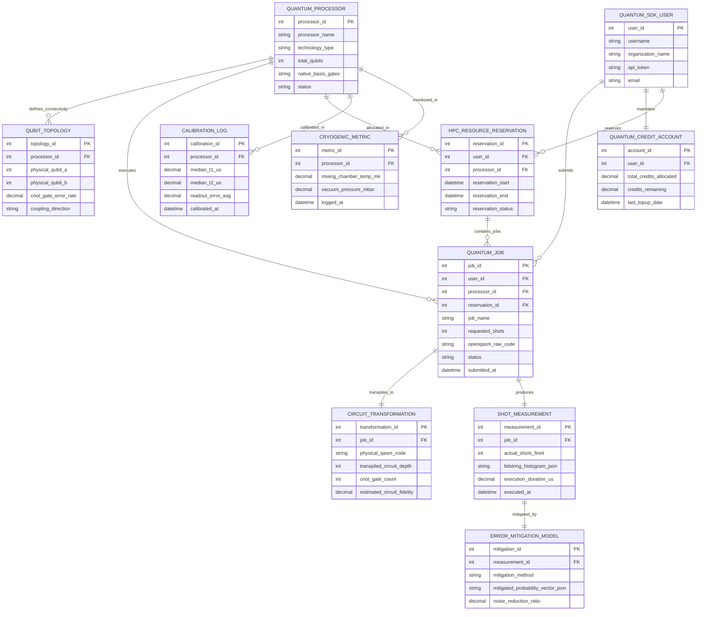

# Conceptual ERD — Quantum Computing Resource Management System

## Mermaid Code

## Entity Description Table | Bảng mô tả Entity

| # | Entity Name | Vietnamese Name | Description | Key Attributes | Main Relationships |
|---|-------------|-----------------|-------------|----------------|-------------------|
| 1 | QUANTUM_PROCESSOR | Tải trọng Quantum QPU | Physical quantum computing hardware (Superconducting, Trapped Ion) backend. | processor_id (PK), processor_name, technology_type, total_qubits, basis_gates | Defines Qubit Topology, executes Quantum Jobs, monitored in Cryogenic Metrics |
| 2 | QUBIT_TOPOLOGY | Sơ đồ Kết nối Qubit | Physical directional coupling graph mapping adjacent qubit pairs and CNOT error rates. | topology_id (PK), processor_id (FK), physical_qubit_a, physical_qubit_b, cnot_error | Belongs to Quantum Processor |
| 3 | QUANTUM_SDK_USER | Người dùng Quantum SDK | Researcher or enterprise user submitting OpenQASM quantum jobs via Python SDK. | user_id (PK), username, organization_name, api_token | Submits Quantum Jobs, maintains Credit Account, reserves QPU time |
| 4 | QUANTUM_CREDIT_ACCOUNT | Tài khoản Tín dụng Quantum | Account balance tracking quantum compute credits, shot consumption ledgers, and top-ups. | account_id (PK), user_id (FK), total_credits_allocated, credits_remaining | Belongs to Quantum SDK User |
| 5 | HPC_RESOURCE_RESERVATION | Đặt chỗ Tài nguyên HPC-QPU | Exclusive time slot reservation allocating QPU hardware blocks for enterprise users. | reservation_id (PK), user_id (FK), processor_id (FK), reservation_start, status | Reserved by User, allocated in QPU, contains Jobs |
| 6 | QUANTUM_JOB | Job Thực thi Quantum | Quantum algorithm job submitted by user specifying target QPU, shots, and circuit code. | job_id (PK), user_id (FK), processor_id (FK), job_name, requested_shots, status | Submitted by User, executed on Processor, transpiles to Transformation |
| 7 | CIRCUIT_TRANSFORMATION | Biến đổi Mạch Transpile | Compiled physical OpenQASM circuit mapped to QPU coupling graph with SWAP insertions. | transformation_id (PK), job_id (FK), physical_qasm_code, circuit_depth, cnot_count | Transpiled for Quantum Job |
| 8 | SHOT_MEASUREMENT | Kết quả Đo đạc Bitstring | Raw QPU measurement output containing shot counts, bitstring histograms, and timing. | measurement_id (PK), job_id (FK), actual_shots_fired, bitstring_histogram_json | Produced by Quantum Job, mitigated by Error Mitigation |
| 9 | ERROR_MITIGATION_MODEL | Mô hình Giảm thiểu Lỗi | Mathematical zero-noise extrapolation or readout error mitigation applied to raw shots. | mitigation_id (PK), measurement_id (FK), mitigation_method, mitigated_probability_vector | Mitigates Shot Measurement |
| 10 | CALIBRATION_LOG | Nhật ký Hiệu chuẩn Qubit | Daily characterization log recording T1/T2 relaxation times, readout errors, and gate error maps. | calibration_id (PK), processor_id (FK), median_t1_us, median_t2_us, readout_error_avg | Calibrates Quantum Processor |
| 11 | CRYOGENIC_METRIC | Chỉ số Nhiệt độ Cryo | Sub-kelvin dilution refrigerator telemetry log tracking mixing chamber mK temperatures. | metric_id (PK), processor_id (FK), mixing_chamber_temp_mk, vacuum_pressure_mbar | Monitors Quantum Processor |

## Relationship Description | Mô tả Quan hệ

| # | From Entity | Cardinality | To Entity | Relationship Label | Business Explanation |
|---|-------------|-------------|-----------|-------------------|----------------------|
| 1 | QUANTUM_PROCESSOR | one-to-many | QUBIT_TOPOLOGY | defines_connectivity | A Quantum Processor defines its physical Qubit Topology coupling graph. |
| 2 | QUANTUM_PROCESSOR | one-to-many | QUANTUM_JOB | executes | A Quantum Processor executes multiple Quantum Jobs. |
| 3 | QUANTUM_SDK_USER | one-to-many | QUANTUM_JOB | submits | A Quantum SDK User submits multiple Quantum Jobs. |
| 4 | QUANTUM_SDK_USER | one-to-one | QUANTUM_CREDIT_ACCOUNT | maintains | A Quantum SDK User maintains a Quantum Credit Account balance. |
| 5 | QUANTUM_SDK_USER | one-to-many | HPC_RESOURCE_RESERVATION | reserves | A Quantum SDK User reserves multiple HPC Resource Reservations. |
| 6 | QUANTUM_PROCESSOR | one-to-many | HPC_RESOURCE_RESERVATION | allocated_in | A Quantum Processor is allocated in multiple HPC Resource Reservations. |
| 7 | HPC_RESOURCE_RESERVATION | one-to-many | QUANTUM_JOB | contains_jobs | An HPC Resource Reservation contains multiple scheduled Quantum Jobs. |
| 8 | QUANTUM_JOB | one-to-one | CIRCUIT_TRANSFORMATION | transpiles_to | A Quantum Job transpiles to a physical Circuit Transformation. |
| 9 | QUANTUM_JOB | one-to-one | SHOT_MEASUREMENT | produces | A Quantum Job produces raw bitstring Shot Measurements. |
| 10 | SHOT_MEASUREMENT | one-to-one | ERROR_MITIGATION_MODEL | mitigated_by | A Shot Measurement is mitigated by an Error Mitigation Model. |
| 11 | QUANTUM_PROCESSOR | one-to-many | CALIBRATION_LOG | calibrated_in | A Quantum Processor is calibrated in daily Calibration Logs. |
| 12 | QUANTUM_PROCESSOR | one-to-many | CRYOGENIC_METRIC | monitored_in | A Quantum Processor is monitored in Cryogenic Metrics. |
