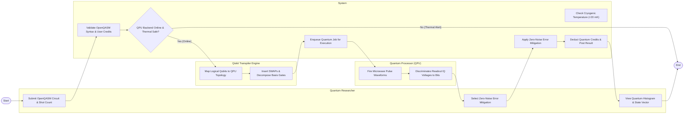

# Swimlane Diagram — Quantum Computing Resource Management System

## Mermaid Code

## Flow Description | Mô tả luồng

| Lane | Actor | Role in Flow |
|------|-------|-------------|
| 1 | Quantum Researcher | Submits OpenQASM 3.0 quantum circuits via SDK, sets shot counts, selects error mitigation parameters, and visualizes measurement state histograms. |
| 2 | System | Validates circuit syntax and credit balances, verifies cryogenic refrigerator sub-kelvin temperatures (<20 mK), queues jobs, applies error mitigation algorithms, and deducts credits. |
| 3 | Qiskit Transpiler Engine | Maps abstract logical qubits onto physical QPU Heavy-Hex coupling topology graphs, inserts SWAP gates, and decomposes gates into native basis sets (`{RZ, SX, X, ECR}`). |
| 4 | Quantum Processor (QPU) | Converts physical circuits into microsecond microwave pulse waveforms, fires requested shot iterations (8192 shots), and discriminates IQ voltages into measurement bitstrings. |
