# Action Tree — Quantum Computing Resource Management System

## Mermaid Code

```mermaid
graph TD
    Root["Quantum Computing Resource Management System"]

    Root --> M1["Quantum QPU Onboarding & Topology"]
    Root --> M2["Quantum Job Scheduling & Queue"]
    Root --> M3["Circuit Transpilation & Optimization"]
    Root --> M4["Cryogenic Environmental Monitoring"]
    Root --> M5["Qubit Calibration & Error Mitigation"]
    Root --> M6["Quantum Credit & Usage Accounting"]

    M1 --> A11["Register Superconducting QPU Backend"]
    M1 --> A12["Map Qubit Heavy-Hex Coupling Topology"]
    M1 --> A13["Define Native Basis Gate Set"]
    M1 --> A14["Configure Microwave Control Rack IP"]

    M2 --> A21["Submit OpenQASM 3.0 Circuit Payload"]
    M2 --> A22["Manage Priority Job Queueing"]
    M2 --> A23["Reserve Dedicated QPU Time Slot"]
    M2 --> A24["Execute Hybrid VQE/QAOA Loops"]

    M3 --> A31["Map Logical Qubits to Physical Topology"]
    M3 --> A32["Insert SWAP Gates for Non-Adjacent Qubits"]
    M3 --> A33["Decompose Gates into Native Basis Set"]
    M3 --> A34["Cancel Redundant Self-Inverse Gates"]

    M4 --> A41["Monitor Dilution Fridge mK Temperatures"]
    M4 --> A42["Track Liquid Helium Vacuum Pressures"]
    M4 --> A43["Trigger Thermal Safety Trip Overrides"]
    M4 --> A44["Log Cryogenic Environmental Telemetry"]

    M5 --> A51["Run Daily T1/T2 Relaxation Calibration"]
    M5 --> A52["Execute Randomized Benchmarking"]
    M5 --> A53["Apply Zero-Noise Error Mitigation"]
    M5 --> A54["Tune Microwave Pulse Waveforms"]

    M6 --> A61["Track Quantum Execution Seconds"]
    M6 --> A62["Deduct Shot Volume Usage Credits"]
    M6 --> A63["Calculate Quantum Volume Benchmarks"]
    M6 --> A64["Export Enterprise Billing Reports"]
```

## Module Description | Mô tả Module

| # | Module | Description | Actions |
|---|--------|-------------|---------|
| 1 | Quantum QPU Onboarding & Topology | Registers physical QPU hardware backends, configures Heavy-Hex coupling graphs, sets native basis gates, and configures control racks. | Register Superconducting QPU Backend, Map Qubit Heavy-Hex Coupling Topology, Define Native Basis Gate Set, Configure Microwave Control Rack IP |
| 2 | Quantum Job Scheduling & Queue | Manages OpenQASM circuit job submissions, schedules priority queueing, manages dedicated QPU reservations, and executes hybrid VQE/QAOA loops. | Submit OpenQASM 3.0 Circuit Payload, Manage Priority Job Queueing, Reserve Dedicated QPU Time Slot, Execute Hybrid VQE/QAOA Loops |
| 3 | Circuit Transpilation & Optimization | Transpiles logical quantum circuits onto physical QPU coupling graphs, inserts SWAP routing gates, decomposes to native basis set, and optimizes depth. | Map Logical Qubits to Physical Topology, Insert SWAP Gates for Non-Adjacent Qubits, Decompose Gates into Native Basis Set, Cancel Redundant Self-Inverse Gates |
| 4 | Cryogenic Environmental Monitoring | Tracks sub-kelvin dilution refrigerator mixing chamber temperatures (mK), vacuum pressures, triggers thermal safety trips, and logs environment data. | Monitor Dilution Fridge mK Temperatures, Track Liquid Helium Vacuum Pressures, Trigger Thermal Safety Trip Overrides, Log Cryogenic Environmental Telemetry |
| 5 | Qubit Calibration & Error Mitigation | Executes daily T1/T2 coherence calibration, Randomized Benchmarking (RB), zero-noise extrapolation (ZNE), and tunes microwave Drag pulse envelopes. | Run Daily T1/T2 Relaxation Calibration, Execute Randomized Benchmarking, Apply Zero-Noise Error Mitigation, Tune Microwave Pulse Waveforms |
| 6 | Quantum Credit & Usage Accounting | Tracks QPU execution seconds, deducts quantum compute usage credits per shot, calculates Quantum Volume (QV) scores, and exports billing ledgers. | Track Quantum Execution Seconds, Deduct Shot Volume Usage Credits, Calculate Quantum Volume Benchmarks, Export Enterprise Billing Reports |
