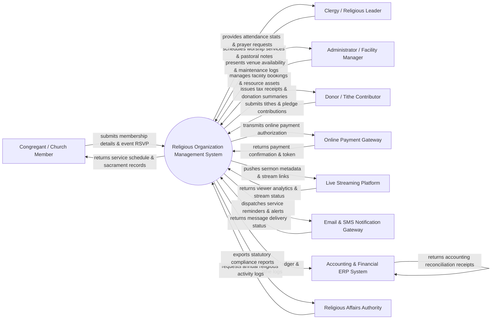

# Context Diagram — Religious Organization Management System

## Mermaid Code

## Actor & Interaction Table | Bảng Actor & Tương tác

| # | Actor | Actor Type | Data Sent TO System | Data Received FROM System | Notes |
|---|-------|------------|---------------------|---------------------------|-------|
| 1 | Congregant / Church Member | Primary | Personal profile, household family details, sacrament requests, service RSVPs, volunteer availability, prayer requests | Service schedules, sacrament certificates, volunteer shift assignments, ministry updates | Individual members, attendees, and families registered in the religious community. |
| 2 | Clergy / Religious Leader | Primary | Worship service schedules, sermon notes, pastoral care logs, counseling appointments, sacrament approvals | Congregant directory, attendance statistics, prayer request queues, pastoral care alerts | Pastors, priests, imams, monks, or ministers providing spiritual leadership. |
| 3 | Administrator / Facility Manager | Primary | Venue reservations, room setup rules, event calendars, equipment maintenance schedules | Facility utilization schedules, maintenance alerts, resource booking requests | Staff managing temple/church halls, audio-visual equipment, and campus facilities. |
| 4 | Donor / Tithe Contributor | Primary | One-time/recurring tithes, building fund gifts, mission pledges, payment card info | Official tax-deductible donation receipts, annual pledge statements, impact reports | Members or supporters donating funds for tithes, missions, or building projects. |
| 5 | Online Payment Gateway | Supporting System | Payment settlement tokens, transaction status codes, credit card authorization codes | Encrypted donation payloads, recurring tithe schedules, transaction amounts | Payment processor handling credit card, e-wallet, and automated bank tithes. |
| 6 | Live Streaming Platform | Supporting System | Viewer metrics, stream health status, live broadcast URLs, chat logs | Service broadcast schedules, sermon video metadata, thumbnail graphics | Video streaming engine (e.g. YouTube Live, Vimeo, custom HLS) broadcasting services. |
| 7 | Email & SMS Notification Gateway | Supporting System | Delivery receipts, SMS response codes, carrier bounce notices | Service reminders, emergency alerts, pastoral care updates, newsletter emails | Messaging service sending daily devotions, event reminders, and emergency prayer alerts. |
| 8 | Accounting & Financial ERP System | Supporting System | Financial ledger sync receipts, account code updates, bank audit status | Tithe & offering totals, fund breakdown reports, expense disbursement logs | Core accounting software recording organizational tithes, payroll, and fund accounting. |
| 9 | Religious Affairs Authority | Regulatory System | Statutory compliance rules, religious gathering guidelines, audit inquiries | Certified annual activity reports, facility safety compliance logs, organizational filings | Government bodies overseeing non-profit religious organizations and public gatherings. |

## System Boundary Description | Mô tả Phạm vi Hệ thống

The **Religious Organization Management System (ROMS)** is a comprehensive church and religious institution software suite. Inside the system boundary, ROMS manages member and household directories, worship service scheduling, sacrament recordkeeping (baptisms, weddings, bar mitzvahs), tithes and donation intake, ministry volunteer coordination, religious education class registration, and facility room bookings. External to the system boundary are commercial card processors (Online Payment Gateway), video distribution infrastructure (Live Streaming Platform), messaging carriers (Email & SMS Gateway), enterprise financial accounting platforms (Financial ERP System), and government oversight entities (Religious Affairs Authority).
