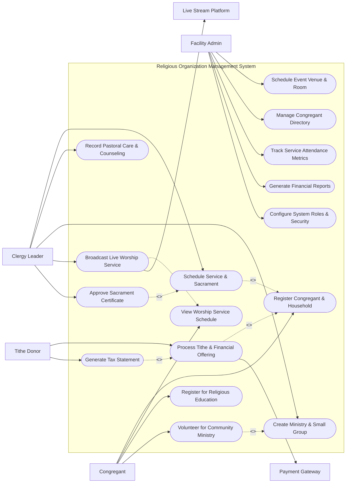

# Use Case Diagram — Religious Organization Management System

## Mermaid Code

## Actor Table | Bảng Actor

| # | Actor | Actor Type | Role Description | Related Use Cases |
|---|-------|------------|------------------|-------------------|
| 1 | Congregant | Primary | Member or visitor participating in services, enrolling in classes, and volunteering. | UC01, UC02, UC08, UC11 |
| 2 | Clergy Leader | Primary | Spiritual leader conducting services, officiating sacraments, and providing pastoral care. | UC03, UC04, UC07, UC10, UC12 |
| 3 | Tithe Donor | Primary | Member contributing financial tithes, offerings, or mission pledges. | UC05, UC06 |
| 4 | Facility Admin | Primary | Administrator managing directory data, room reservations, attendance, and finance. | UC09, UC13, UC14, UC15, UC16 |
| 5 | Payment Gateway | System | Commercial payment processor facilitating online credit card and ACH tithes. | UC05 |
| 6 | Live Stream Platform | System | External video streaming engine broadcasting live services to remote viewers. | UC10 |

## Use Case Table | Bảng Use Case

| # | UC ID | Use Case Name | Primary Actor | Secondary Actor | Description | Priority |
|---|-------|---------------|---------------|-----------------|-------------|----------|
| 1 | UC01 | Register Congregant & Household | Congregant | Facility Admin | Registers personal member profile and links family household members. | High |
| 2 | UC02 | View Worship Service Schedule | Congregant | None | Views service times, sermon topics, venue details, and live stream links. | High |
| 3 | UC03 | Schedule Service & Sacrament | Clergy Leader | Congregant | Schedules worship services, baptisms, weddings, or memorial services. | High |
| 4 | UC04 | Record Pastoral Care & Counseling | Clergy Leader | None | Logs confidential pastoral visitation notes, counseling sessions, and prayer needs. | Medium |
| 5 | UC05 | Process Tithe & Financial Offering | Tithe Donor | Payment Gateway | Processes one-time or recurring tithe donations online with card or ACH transfer. | High |
| 6 | UC06 | Generate Tax Statement | Tithe Donor | Facility Admin | Compiles annual charitable contribution summaries for member income tax filing. | High |
| 7 | UC07 | Create Ministry & Small Group | Clergy Leader | None | Establishes community ministry teams, youth groups, or Bible study circles. | Medium |
| 8 | UC08 | Register for Religious Education | Congregant | None | Enrolls children or adults in Sunday school, catechism, or spiritual growth classes. | Medium |
| 9 | UC09 | Schedule Event Venue & Room | Facility Admin | None | Reserves rooms, halls, and audio-visual equipment for community events. | Medium |
| 10 | UC10 | Broadcast Live Worship Service | Clergy Leader | Live Stream Platform | Streams live worship services and uploads archived sermon recordings. | Medium |
| 11 | UC11 | Volunteer for Community Ministry | Congregant | Clergy Leader | Signs up for volunteer rosters (ushers, choir, outreach, food pantry). | High |
| 12 | UC12 | Approve Sacrament Certificate | Clergy Leader | Congregant | Verifies sacrament completion and generates official baptism/marriage certificates. | Medium |
| 13 | UC13 | Manage Congregant Directory | Facility Admin | None | Maintains member status, address changes, membership transfers, and emergency contacts. | High |
| 14 | UC14 | Track Service Attendance Metrics | Facility Admin | None | Logs headcounts, check-ins, and online streaming viewer metrics across services. | Medium |
| 15 | UC15 | Generate Financial Reports | Facility Admin | None | Exports fund accounting balance sheets, tithe income vs expense budgets, and audit logs. | High |
| 16 | UC16 | Configure System Roles & Security | Facility Admin | None | Manages user access permissions, clergy roles, and data privacy safeguards. | Low |

## Use Case Specification | Đặc tả Use Case

---

### UC01 — Register Congregant & Household

| Field | Detail |
|-------|--------|
| **UC ID** | UC01 |
| **Use Case Name** | Register Congregant & Household |
| **Actor(s)** | Primary: Congregant / Secondary: Facility Admin |
| **Description** | Allows a new member or family to create a congregant account, specify contact information, define family household relationships, and input emergency contact details. |
| **Precondition** | 1. User accesses the online member portal or in-person registration kiosk.   2. Member registration form is available. |
| **Main Flow** | 1. Actor selects "Register New Member / Family".   2. System presents registration form asking for Head of Household details (Full Name, Address, Phone, Email, DOB, Marital Status).   3. Actor inputs personal information and clicks "Add Household Member".   4. Actor inputs spouse, children, or elderly dependent details (Name, DOB, Relationship, Allergy/Special Needs notes).   5. Actor selects preferred communication channels (Email, SMS, App Push) and privacy settings.   6. Actor submits registration.   7. System validates data, assigns Household ID (e.g. HH-9042), creates individual Member records, and sends welcome email. |
| **Alternative Flow** | **AF1** — Admin In-Person Entry: Facility Admin inputs paper registration card data on behalf of a congregant; System flags profile as "Admin Created".   **AF2** — Membership Transfer: Congregant indicates transfer from another branch/parish; System initiates membership transfer request workflow. |
| **Exception Flow** | **EX1** — Duplicate Household Detected: If matching address and last name exist, System alerts "Existing Household Found. Merge or create new?"   **EX2** — Minor Unaccompanied Registration: If applicant is under 18 without adult guardian details, System blocks submission until parent/guardian info is added. |
| **Postcondition** | A Household entity and associated Congregant records are created in status "Active Member" (or "Visitor"). |
| **Business Rule** | **BR1**: Household addresses must be verified against standard postal lookup to ensure accurate parish zoning. |

---

### UC03 — Schedule Service & Sacrament

| Field | Detail |
|-------|--------|
| **UC ID** | UC03 |
| **Use Case Name** | Schedule Service & Sacrament |
| **Actor(s)** | Primary: Clergy Leader / Secondary: Congregant |
| **Description** | Enables clergy members to schedule regular worship services, special holy day observances, or personal sacraments (Baptism, Confirmation, Matrimony, Memorials). |
| **Precondition** | 1. Clergy Leader is logged in with pastoral scheduling privileges.   2. Target venue or sanctuary availability is open. |
| **Main Flow** | 1. Actor selects "Schedule Service / Sacrament Event".   2. System displays scheduling form requesting Event Type (Sunday Service, Baptism, Wedding, Funeral, Special Vigils).   3. Actor selects date, start/end time, target sanctuary/room, and presiding clergy member.   4. If a personal sacrament, Actor links candidate Congregant(s) and sponsors/godparents (UC01).   5. Actor specifies liturgy order, scripture readings, sermon title, and music requirements.   6. Actor submits event schedule.   7. System verifies room non-conflict (UC09), reserves facility, creates Religious_Service record, and notifies participating congregants and staff. |
| **Alternative Flow** | **AF1** — Recurring Service Setup: Clergy checks "Weekly Service", and System generates recurring service series for the liturgical calendar year.   **AF2** — Off-Site Sacrament: Sacrament takes place at hospital or home; Clergy inputs custom location address instead of church facility. |
| **Exception Flow** | **EX1** — Sanctuary Double Booking: If selected sanctuary is booked for another event, System displays "Venue Conflict: Sanctuary reserved for Youth Event from 10:00 to 12:00".   **EX2** — Missing Prerequisite Class: For weddings or confirmations, if candidates have not completed mandatory preparation class (UC08), System alerts "Prerequisite Class Not Completed". |
| **Postcondition** | A Religious_Service or Sacrament_Record entity is persisted in status "Scheduled", reserving venue space and clergy time. |
| **Business Rule** | **BR1**: Wedding sacraments require at least 6 months advance scheduling and pre-marital counseling completion. |

---

### UC05 — Process Tithe & Financial Offering

| Field | Detail |
|-------|--------|
| **UC ID** | UC05 |
| **Use Case Name** | Process Tithe & Financial Offering |
| **Actor(s)** | Primary: Tithe Donor / Secondary: Payment Gateway |
| **Description** | Allows church members or online visitors to submit financial tithes, general offerings, mission gifts, or building fund pledges securely via online payment processing. |
| **Precondition** | 1. Payment Gateway integration is active.   2. Donor has selected giving portal. |
| **Main Flow** | 1. Actor accesses Giving Portal and selects "Give Online".   2. System displays giving form with options for Fund Category (General Tithe, Missions, Building Fund, Benevolence, Custom Pledge).   3. Actor enters donation amount and chooses frequency (One-Time, Weekly Recurring, Monthly Recurring).   4. Actor inputs donor details (or logs in for automated tax record tracking) and enters payment card or ACH bank account info.   5. Actor submits donation.   6. System transmits transaction payload to Payment Gateway and receives authorization token.   7. System records Tithe_Donation entity, updates fund ledger, issues official tax-deductible email receipt, and updates donor pledge balance. |
| **Alternative Flow** | **AF1** — Anonymous Giving: Donor checks "Give Anonymously"; System processes transaction without linking donor identity to public records (retains tax ID privately for receipt).   **AF2** — Manual Offering Plate Entry: Facility Admin inputs physical cash/check envelope collections; System updates member tithe records manually. |
| **Exception Flow** | **EX1** — Card Payment Declined: If Payment Gateway returns decline code (e.g., insufficient funds), System displays "Payment declined. Please try another card or check details."   **EX2** — Recurring Setup Failure: If ACH bank routing number is invalid, System alerts "Invalid ACH bank routing number". |
| **Postcondition** | Financial contribution is processed, recorded in Tithe_Donation entity, updated in member tax ledger, and queued for accounting export (UC15). |
| **Business Rule** | **BR1**: All charitable tithes and offerings must generate an official tax-compliant receipt containing non-profit Tax EIN number. |

---

### UC08 — Register for Religious Education Class

| Field | Detail |
|-------|--------|
| **UC ID** | UC08 |
| **Use Case Name** | Register for Religious Education Class |
| **Actor(s)** | Primary: Congregant / Secondary: Facility Admin |
| **Description** | Enables members or parents to enroll themselves or their children in Sunday school, catechism, Bible study, or sacrament preparation classes. |
| **Precondition** | 1. Religious education classes have been configured with schedule and capacity limits.   2. Registration window is open. |
| **Main Flow** | 1. Actor selects "Education & Classes" from member portal.   2. System lists available courses with age groups, schedules, instructor names, tuition fees (if any), and seat availability.   3. Actor selects desired class and picks household member to enroll (UC01).   4. System checks age/grade eligibility rules.   5. Actor completes emergency contact info, medical notes, and photo release consent.   6. Actor submits registration (and pays materials fee if applicable via UC05).   7. System verifies capacity, enrolls student, updates class roster, and sends class schedule confirmation. |
| **Alternative Flow** | **AF1** — Class Waitlist: If selected class is full, System offers "Join Waitlist"; if a seat opens, System automatically notifies next waitlisted student.   **AF2** — Volunteer Teacher Assignment: Adult congregant registers as Volunteer Class Teacher; System routes application to Director of Education. |
| **Exception Flow** | **EX1** — Age Ineligibility: If child's age is outside class parameters (e.g. 5-year-old in Teen Youth Group), System alerts "Ineligible Age Category for selected class."   **EX2** — Unpaid Tuition: If class requires materials fee and payment fails, System holds registration in "Pending Payment" status for 24 hours. |
| **Postcondition** | A student enrollment record is created, linking Congregant to Religious_Class with seat reservation. |
| **Business Rule** | **BR1**: Children enrolled in youth classes must have updated medical consent and emergency contact information renewed annually. |

---

### UC11 — Volunteer for Community Ministry

| Field | Detail |
|-------|--------|
| **UC ID** | UC11 |
| **Use Case Name** | Volunteer for Community Ministry |
| **Actor(s)** | Primary: Congregant / Secondary: Clergy Leader |
| **Description** | Allows congregants to sign up for volunteer service roles across various church ministries (ushers, choir, hospitality, tech team, community outreach). |
| **Precondition** | 1. Congregant has an active profile (UC01).   2. Volunteer opportunities and ministry groups exist in the system (UC07). |
| **Main Flow** | 1. Actor opens "Serve & Volunteer" page.   2. System displays list of active ministry teams needing volunteers along with required skills and shift times.   3. Actor selects target ministry (e.g. Community Food Pantry) and picks preferred volunteer roles and shift schedules.   4. System prompts actor for background check consent (if role involves minors or financial handling).   5. Actor submits volunteer application.   6. System records Volunteer_Assignment entity in status "Pending Leader Review" and notifies Ministry Leader.   7. Ministry Leader approves assignment, and System sends volunteer orientation schedule and shift reminders. |
| **Alternative Flow** | **AF1** — Shift Swap Request: Assigned volunteer requests shift swap; System notifies available team members for substitute coverage.   **AF2** — Team Leader Promotion: Ministry Leader promotes experienced volunteer to "Team Captain" role with schedule roster edit privileges. |
| **Exception Flow** | **EX1** — Background Check Pending: For youth ministry volunteers, if background check is pending, System restricts shift assignment to "Supervised Only".   **EX2** — Shift Schedule Conflict: If volunteer is already scheduled for usher duty during the same hour, System alerts "Schedule conflict with existing Usher assignment." |
| **Postcondition** | A Volunteer_Assignment record is linked to the Congregant, reserving volunteer capacity and updating ministry roster calendars. |
| **Business Rule** | **BR1**: All volunteers working with children or vulnerable adults must undergo background check clearance every 2 years. |
