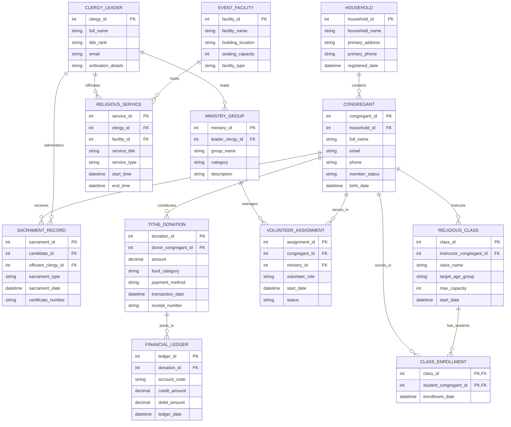

# Conceptual ERD — Religious Organization Management System

## Mermaid Code

## Entity Description Table | Bảng mô tả Entity

| # | Entity Name | Vietnamese Name | Description | Key Attributes | Main Relationships |
|---|-------------|-----------------|-------------|----------------|-------------------|
| 1 | HOUSEHOLD | Hộ gia đình | Represents a family household unit linking members sharing address and family structure. | household_id (PK), household_name, primary_address | Contains Congregants |
| 2 | CONGREGANT | Tín đồ / Thành viên | Individual church member or attendee holding profile, contact, and membership status. | congregant_id (PK), household_id (FK), full_name, member_status | Belongs to Household, contributes Tithe Donations, receives Sacraments, serves in Volunteer Assignments, instructs/enrolls in Classes |
| 3 | CLERGY_LEADER | Giáo sĩ / Lãnh đạo | Pastor, priest, minister, or spiritual leader conducting services and pastoral care. | clergy_id (PK), full_name, title_rank, ordination_details | Officiates Services, administers Sacraments, leads Ministry Groups |
| 4 | RELIGIOUS_SERVICE | Lễ Worship / Phụng vụ | Worship service, holy day mass, or prayer gathering held at a church facility. | service_id (PK), clergy_id (FK), facility_id (FK), service_title, start_time | Officiated by Clergy, hosted in Event Facility |
| 5 | SACRAMENT_RECORD | Hồ sơ Bí tích / Lễ nghi | Formal record of religious sacraments (Baptism, Confirmation, Holy Matrimony, Ordination). | sacrament_id (PK), candidate_id (FK), officiant_clergy_id (FK), sacrament_type, certificate_number | Received by Candidate Congregant, administered by Officiant Clergy |
| 6 | TITHE_DONATION | Khoản Đóng góp / Mười phần trăm | Financial tithe, offering, mission donation, or pledge contributed by a member. | donation_id (PK), donor_congregant_id (FK), amount, fund_category, receipt_number | Contributed by Congregant, posts to Financial Ledger |
| 7 | MINISTRY_GROUP | Ban / Nhóm Mục vụ | Specialized ministry team, youth group, choir, usher board, or outreach group. | ministry_id (PK), leader_clergy_id (FK), group_name, category | Led by Clergy Leader, manages Volunteer Assignments |
| 8 | VOLUNTEER_ASSIGNMENT | Phân công Tình nguyện | Service assignment linking a congregant to a specific ministry team and volunteer role. | assignment_id (PK), congregant_id (FK), ministry_id (FK), volunteer_role, status | Links Congregant to Ministry Group |
| 9 | RELIGIOUS_CLASS | Lớp Học Tôn giáo | Sunday school, catechism, or adult Bible study class taught by instructors. | class_id (PK), instructor_congregant_id (FK), class_name, target_age_group | Instructed by Congregant, has Class Enrollments |
| 10 | EVENT_FACILITY | Cơ sở / Nhà Lễ | Physical sanctuary, chapel, fellowship hall, or room used for services and events. | facility_id (PK), facility_name, building_location, seating_capacity | Hosts Religious Services |
| 11 | FINANCIAL_LEDGER | Sổ sách Kế toán | Fund accounting entry recording tithe income and fund allocations into accounting codes. | ledger_id (PK), donation_id (FK), account_code, credit_amount, debit_amount | Posted from Tithe Donation |

## Relationship Description | Mô tả Quan hệ

| # | From Entity | Cardinality | To Entity | Relationship Label | Business Explanation |
|---|-------------|-------------|-----------|-------------------|----------------------|
| 1 | HOUSEHOLD | one-to-many | CONGREGANT | contains | A Household contains multiple Congregant family members. |
| 2 | CONGREGANT | one-to-many | TITHE_DONATION | contributes | A Congregant contributes multiple Tithe Donations over time. |
| 3 | CLERGY_LEADER | one-to-many | RELIGIOUS_SERVICE | officiates | A Clergy Leader officiates multiple Religious Services. |
| 4 | EVENT_FACILITY | one-to-many | RELIGIOUS_SERVICE | hosts | An Event Facility hosts multiple Religious Services. |
| 5 | CONGREGANT | one-to-many | SACRAMENT_RECORD | receives | A Congregant receives one or more milestone Sacraments. |
| 6 | CLERGY_LEADER | one-to-many | SACRAMENT_RECORD | administers | A Clergy Leader administers multiple Sacrament Records. |
| 7 | CLERGY_LEADER | one-to-many | MINISTRY_GROUP | leads | A Clergy Leader leads or oversees multiple Ministry Groups. |
| 8 | MINISTRY_GROUP | one-to-many | VOLUNTEER_ASSIGNMENT | manages | A Ministry Group manages multiple Volunteer Assignments. |
| 9 | CONGREGANT | one-to-many | VOLUNTEER_ASSIGNMENT | serves_in | A Congregant serves in multiple Volunteer Assignments. |
| 10 | CONGREGANT | one-to-many | RELIGIOUS_CLASS | instructs | A Congregant instructs one or more Religious Classes. |
| 11 | TITHE_DONATION | one-to-many | FINANCIAL_LEDGER | posts_to | A Tithe Donation posts transaction entries to the Financial Ledger. |
| 12 | CONGREGANT | many-to-many | RELIGIOUS_CLASS | enrolls_in | Congregants enroll in multiple Classes (via CLASS_ENROLLMENT). |
