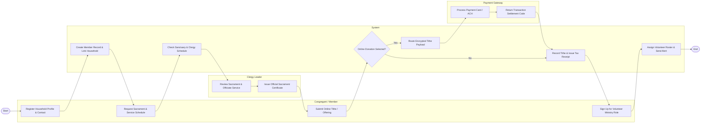

# Swimlane Diagram — Religious Organization Management System

## Mermaid Code

## Flow Description | Mô tả luồng

| Lane | Actor | Role in Flow |
|------|-------|-------------|
| 1 | Congregant / Member | Registers profile and family household, requests sacrament appointments, submits online tithes/pledges, and volunteers for ministry shifts. |
| 2 | System | Automates household linking, checks venue/clergy schedules, routes encrypted payment payloads, records tax-deductible receipts, and manages ministry rosters. |
| 3 | Payment Gateway | Processes electronic credit card and ACH bank tithe transactions and returns settlement confirmation tokens. |
| 4 | Clergy Leader | Evaluates sacrament requests, officiates worship services, logs pastoral care notes, and approves official religious certificates. |
